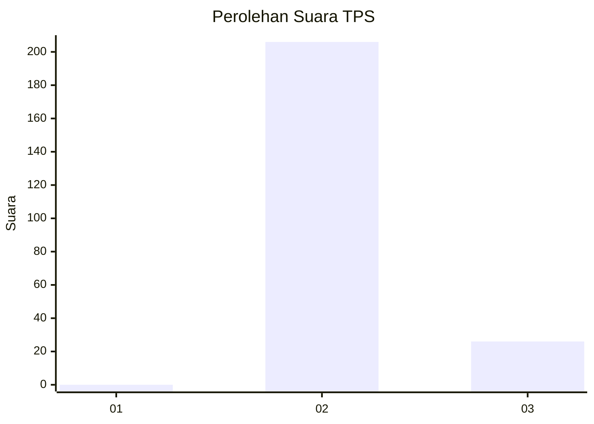
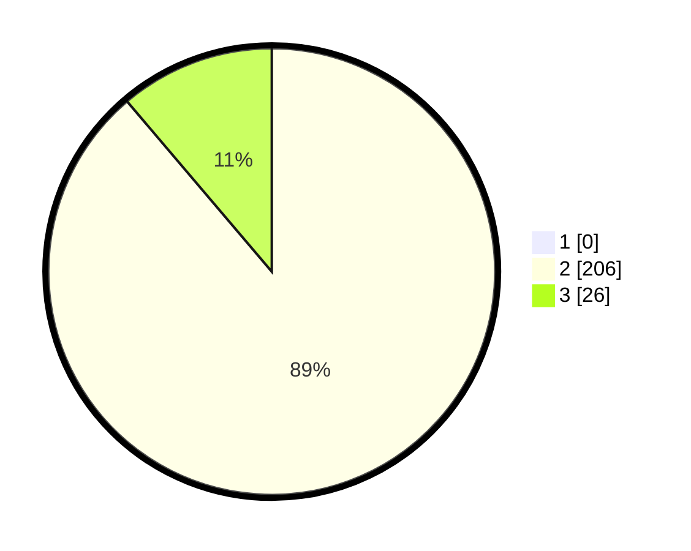

# Hasil

## Grafik

## Tabel

| No. | Nama Paslon    | Suara | Suara (raw) | Persentase |
|:--- |:-------------- | -----:| -----------:| ----------:|
| 1   | ANIES MUHAIMIN | 0     | [0][p-1]    | 0,00       |
| 2   | PRABOWO GIBRAN | 206   | [206][p-2]  | 88,79      |
| 3   | GANJAR MAHFUD  | 26    | [26][p-3]   | 11,21      |

[p-1]: https://github.com/gigit-pemilu/pemilu-2024-51-bali/blob/main/pilpres/hitung-suara/sub/51-bali/sub/05-klungkung/sub/01-nusa-penida/sub/2001-sakti/sub/003-tps/sub/paslon-1.txt
[p-2]: https://github.com/gigit-pemilu/pemilu-2024-51-bali/blob/main/pilpres/hitung-suara/sub/51-bali/sub/05-klungkung/sub/01-nusa-penida/sub/2001-sakti/sub/003-tps/sub/paslon-2.txt
[p-3]: https://github.com/gigit-pemilu/pemilu-2024-51-bali/blob/main/pilpres/hitung-suara/sub/51-bali/sub/05-klungkung/sub/01-nusa-penida/sub/2001-sakti/sub/003-tps/sub/paslon-3.txt

## Foto C Plano

https://sirekap-obj-formc.kpu.go.id/6258/pemilu/ppwp/51/05/01/20/01/5105012001003-20240216-024405--a54c3c2c-c3fa-41c1-a012-38f71ef992e6.jpg

https://sirekap-obj-formc.kpu.go.id/6258/pemilu/ppwp/51/05/01/20/01/5105012001003-20240216-024406--a44929d3-41e1-439d-826a-5546684c225f.jpg

https://sirekap-obj-formc.kpu.go.id/6258/pemilu/ppwp/51/05/01/20/01/5105012001003-20240216-024406--9cf4664a-dbe9-4f7a-80aa-80d832462c7e.jpg

## Metadata

| Key        | Value               |
| ---------- | ------------------- |
| Time Stamp | 2024-02-16 10:00:28 |

## DATA PEMILIH TETAP

Jumlah pemilih dalam DPT: **247**.
 * L: **116**.
 * P: **131**.

## DATA PENGGUNA HAK PILIH

Jumlah pengguna hak pilih dalam DPT: **226**.
 * L: **109**.
 * P: **117**.

Jumlah pengguna hak pilih dalam DPTb: **0**.
 * L: **0**.
 * P: **0**.

Jumlah pengguna hak pilih dalam DPK: **7**.
 * L: **4**.
 * P: **3**.

Jumlah pengguna hak pilih: **233**.
 * L: **113**.
 * P: **120**.

## JUMLAH SUARA SAH DAN TIDAK SAH

JUMLAH SELURUH SUARA SAH: **232**.

JUMLAH SUARA TIDAK SAH: **1**.

JUMLAH SELURUH SUARA SAH DAN SUARA TIDAK SAH: **233**.

