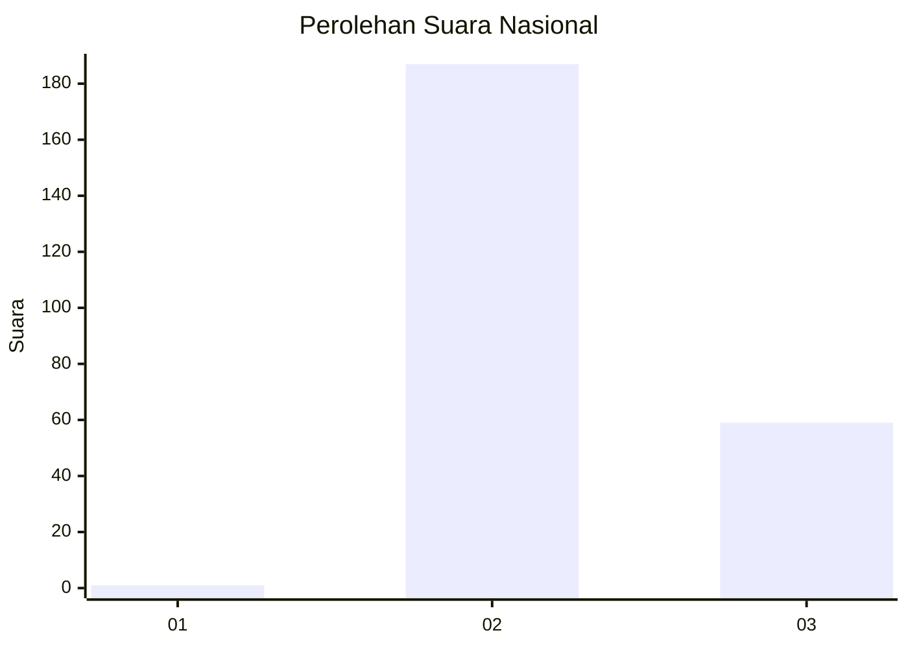
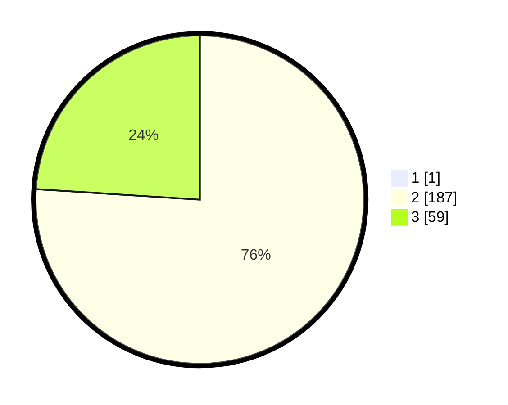

# Hasil

## Grafik

## Tabel

| No. | Nama Paslon    | Suara | Suara (raw) | Persentase |
|:--- |:-------------- | -----:| -----------:| ----------:|
| 1   | ANIES MUHAIMIN | 1     | [1][p-1]    | 0,40       |
| 2   | PRABOWO GIBRAN | 187   | [187][p-2]  | 75,71      |
| 3   | GANJAR MAHFUD  | 59    | [59][p-3]   | 23,89      |

[p-1]: https://github.com/gigit-pemilu/pemilu-2024/blob/main/pilpres/hitung-suara/sub/51-bali/sub/05-klungkung/sub/01-nusa-penida/sub/2001-sakti/sub/004-tps/sub/paslon-1.txt
[p-2]: https://github.com/gigit-pemilu/pemilu-2024/blob/main/pilpres/hitung-suara/sub/51-bali/sub/05-klungkung/sub/01-nusa-penida/sub/2001-sakti/sub/004-tps/sub/paslon-2.txt
[p-3]: https://github.com/gigit-pemilu/pemilu-2024/blob/main/pilpres/hitung-suara/sub/51-bali/sub/05-klungkung/sub/01-nusa-penida/sub/2001-sakti/sub/004-tps/sub/paslon-3.txt

## Foto C Plano

https://sirekap-obj-formc.kpu.go.id/a0ee/pemilu/ppwp/51/05/01/20/01/5105012001004-20240216-144738--1b063d04-3e04-4d88-ac85-b03bf718b510.jpg

https://sirekap-obj-formc.kpu.go.id/a0ee/pemilu/ppwp/51/05/01/20/01/5105012001004-20240216-144739--a3fa4811-0393-46e4-9845-e3e2b7b2c126.jpg

https://sirekap-obj-formc.kpu.go.id/a0ee/pemilu/ppwp/51/05/01/20/01/5105012001004-20240216-144738--ca7dc2eb-3fb2-406f-9ebd-1e4847b8af2a.jpg

## Metadata

| Key        | Value               |
| ---------- | ------------------- |
| Time Stamp | 2024-02-16 21:01:00 |

## DATA PEMILIH TETAP

Jumlah pemilih dalam DPT: **291**.
 * L: **144**.
 * P: **147**.

## DATA PENGGUNA HAK PILIH

Jumlah pengguna hak pilih dalam DPT: **256**.
 * L: **125**.
 * P: **131**.

Jumlah pengguna hak pilih dalam DPTb: **2**.
 * L: **1**.
 * P: **1**.

Jumlah pengguna hak pilih dalam DPK: **0**.
 * L: **0**.
 * P: **0**.

Jumlah pengguna hak pilih: **258**.
 * L: **126**.
 * P: **132**.

## JUMLAH SUARA SAH DAN TIDAK SAH

JUMLAH SELURUH SUARA SAH: **247**.

JUMLAH SUARA TIDAK SAH: **11**.

JUMLAH SELURUH SUARA SAH DAN SUARA TIDAK SAH: **258**.

