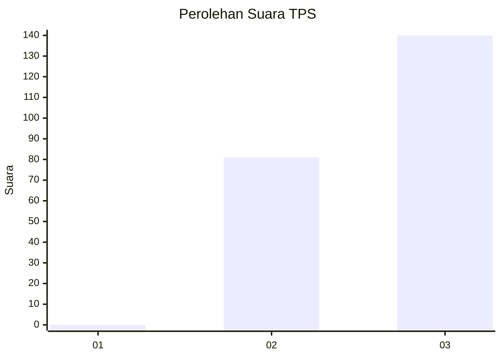
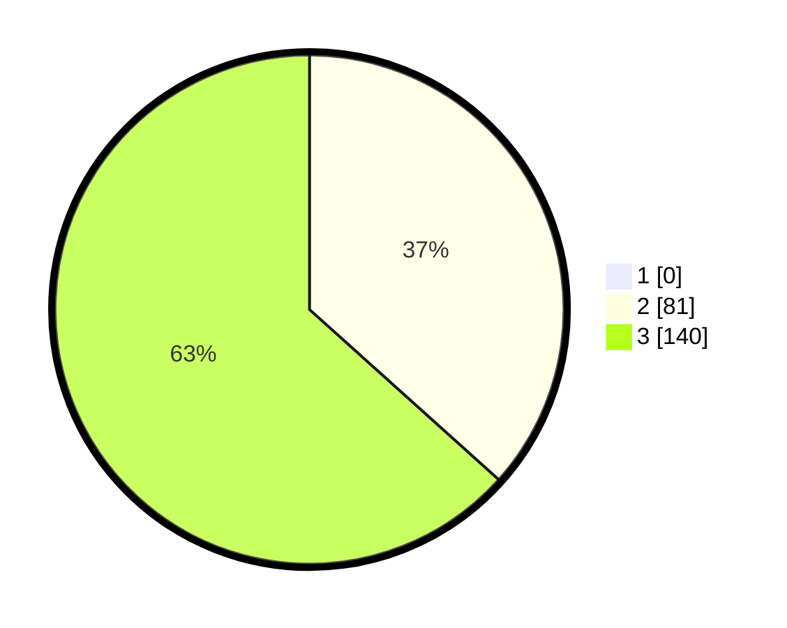

# Hasil

## Grafik

## Tabel

| No. | Nama Paslon    | Suara | Suara (raw) | Persentase |
|:--- |:-------------- | -----:| -----------:| ----------:|
| 1   | ANIES MUHAIMIN | 0     | [0][p-1]    | 0,00       |
| 2   | PRABOWO GIBRAN | 81    | [81][p-2]   | 36,65      |
| 3   | GANJAR MAHFUD  | 140   | [140][p-3]  | 63,35      |

[p-1]: https://github.com/gigit-pemilu/pemilu-2024-51-bali/blob/main/pilpres/hitung-suara/sub/51-bali/sub/05-klungkung/sub/01-nusa-penida/sub/2001-sakti/sub/005-tps/sub/paslon-1.txt
[p-2]: https://github.com/gigit-pemilu/pemilu-2024-51-bali/blob/main/pilpres/hitung-suara/sub/51-bali/sub/05-klungkung/sub/01-nusa-penida/sub/2001-sakti/sub/005-tps/sub/paslon-2.txt
[p-3]: https://github.com/gigit-pemilu/pemilu-2024-51-bali/blob/main/pilpres/hitung-suara/sub/51-bali/sub/05-klungkung/sub/01-nusa-penida/sub/2001-sakti/sub/005-tps/sub/paslon-3.txt

## Foto C Plano

https://sirekap-obj-formc.kpu.go.id/bbaf/pemilu/ppwp/51/05/01/20/01/5105012001005-20240217-222850--3c1a2229-4228-4578-8cbc-1006561b6a8a.jpg

https://sirekap-obj-formc.kpu.go.id/bbaf/pemilu/ppwp/51/05/01/20/01/5105012001005-20240217-222853--cf04b730-2645-4e03-abb9-f487541fb4b8.jpg

https://sirekap-obj-formc.kpu.go.id/bbaf/pemilu/ppwp/51/05/01/20/01/5105012001005-20240217-222852--5fa1234b-f9c9-41fc-bbb8-d69485bd4b0d.jpg

## Metadata

| Key        | Value               |
| ---------- | ------------------- |
| Time Stamp | 2024-02-19 06:16:00 |

## DATA PEMILIH TETAP

Jumlah pemilih dalam DPT: **219**.
 * L: **118**.
 * P: **101**.

## DATA PENGGUNA HAK PILIH

Jumlah pengguna hak pilih dalam DPT: **219**.
 * L: **118**.
 * P: **101**.

Jumlah pengguna hak pilih dalam DPTb: **1**.
 * L: **0**.
 * P: **1**.

Jumlah pengguna hak pilih dalam DPK: **3**.
 * L: **2**.
 * P: **1**.

Jumlah pengguna hak pilih: **223**.
 * L: **120**.
 * P: **103**.

## JUMLAH SUARA SAH DAN TIDAK SAH

JUMLAH SELURUH SUARA SAH: **221**.

JUMLAH SUARA TIDAK SAH: **2**.

JUMLAH SELURUH SUARA SAH DAN SUARA TIDAK SAH: **223**.

