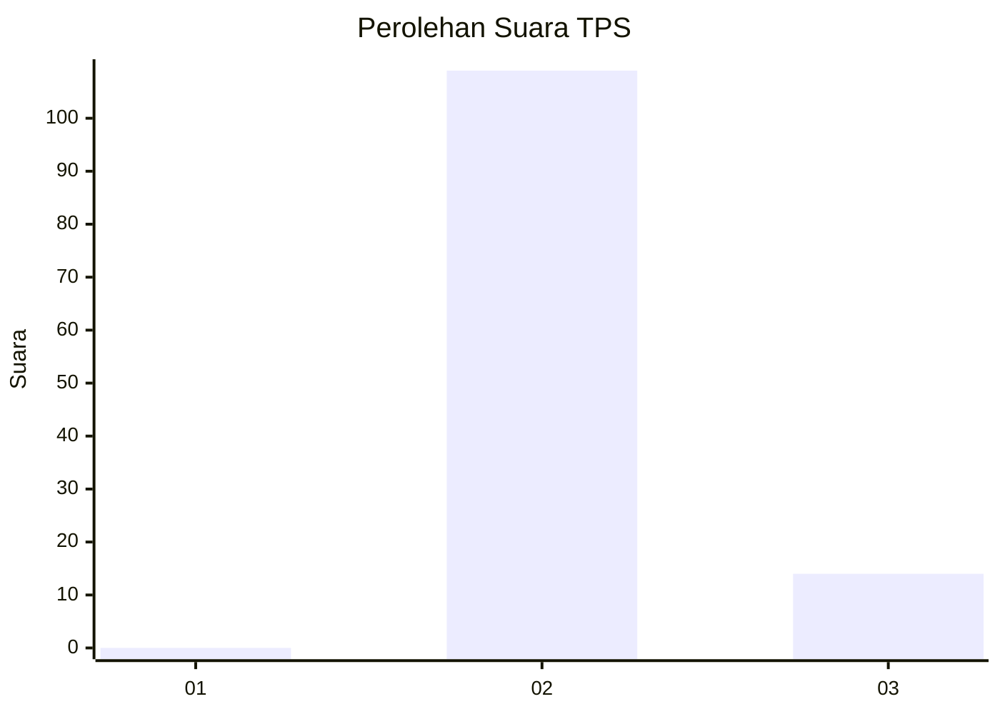
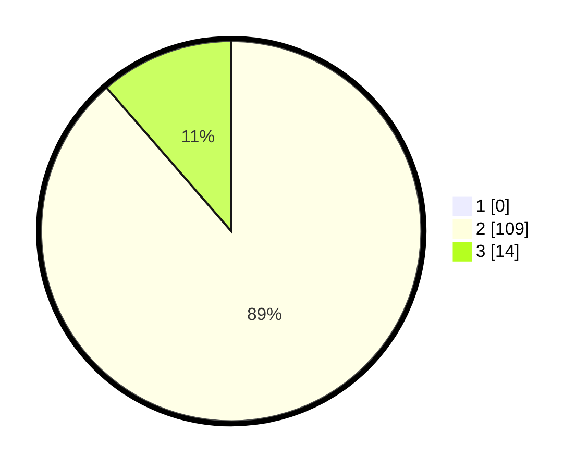

# Hasil

## Grafik

## Tabel

| No. | Nama Paslon    | Suara | Suara (raw) | Persentase |
|:--- |:-------------- | -----:| -----------:| ----------:|
| 1   | ANIES MUHAIMIN | 0     | [0][p-1]    | 0,00       |
| 2   | PRABOWO GIBRAN | 109   | [109][p-2]  | 88,62      |
| 3   | GANJAR MAHFUD  | 14    | [14][p-3]   | 11,38      |

[p-1]: https://github.com/gigit-pemilu/pemilu-2024-51-bali/blob/main/pilpres/hitung-suara/sub/51-bali/sub/05-klungkung/sub/01-nusa-penida/sub/2001-sakti/sub/006-tps/sub/paslon-1.txt
[p-2]: https://github.com/gigit-pemilu/pemilu-2024-51-bali/blob/main/pilpres/hitung-suara/sub/51-bali/sub/05-klungkung/sub/01-nusa-penida/sub/2001-sakti/sub/006-tps/sub/paslon-2.txt
[p-3]: https://github.com/gigit-pemilu/pemilu-2024-51-bali/blob/main/pilpres/hitung-suara/sub/51-bali/sub/05-klungkung/sub/01-nusa-penida/sub/2001-sakti/sub/006-tps/sub/paslon-3.txt

## Foto C Plano

https://sirekap-obj-formc.kpu.go.id/61b1/pemilu/ppwp/51/05/01/20/01/5105012001006-20240219-072508--62257773-30f5-4125-8130-781e36d89e17.jpg

https://sirekap-obj-formc.kpu.go.id/61b1/pemilu/ppwp/51/05/01/20/01/5105012001006-20240219-072510--92cc3b6d-8f78-40a0-a194-d76f77e09dbf.jpg

https://sirekap-obj-formc.kpu.go.id/61b1/pemilu/ppwp/51/05/01/20/01/5105012001006-20240219-072509--4057e06a-b913-41ef-a55b-7793471196ca.jpg

## Metadata

| Key        | Value               |
| ---------- | ------------------- |
| Time Stamp | 2024-02-19 08:00:00 |

## DATA PEMILIH TETAP

Jumlah pemilih dalam DPT: **141**.
 * L: **71**.
 * P: **70**.

## DATA PENGGUNA HAK PILIH

Jumlah pengguna hak pilih dalam DPT: **121**.
 * L: **60**.
 * P: **61**.

Jumlah pengguna hak pilih dalam DPTb: **0**.
 * L: **0**.
 * P: **0**.

Jumlah pengguna hak pilih dalam DPK: **2**.
 * L: **1**.
 * P: **1**.

Jumlah pengguna hak pilih: **123**.
 * L: **61**.
 * P: **62**.

## JUMLAH SUARA SAH DAN TIDAK SAH

JUMLAH SELURUH SUARA SAH: **123**.

JUMLAH SUARA TIDAK SAH: **0**.

JUMLAH SELURUH SUARA SAH DAN SUARA TIDAK SAH: **123**.

