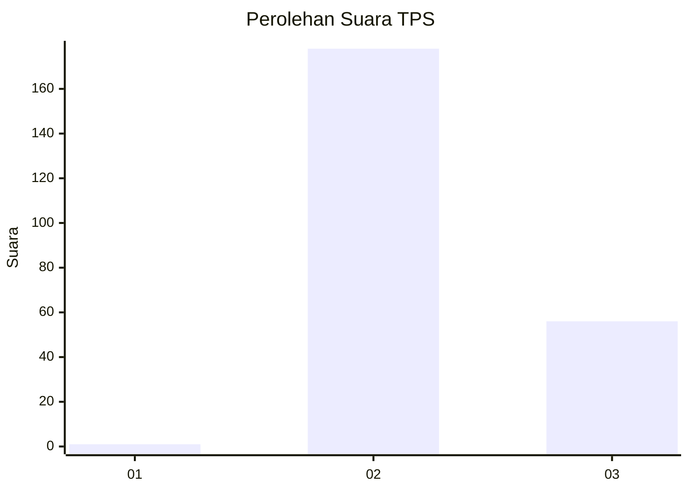
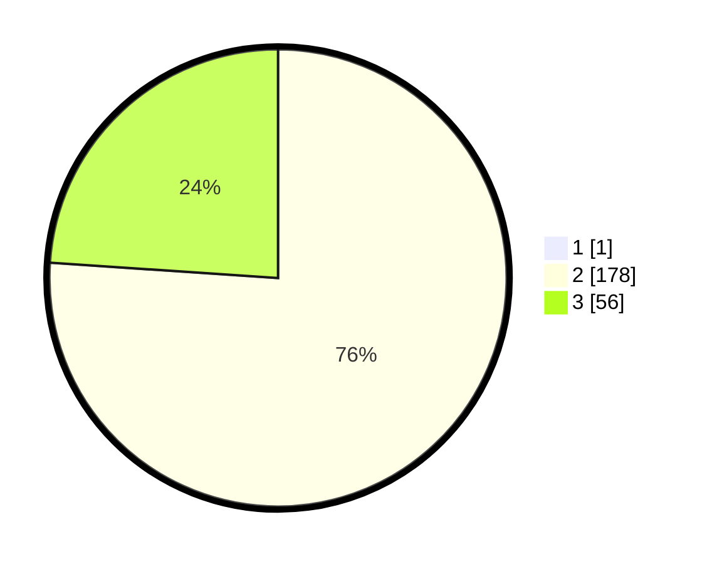

# Hasil

## Grafik

## Tabel

| No. | Nama Paslon    | Suara | Suara (raw) | Persentase |
|:--- |:-------------- | -----:| -----------:| ----------:|
| 1   | ANIES MUHAIMIN | 1     | [1][p-1]    | 0,43       |
| 2   | PRABOWO GIBRAN | 178   | [178][p-2]  | 75,74      |
| 3   | GANJAR MAHFUD  | 56    | [56][p-3]   | 23,83      |

[p-1]: https://github.com/gigit-pemilu/pemilu-2024-51-bali/blob/main/pilpres/hitung-suara/sub/51-bali/sub/05-klungkung/sub/01-nusa-penida/sub/2002-batumadeg/sub/002-tps/sub/paslon-1.txt
[p-2]: https://github.com/gigit-pemilu/pemilu-2024-51-bali/blob/main/pilpres/hitung-suara/sub/51-bali/sub/05-klungkung/sub/01-nusa-penida/sub/2002-batumadeg/sub/002-tps/sub/paslon-2.txt
[p-3]: https://github.com/gigit-pemilu/pemilu-2024-51-bali/blob/main/pilpres/hitung-suara/sub/51-bali/sub/05-klungkung/sub/01-nusa-penida/sub/2002-batumadeg/sub/002-tps/sub/paslon-3.txt

## Foto C Plano

https://sirekap-obj-formc.kpu.go.id/a78c/pemilu/ppwp/51/05/01/20/02/5105012002002-20240214-223130--26876e82-f840-4382-b963-ad2f9fbf72c8.jpg

https://sirekap-obj-formc.kpu.go.id/a78c/pemilu/ppwp/51/05/01/20/02/5105012002002-20240214-223435--bbe35d1f-1e95-4af6-be34-98046ed7201c.jpg

https://sirekap-obj-formc.kpu.go.id/a78c/pemilu/ppwp/51/05/01/20/02/5105012002002-20240214-223605--680f1af0-0069-4b62-a739-1be8efc79a13.jpg

## Metadata

| Key        | Value               |
| ---------- | ------------------- |
| Time Stamp | 2024-02-16 01:00:27 |

