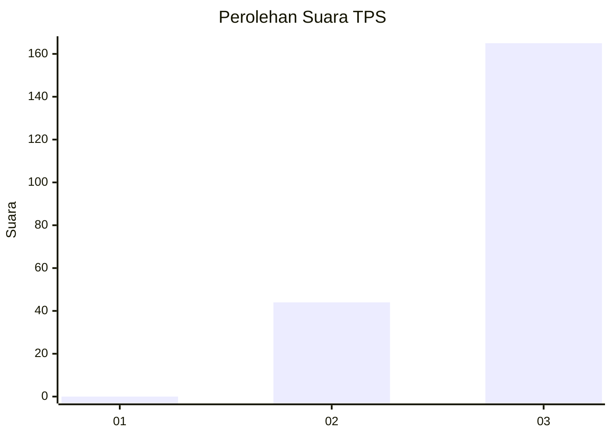
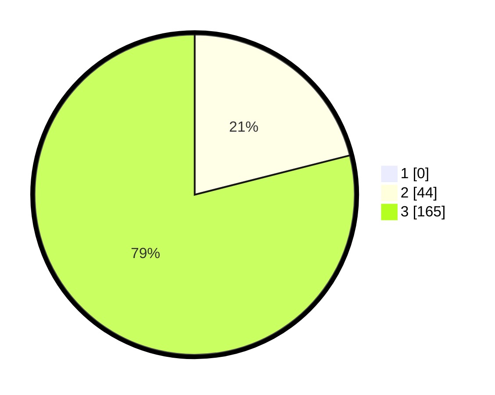

# Hasil

## Grafik

## Tabel

| No. | Nama Paslon    | Suara | Suara (raw) | Persentase |
|:--- |:-------------- | -----:| -----------:| ----------:|
| 1   | ANIES MUHAIMIN | 0     | [0][p-1]    | 0,00       |
| 2   | PRABOWO GIBRAN | 44    | [44][p-2]   | 21,05      |
| 3   | GANJAR MAHFUD  | 165   | [165][p-3]  | 78,95      |

[p-1]: https://github.com/gigit-pemilu/pemilu-2024-51-bali/blob/main/pilpres/hitung-suara/sub/51-bali/sub/05-klungkung/sub/01-nusa-penida/sub/2002-batumadeg/sub/007-tps/sub/paslon-1.txt
[p-2]: https://github.com/gigit-pemilu/pemilu-2024-51-bali/blob/main/pilpres/hitung-suara/sub/51-bali/sub/05-klungkung/sub/01-nusa-penida/sub/2002-batumadeg/sub/007-tps/sub/paslon-2.txt
[p-3]: https://github.com/gigit-pemilu/pemilu-2024-51-bali/blob/main/pilpres/hitung-suara/sub/51-bali/sub/05-klungkung/sub/01-nusa-penida/sub/2002-batumadeg/sub/007-tps/sub/paslon-3.txt

## Foto C Plano

https://sirekap-obj-formc.kpu.go.id/0fe4/pemilu/ppwp/51/05/01/20/02/5105012002007-20240215-001905--d00d7d4d-1769-4f1a-a0da-552a24ca4207.jpg

https://sirekap-obj-formc.kpu.go.id/0fe4/pemilu/ppwp/51/05/01/20/02/5105012002007-20240215-000810--c67d8ff8-2a07-4234-ad30-35e37a8cddc6.jpg

https://sirekap-obj-formc.kpu.go.id/0fe4/pemilu/ppwp/51/05/01/20/02/5105012002007-20240215-000449--32896291-3ebb-4a4b-b88f-4848767ad1e0.jpg

## Metadata

| Key        | Value               |
| ---------- | ------------------- |
| Time Stamp | 2024-02-15 15:30:25 |

