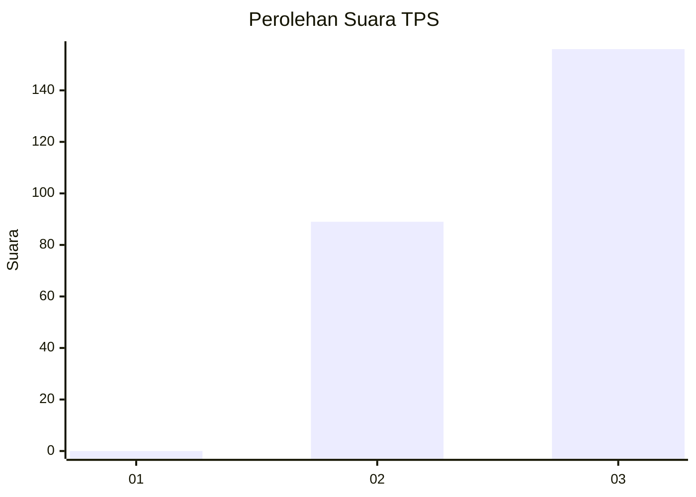
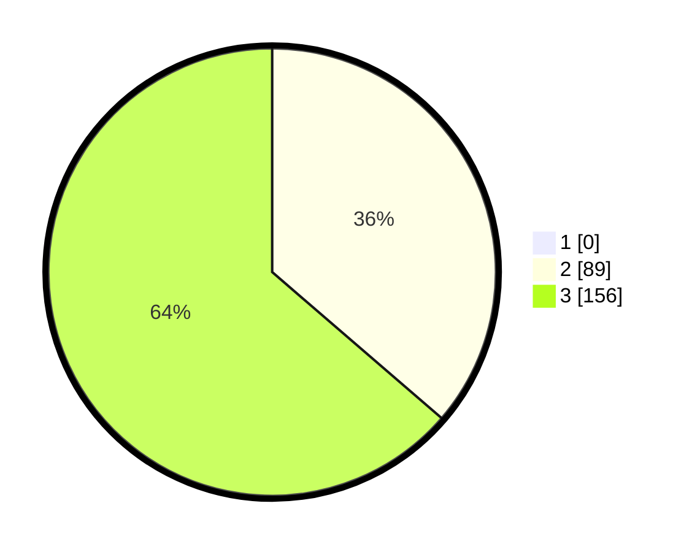

# Hasil

## Grafik

## Tabel

| No. | Nama Paslon    | Suara | Suara (raw) | Persentase |
|:--- |:-------------- | -----:| -----------:| ----------:|
| 1   | ANIES MUHAIMIN | 0     | [0][p-1]    | 0,00       |
| 2   | PRABOWO GIBRAN | 89    | [89][p-2]   | 36,33      |
| 3   | GANJAR MAHFUD  | 156   | [156][p-3]  | 63,67      |

[p-1]: https://github.com/gigit-pemilu/pemilu-2024-51-bali/blob/main/pilpres/hitung-suara/sub/51-bali/sub/05-klungkung/sub/01-nusa-penida/sub/2002-batumadeg/sub/009-tps/sub/paslon-1.txt
[p-2]: https://github.com/gigit-pemilu/pemilu-2024-51-bali/blob/main/pilpres/hitung-suara/sub/51-bali/sub/05-klungkung/sub/01-nusa-penida/sub/2002-batumadeg/sub/009-tps/sub/paslon-2.txt
[p-3]: https://github.com/gigit-pemilu/pemilu-2024-51-bali/blob/main/pilpres/hitung-suara/sub/51-bali/sub/05-klungkung/sub/01-nusa-penida/sub/2002-batumadeg/sub/009-tps/sub/paslon-3.txt

## Foto C Plano

https://sirekap-obj-formc.kpu.go.id/c08e/pemilu/ppwp/51/05/01/20/02/5105012002009-20240301-085307--892f9f77-52cb-4a27-bddd-2e8a7362c072.jpg

https://sirekap-obj-formc.kpu.go.id/c08e/pemilu/ppwp/51/05/01/20/02/5105012002009-20240214-233615--253f49eb-6b5c-4045-9388-1c1640de36df.jpg

https://sirekap-obj-formc.kpu.go.id/c08e/pemilu/ppwp/51/05/01/20/02/5105012002009-20240214-233651--27d48f60-bd7c-402e-8561-5dfc99cebbe6.jpg

## Metadata

| Key        | Value               |
| ---------- | ------------------- |
| Time Stamp | 2024-03-01 09:00:00 |

