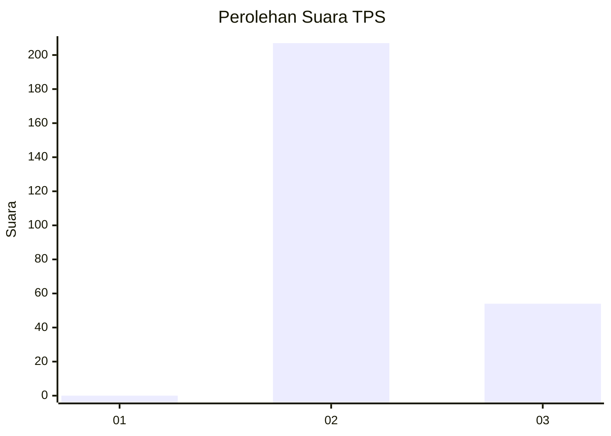
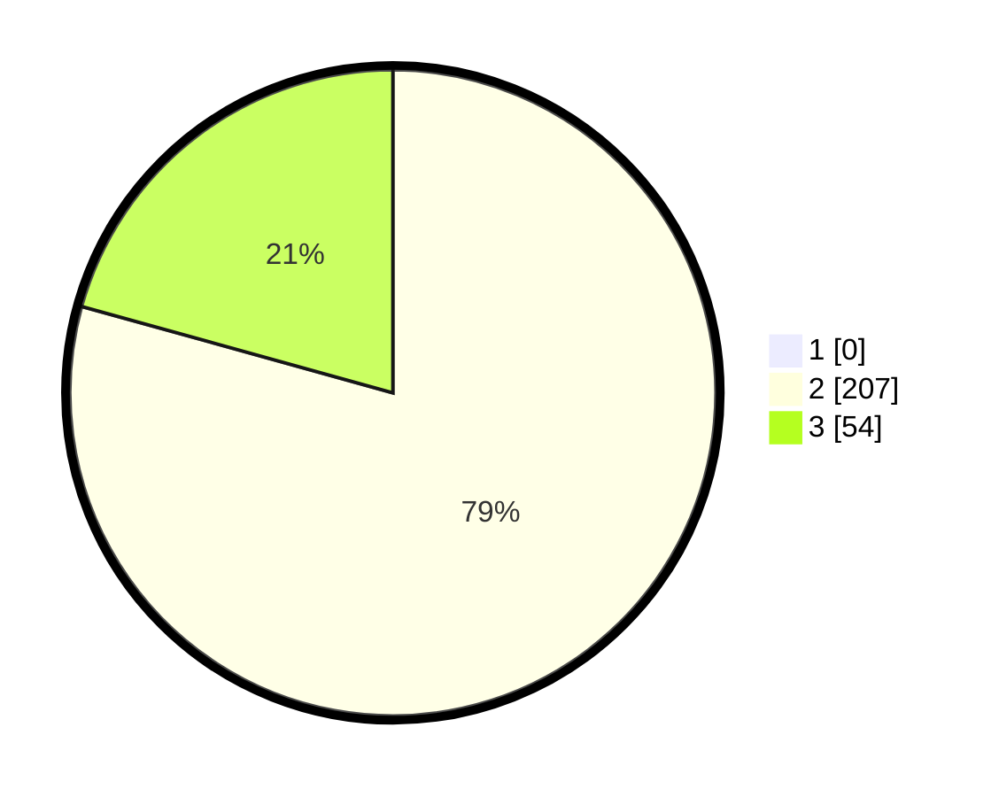

# Hasil

## Grafik

## Tabel

| No. | Nama Paslon    | Suara | Suara (raw) | Persentase |
|:--- |:-------------- | -----:| -----------:| ----------:|
| 1   | ANIES MUHAIMIN | 0     | [0][p-1]    | 0,00       |
| 2   | PRABOWO GIBRAN | 207   | [207][p-2]  | 79,31      |
| 3   | GANJAR MAHFUD  | 54    | [54][p-3]   | 20,69      |

[p-1]: https://github.com/gigit-pemilu/pemilu-2024-51-bali/blob/main/pilpres/hitung-suara/sub/51-bali/sub/05-klungkung/sub/01-nusa-penida/sub/2003-klumpu/sub/002-tps/sub/paslon-1.txt
[p-2]: https://github.com/gigit-pemilu/pemilu-2024-51-bali/blob/main/pilpres/hitung-suara/sub/51-bali/sub/05-klungkung/sub/01-nusa-penida/sub/2003-klumpu/sub/002-tps/sub/paslon-2.txt
[p-3]: https://github.com/gigit-pemilu/pemilu-2024-51-bali/blob/main/pilpres/hitung-suara/sub/51-bali/sub/05-klungkung/sub/01-nusa-penida/sub/2003-klumpu/sub/002-tps/sub/paslon-3.txt

## Foto C Plano

https://sirekap-obj-formc.kpu.go.id/83ab/pemilu/ppwp/51/05/01/20/03/5105012003002-20240215-170326--986acc17-312e-4603-898c-67773fb3228d.jpg

https://sirekap-obj-formc.kpu.go.id/83ab/pemilu/ppwp/51/05/01/20/03/5105012003002-20240215-170501--3ad7c11f-0dca-45b3-959a-38bbc1fc8082.jpg

https://sirekap-obj-formc.kpu.go.id/83ab/pemilu/ppwp/51/05/01/20/03/5105012003002-20240215-170707--852eeaee-61bd-47a8-8415-232da2af9184.jpg

## Metadata

| Key        | Value               |
| ---------- | ------------------- |
| Time Stamp | 2024-02-16 10:00:28 |

