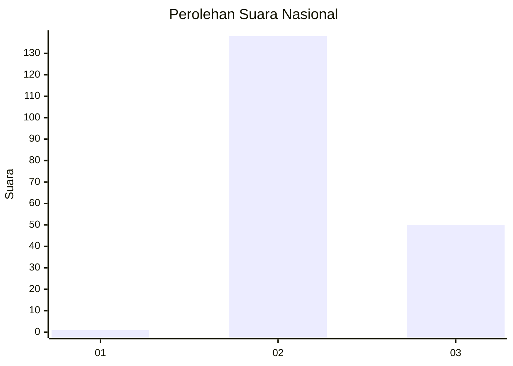
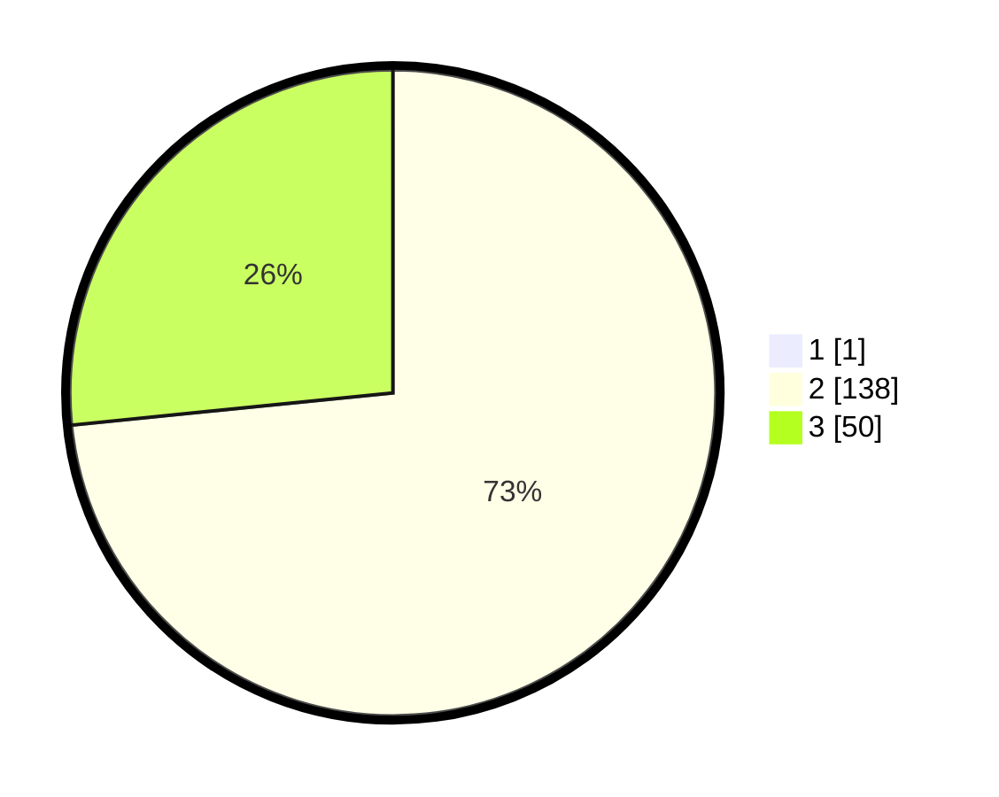

# Hasil

## Grafik

## Tabel

| No. | Nama Paslon    | Suara | Suara (raw) | Persentase |
|:--- |:-------------- | -----:| -----------:| ----------:|
| 1   | ANIES MUHAIMIN | 1     | [1][p-1]    | 0,53       |
| 2   | PRABOWO GIBRAN | 138   | [138][p-2]  | 73,02      |
| 3   | GANJAR MAHFUD  | 50    | [50][p-3]   | 26,46      |

[p-1]: https://github.com/gigit-pemilu/pemilu-2024/blob/main/pilpres/hitung-suara/sub/51-bali/sub/05-klungkung/sub/01-nusa-penida/sub/2003-klumpu/sub/010-tps/sub/paslon-1.txt
[p-2]: https://github.com/gigit-pemilu/pemilu-2024/blob/main/pilpres/hitung-suara/sub/51-bali/sub/05-klungkung/sub/01-nusa-penida/sub/2003-klumpu/sub/010-tps/sub/paslon-2.txt
[p-3]: https://github.com/gigit-pemilu/pemilu-2024/blob/main/pilpres/hitung-suara/sub/51-bali/sub/05-klungkung/sub/01-nusa-penida/sub/2003-klumpu/sub/010-tps/sub/paslon-3.txt

## Foto C Plano

https://sirekap-obj-formc.kpu.go.id/d5ac/pemilu/ppwp/51/05/01/20/03/5105012003010-20240224-044602--1d9634ed-7929-4dc4-9e44-0688ebdf7d09.jpg

https://sirekap-obj-formc.kpu.go.id/d5ac/pemilu/ppwp/51/05/01/20/03/5105012003010-20240224-044620--be063187-6c7f-491b-a1b3-952a9e3e7b32.jpg

https://sirekap-obj-formc.kpu.go.id/d5ac/pemilu/ppwp/51/05/01/20/03/5105012003010-20240224-044659--1879443c-e97f-46fb-9a58-9ef630dda06a.jpg

## Metadata

| Key        | Value               |
| ---------- | ------------------- |
| Time Stamp | 2024-02-24 22:31:28 |

