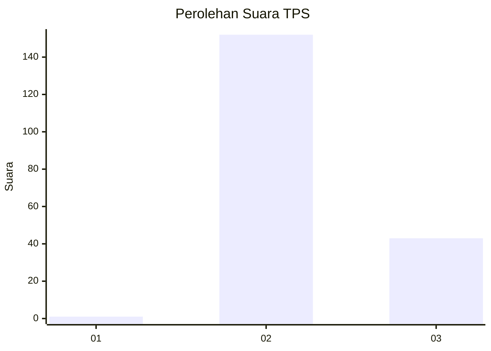
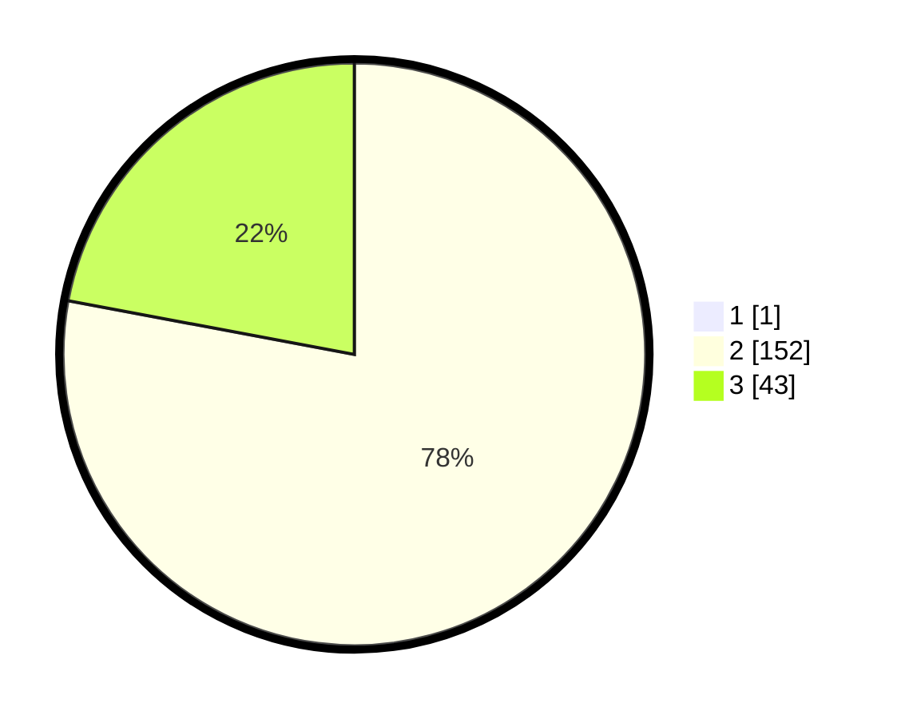

# Hasil

## Grafik

## Tabel

| No. | Nama Paslon    | Suara | Suara (raw) | Persentase |
|:--- |:-------------- | -----:| -----------:| ----------:|
| 1   | ANIES MUHAIMIN | 1     | [1][p-1]    | 0,51       |
| 2   | PRABOWO GIBRAN | 152   | [152][p-2]  | 77,55      |
| 3   | GANJAR MAHFUD  | 43    | [43][p-3]   | 21,94      |

[p-1]: https://github.com/gigit-pemilu/pemilu-2024-51-bali/blob/main/pilpres/hitung-suara/sub/51-bali/sub/05-klungkung/sub/01-nusa-penida/sub/2003-klumpu/sub/014-tps/sub/paslon-1.txt
[p-2]: https://github.com/gigit-pemilu/pemilu-2024-51-bali/blob/main/pilpres/hitung-suara/sub/51-bali/sub/05-klungkung/sub/01-nusa-penida/sub/2003-klumpu/sub/014-tps/sub/paslon-2.txt
[p-3]: https://github.com/gigit-pemilu/pemilu-2024-51-bali/blob/main/pilpres/hitung-suara/sub/51-bali/sub/05-klungkung/sub/01-nusa-penida/sub/2003-klumpu/sub/014-tps/sub/paslon-3.txt

## Foto C Plano

https://sirekap-obj-formc.kpu.go.id/a937/pemilu/ppwp/51/05/01/20/03/5105012003014-20240214-215706--7bc945ff-78b7-46d6-bf86-7c96220dc525.jpg

https://sirekap-obj-formc.kpu.go.id/a937/pemilu/ppwp/51/05/01/20/03/5105012003014-20240214-215927--52139d36-90b7-4902-a7e7-a39355238fe5.jpg

https://sirekap-obj-formc.kpu.go.id/a937/pemilu/ppwp/51/05/01/20/03/5105012003014-20240214-220038--351e0ada-19bd-4448-990e-aeb9d067fedd.jpg

## Metadata

| Key        | Value               |
| ---------- | ------------------- |
| Time Stamp | 2024-02-15 09:00:24 |

