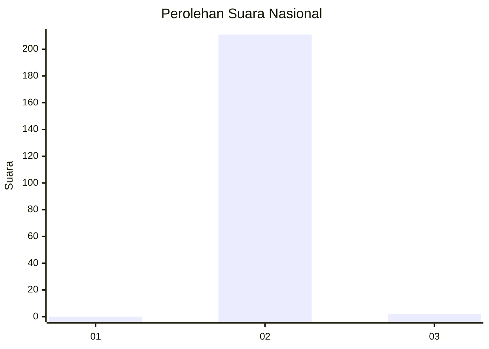
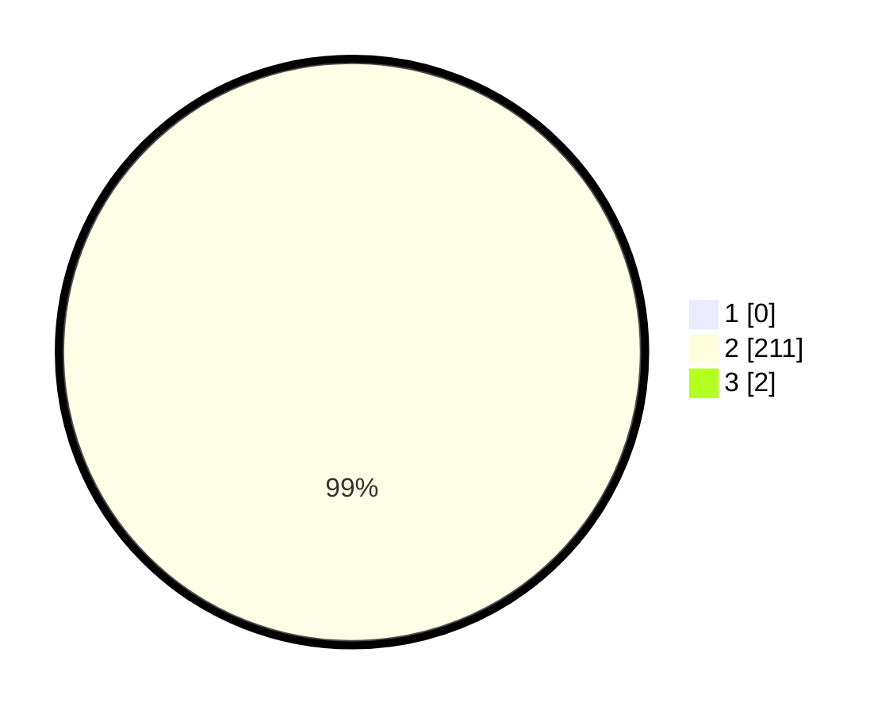

# Hasil

## Grafik

## Tabel

| No. | Nama Paslon    | Suara | Suara (raw) | Persentase |
|:--- |:-------------- | -----:| -----------:| ----------:|
| 1   | ANIES MUHAIMIN | 0     | [0][p-1]    | 0,00       |
| 2   | PRABOWO GIBRAN | 211   | [211][p-2]  | 99,06      |
| 3   | GANJAR MAHFUD  | 2     | [2][p-3]    | 0,94       |

[p-1]: https://github.com/gigit-pemilu/pemilu-2024/blob/main/pilpres/hitung-suara/sub/51-bali/sub/05-klungkung/sub/01-nusa-penida/sub/2003-klumpu/sub/015-tps/sub/paslon-1.txt
[p-2]: https://github.com/gigit-pemilu/pemilu-2024/blob/main/pilpres/hitung-suara/sub/51-bali/sub/05-klungkung/sub/01-nusa-penida/sub/2003-klumpu/sub/015-tps/sub/paslon-2.txt
[p-3]: https://github.com/gigit-pemilu/pemilu-2024/blob/main/pilpres/hitung-suara/sub/51-bali/sub/05-klungkung/sub/01-nusa-penida/sub/2003-klumpu/sub/015-tps/sub/paslon-3.txt

## Foto C Plano

https://sirekap-obj-formc.kpu.go.id/d9d3/pemilu/ppwp/51/05/01/20/03/5105012003015-20240214-191813--0149f421-8ccc-4489-bcd7-b5297b57a577.jpg

https://sirekap-obj-formc.kpu.go.id/d9d3/pemilu/ppwp/51/05/01/20/03/5105012003015-20240214-191820--d9980230-08b1-4799-89bf-c8e2c9d9a17b.jpg

https://sirekap-obj-formc.kpu.go.id/d9d3/pemilu/ppwp/51/05/01/20/03/5105012003015-20240214-210310--972e0cc3-3283-41f0-8445-b247b5d4528a.jpg

## Metadata

| Key        | Value               |
| ---------- | ------------------- |
| Time Stamp | 2024-02-15 00:41:44 |

