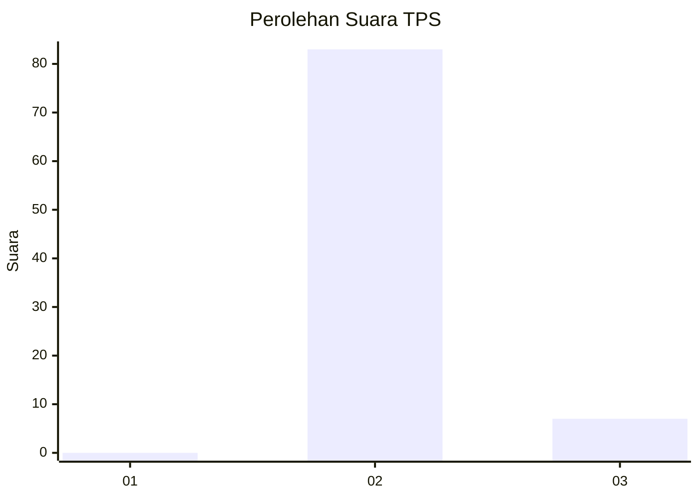
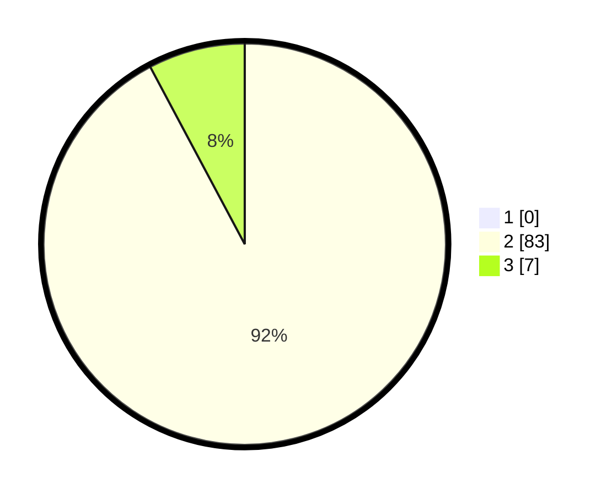

# Hasil

## Grafik

## Tabel

| No. | Nama Paslon    | Suara | Suara (raw) | Persentase |
|:--- |:-------------- | -----:| -----------:| ----------:|
| 1   | ANIES MUHAIMIN | 0     | [0][p-1]    | 0,00       |
| 2   | PRABOWO GIBRAN | 83    | [83][p-2]   | 92,22      |
| 3   | GANJAR MAHFUD  | 7     | [7][p-3]    | 7,78       |

[p-1]: https://github.com/gigit-pemilu/pemilu-2024-51-bali/blob/main/pilpres/hitung-suara/sub/51-bali/sub/05-klungkung/sub/01-nusa-penida/sub/2005-sekartaji/sub/001-tps/sub/paslon-1.txt
[p-2]: https://github.com/gigit-pemilu/pemilu-2024-51-bali/blob/main/pilpres/hitung-suara/sub/51-bali/sub/05-klungkung/sub/01-nusa-penida/sub/2005-sekartaji/sub/001-tps/sub/paslon-2.txt
[p-3]: https://github.com/gigit-pemilu/pemilu-2024-51-bali/blob/main/pilpres/hitung-suara/sub/51-bali/sub/05-klungkung/sub/01-nusa-penida/sub/2005-sekartaji/sub/001-tps/sub/paslon-3.txt

## Foto C Plano

https://sirekap-obj-formc.kpu.go.id/a1db/pemilu/ppwp/51/05/01/20/05/5105012005001-20240214-222253--588a00db-92cb-4b58-bfb3-b40d9244b64d.jpg

https://sirekap-obj-formc.kpu.go.id/a1db/pemilu/ppwp/51/05/01/20/05/5105012005001-20240214-222437--52806f46-2a40-4518-83f2-a76ecb1770bb.jpg

https://sirekap-obj-formc.kpu.go.id/a1db/pemilu/ppwp/51/05/01/20/05/5105012005001-20240214-222818--d8cfe76b-0975-467d-b4fb-b2530edc0fc5.jpg

## Metadata

| Key        | Value               |
| ---------- | ------------------- |
| Time Stamp | 2024-02-15 20:30:46 |

