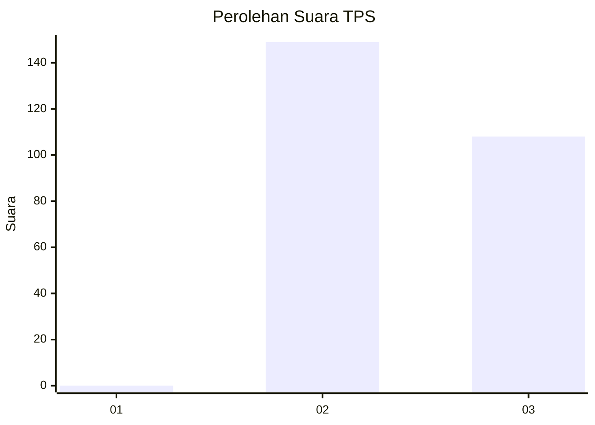
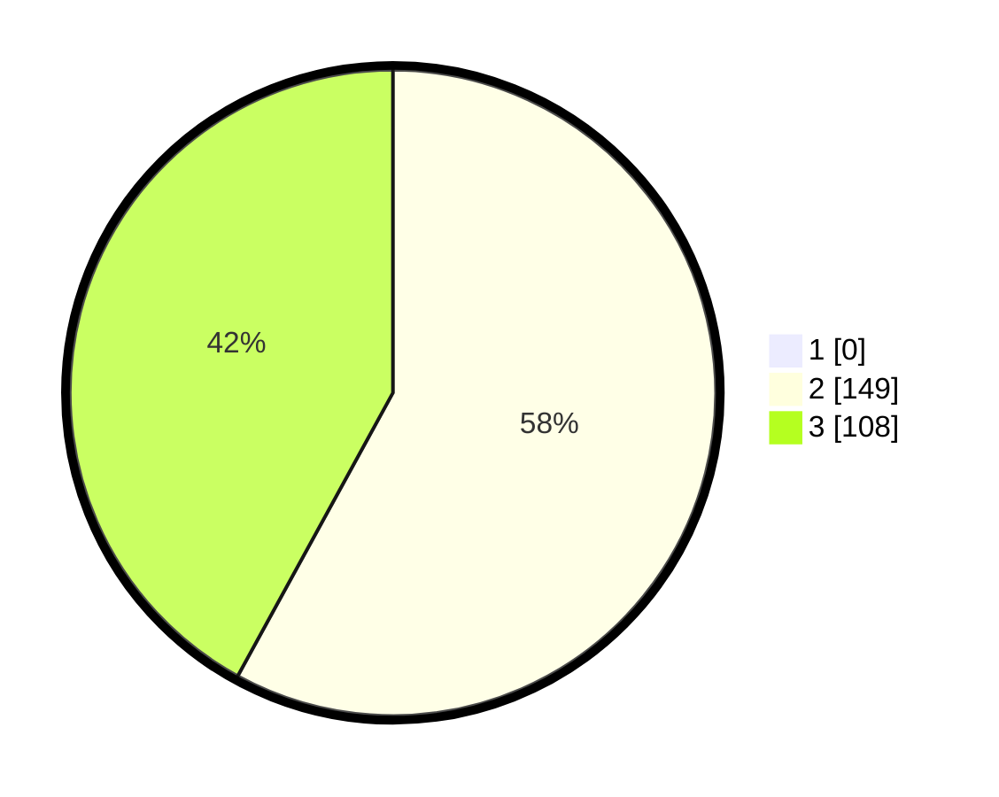

# Hasil

## Grafik

## Tabel

| No. | Nama Paslon    | Suara | Suara (raw) | Persentase |
|:--- |:-------------- | -----:| -----------:| ----------:|
| 1   | ANIES MUHAIMIN | 0     | [0][p-1]    | 0,00       |
| 2   | PRABOWO GIBRAN | 149   | [149][p-2]  | 57,98      |
| 3   | GANJAR MAHFUD  | 108   | [108][p-3]  | 42,02      |

[p-1]: https://github.com/gigit-pemilu/pemilu-2024-51-bali/blob/main/pilpres/hitung-suara/sub/51-bali/sub/05-klungkung/sub/01-nusa-penida/sub/2005-sekartaji/sub/002-tps/sub/paslon-1.txt
[p-2]: https://github.com/gigit-pemilu/pemilu-2024-51-bali/blob/main/pilpres/hitung-suara/sub/51-bali/sub/05-klungkung/sub/01-nusa-penida/sub/2005-sekartaji/sub/002-tps/sub/paslon-2.txt
[p-3]: https://github.com/gigit-pemilu/pemilu-2024-51-bali/blob/main/pilpres/hitung-suara/sub/51-bali/sub/05-klungkung/sub/01-nusa-penida/sub/2005-sekartaji/sub/002-tps/sub/paslon-3.txt

## Foto C Plano

https://sirekap-obj-formc.kpu.go.id/c9ac/pemilu/ppwp/51/05/01/20/05/5105012005002-20240215-083206--3963dc02-803b-48b4-8c4c-6a06e5482f3c.jpg

https://sirekap-obj-formc.kpu.go.id/c9ac/pemilu/ppwp/51/05/01/20/05/5105012005002-20240215-083007--adeb2490-85ce-4594-b167-05e79ef802d1.jpg

https://sirekap-obj-formc.kpu.go.id/c9ac/pemilu/ppwp/51/05/01/20/05/5105012005002-20240214-221938--c60a0760-3276-40a0-bb14-e5f17be8215e.jpg

## Metadata

| Key        | Value               |
| ---------- | ------------------- |
| Time Stamp | 2024-02-15 17:00:25 |

