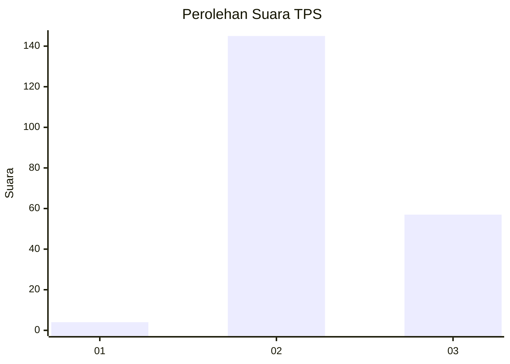
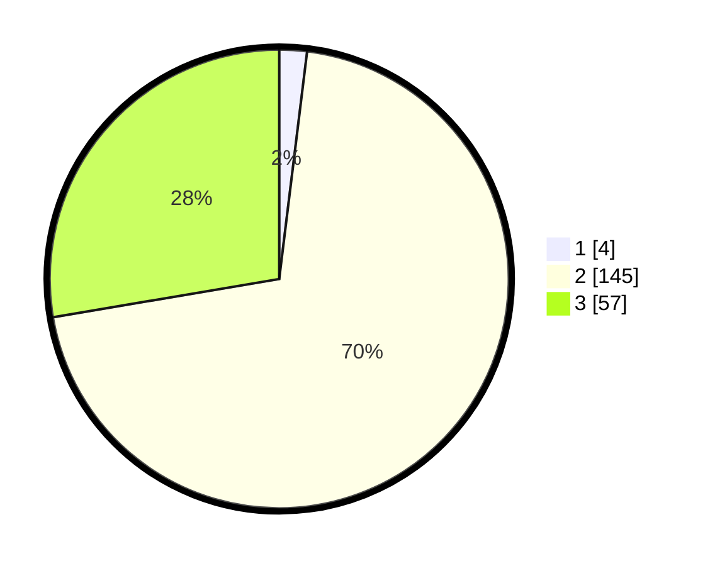

# Hasil

## Grafik

## Tabel

| No. | Nama Paslon    | Suara | Suara (raw) | Persentase |
|:--- |:-------------- | -----:| -----------:| ----------:|
| 1   | ANIES MUHAIMIN | 4     | [4][p-1]    | 1,94       |
| 2   | PRABOWO GIBRAN | 145   | [145][p-2]  | 70,39      |
| 3   | GANJAR MAHFUD  | 57    | [57][p-3]   | 27,67      |

[p-1]: https://github.com/gigit-pemilu/pemilu-2024-51-bali/blob/main/pilpres/hitung-suara/sub/51-bali/sub/05-klungkung/sub/01-nusa-penida/sub/2007-suana/sub/002-tps/sub/paslon-1.txt
[p-2]: https://github.com/gigit-pemilu/pemilu-2024-51-bali/blob/main/pilpres/hitung-suara/sub/51-bali/sub/05-klungkung/sub/01-nusa-penida/sub/2007-suana/sub/002-tps/sub/paslon-2.txt
[p-3]: https://github.com/gigit-pemilu/pemilu-2024-51-bali/blob/main/pilpres/hitung-suara/sub/51-bali/sub/05-klungkung/sub/01-nusa-penida/sub/2007-suana/sub/002-tps/sub/paslon-3.txt

## Foto C Plano

https://sirekap-obj-formc.kpu.go.id/16a3/pemilu/ppwp/51/05/01/20/07/5105012007002-20240216-132126--be8bef6b-5f30-4828-9219-84ea47774e71.jpg

https://sirekap-obj-formc.kpu.go.id/16a3/pemilu/ppwp/51/05/01/20/07/5105012007002-20240216-132127--0f766c4a-8d04-4314-b357-2e7b3032bb71.jpg

https://sirekap-obj-formc.kpu.go.id/16a3/pemilu/ppwp/51/05/01/20/07/5105012007002-20240216-132126--4a00138c-461a-40a9-b8c2-809bab8b57d8.jpg

## Metadata

| Key        | Value               |
| ---------- | ------------------- |
| Time Stamp | 2024-02-16 22:01:00 |

## DATA PEMILIH TETAP

Jumlah pemilih dalam DPT: **0**.
 * L: **125**.
 * P: **125**.

## DATA PENGGUNA HAK PILIH

Jumlah pengguna hak pilih dalam DPT: **208**.
 * L: **96**.
 * P: **112**.

Jumlah pengguna hak pilih dalam DPTb: **1**.
 * L: **0**.
 * P: **1**.

Jumlah pengguna hak pilih dalam DPK: **0**.
 * L: **2**.
 * P: **2**.

Jumlah pengguna hak pilih: **213**.
 * L: **98**.
 * P: **115**.

## JUMLAH SUARA SAH DAN TIDAK SAH

JUMLAH SELURUH SUARA SAH: **206**.

JUMLAH SUARA TIDAK SAH: **7**.

JUMLAH SELURUH SUARA SAH DAN SUARA TIDAK SAH: **213**.

