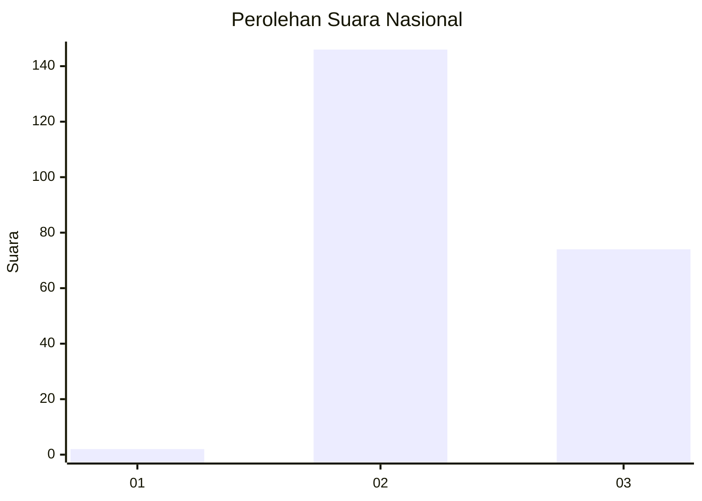
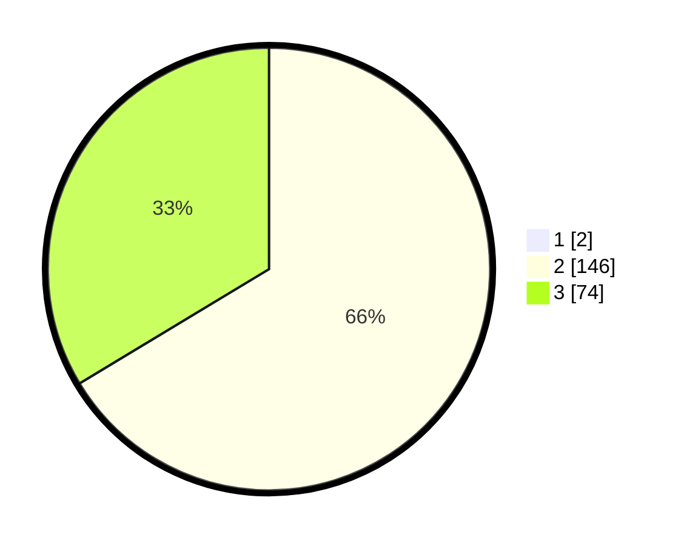

# Hasil

## Grafik

## Tabel

| No. | Nama Paslon    | Suara | Suara (raw) | Persentase |
|:--- |:-------------- | -----:| -----------:| ----------:|
| 1   | ANIES MUHAIMIN | 2     | [2][p-1]    | 0,90       |
| 2   | PRABOWO GIBRAN | 146   | [146][p-2]  | 65,77      |
| 3   | GANJAR MAHFUD  | 74    | [74][p-3]   | 33,33      |

[p-1]: https://github.com/gigit-pemilu/pemilu-2024/blob/main/pilpres/hitung-suara/sub/51-bali/sub/05-klungkung/sub/01-nusa-penida/sub/2007-suana/sub/005-tps/sub/paslon-1.txt
[p-2]: https://github.com/gigit-pemilu/pemilu-2024/blob/main/pilpres/hitung-suara/sub/51-bali/sub/05-klungkung/sub/01-nusa-penida/sub/2007-suana/sub/005-tps/sub/paslon-2.txt
[p-3]: https://github.com/gigit-pemilu/pemilu-2024/blob/main/pilpres/hitung-suara/sub/51-bali/sub/05-klungkung/sub/01-nusa-penida/sub/2007-suana/sub/005-tps/sub/paslon-3.txt

## Foto C Plano

https://sirekap-obj-formc.kpu.go.id/b4c9/pemilu/ppwp/51/05/01/20/07/5105012007005-20240214-210621--1d735234-4135-4a57-9d16-c4145881b739.jpg

https://sirekap-obj-formc.kpu.go.id/b4c9/pemilu/ppwp/51/05/01/20/07/5105012007005-20240214-211101--2b9085ef-aecf-4d40-85b9-f57d460ff548.jpg

https://sirekap-obj-formc.kpu.go.id/b4c9/pemilu/ppwp/51/05/01/20/07/5105012007005-20240214-211345--ba5e1b5e-fc9e-4c54-94a8-a9e21afac19d.jpg

## Metadata

| Key        | Value               |
| ---------- | ------------------- |
| Time Stamp | 2024-02-15 09:00:24 |

