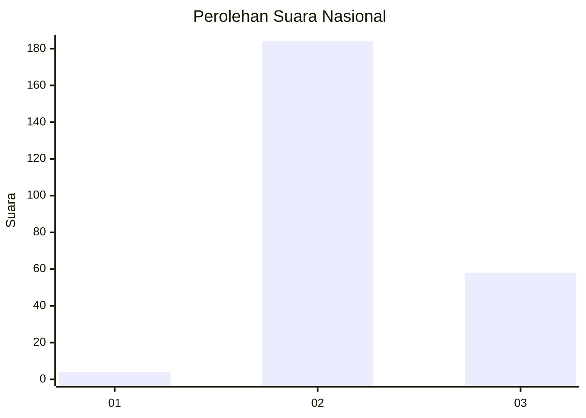
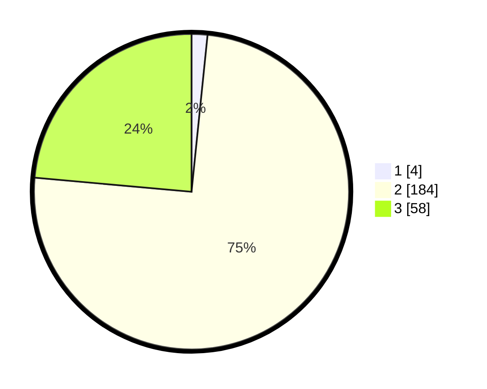

# Hasil

## Grafik

## Tabel

| No. | Nama Paslon    | Suara | Suara (raw) | Persentase |
|:--- |:-------------- | -----:| -----------:| ----------:|
| 1   | ANIES MUHAIMIN | 4     | [4][p-1]    | 1,63       |
| 2   | PRABOWO GIBRAN | 184   | [184][p-2]  | 74,80      |
| 3   | GANJAR MAHFUD  | 58    | [58][p-3]   | 23,58      |

[p-1]: https://github.com/gigit-pemilu/pemilu-2024/blob/main/pilpres/hitung-suara/sub/51-bali/sub/05-klungkung/sub/01-nusa-penida/sub/2007-suana/sub/007-tps/sub/paslon-1.txt
[p-2]: https://github.com/gigit-pemilu/pemilu-2024/blob/main/pilpres/hitung-suara/sub/51-bali/sub/05-klungkung/sub/01-nusa-penida/sub/2007-suana/sub/007-tps/sub/paslon-2.txt
[p-3]: https://github.com/gigit-pemilu/pemilu-2024/blob/main/pilpres/hitung-suara/sub/51-bali/sub/05-klungkung/sub/01-nusa-penida/sub/2007-suana/sub/007-tps/sub/paslon-3.txt

## Foto C Plano

https://sirekap-obj-formc.kpu.go.id/3704/pemilu/ppwp/51/05/01/20/07/5105012007007-20240214-221718--5bf916b3-6917-44d8-a20b-1dcc9a49b917.jpg

https://sirekap-obj-formc.kpu.go.id/3704/pemilu/ppwp/51/05/01/20/07/5105012007007-20240214-221936--5e7f82c6-103c-4576-81ab-f28afe3ee7db.jpg

https://sirekap-obj-formc.kpu.go.id/3704/pemilu/ppwp/51/05/01/20/07/5105012007007-20240214-222109--1f48b966-1461-4dcf-90ea-edf24d9391be.jpg

## Metadata

| Key        | Value               |
| ---------- | ------------------- |
| Time Stamp | 2024-02-15 17:00:25 |

