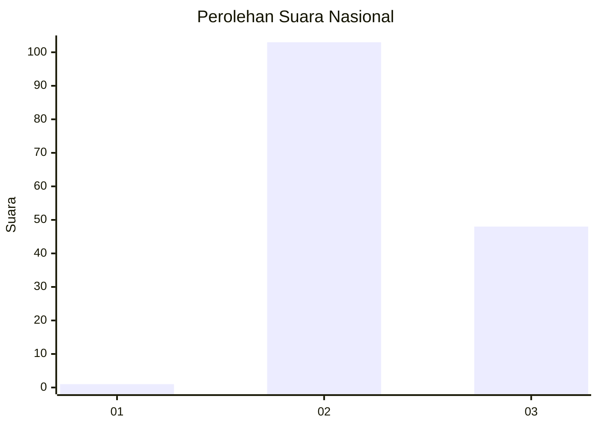
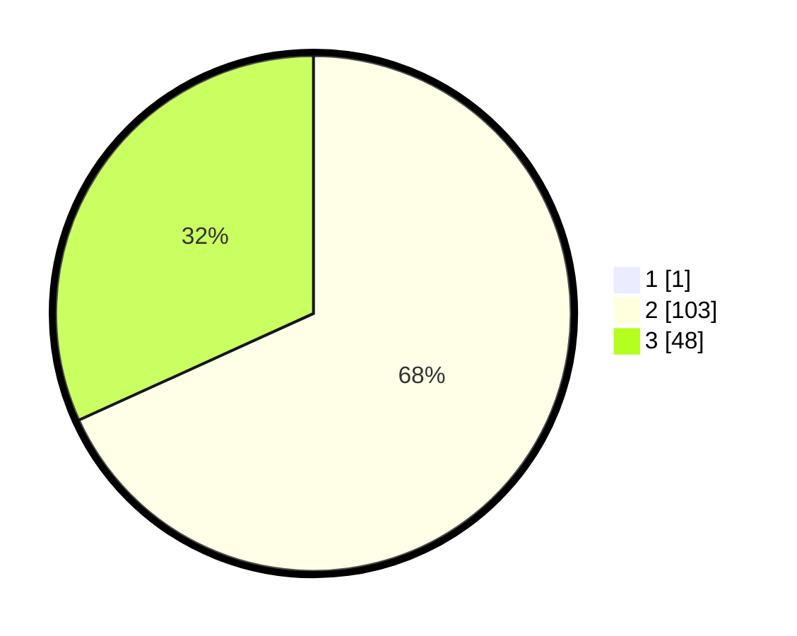

# Hasil

## Grafik

## Tabel

| No. | Nama Paslon    | Suara | Suara (raw) | Persentase |
|:--- |:-------------- | -----:| -----------:| ----------:|
| 1   | ANIES MUHAIMIN | 1     | [1][p-1]    | 0,66       |
| 2   | PRABOWO GIBRAN | 103   | [103][p-2]  | 67,76      |
| 3   | GANJAR MAHFUD  | 48    | [48][p-3]   | 31,58      |

[p-1]: https://github.com/gigit-pemilu/pemilu-2024/blob/main/pilpres/hitung-suara/sub/51-bali/sub/05-klungkung/sub/01-nusa-penida/sub/2007-suana/sub/011-tps/sub/paslon-1.txt
[p-2]: https://github.com/gigit-pemilu/pemilu-2024/blob/main/pilpres/hitung-suara/sub/51-bali/sub/05-klungkung/sub/01-nusa-penida/sub/2007-suana/sub/011-tps/sub/paslon-2.txt
[p-3]: https://github.com/gigit-pemilu/pemilu-2024/blob/main/pilpres/hitung-suara/sub/51-bali/sub/05-klungkung/sub/01-nusa-penida/sub/2007-suana/sub/011-tps/sub/paslon-3.txt

## Foto C Plano

https://sirekap-obj-formc.kpu.go.id/4f41/pemilu/ppwp/51/05/01/20/07/5105012007011-20240214-220539--dd53c64e-33c7-4e6b-9d4d-cb271005f251.jpg

https://sirekap-obj-formc.kpu.go.id/4f41/pemilu/ppwp/51/05/01/20/07/5105012007011-20240214-221257--e35787d6-c25d-47fa-8999-40e8d5d86644.jpg

https://sirekap-obj-formc.kpu.go.id/4f41/pemilu/ppwp/51/05/01/20/07/5105012007011-20240214-221431--9e433a5e-992d-4917-8cd8-ae3874234147.jpg

## Metadata

| Key        | Value               |
| ---------- | ------------------- |
| Time Stamp | 2024-02-15 19:00:26 |

