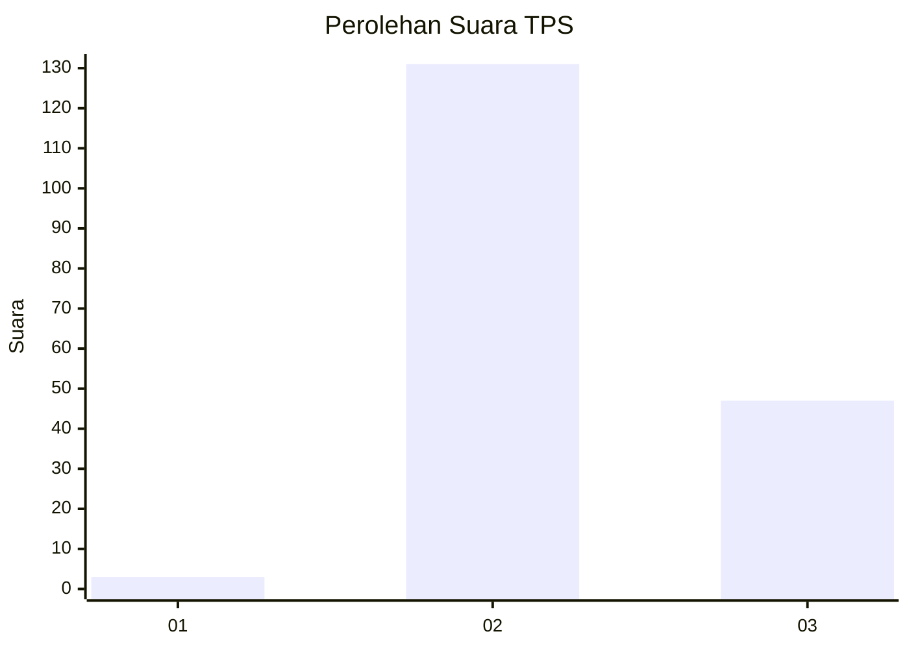
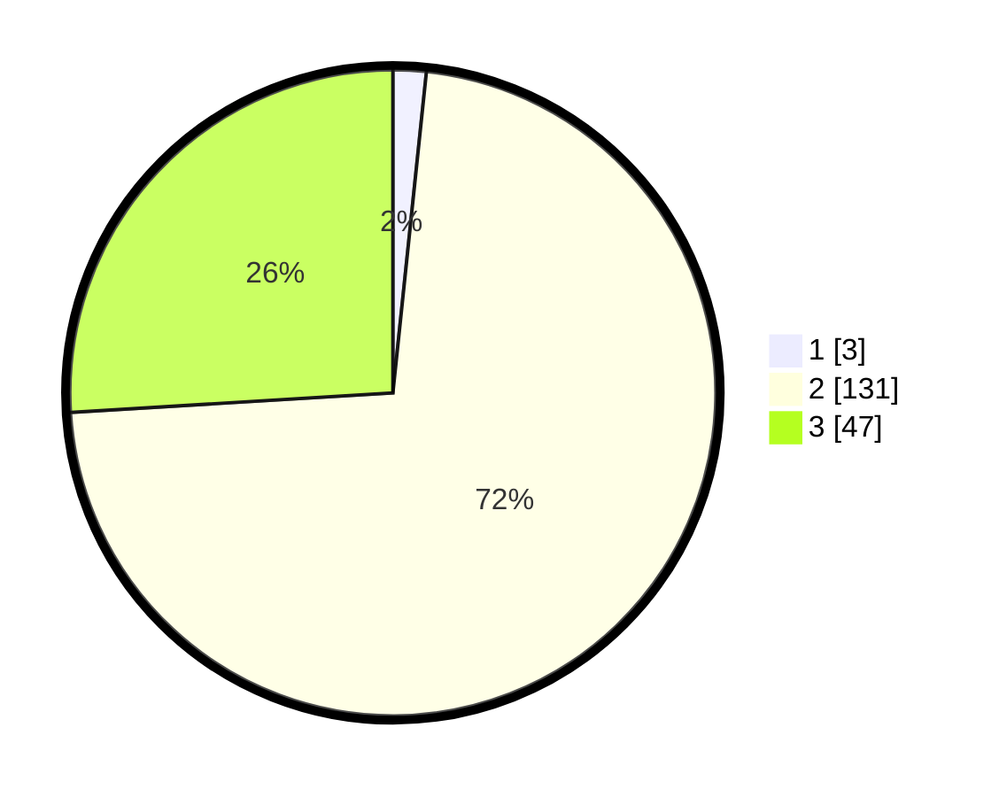

# Hasil

## Grafik

## Tabel

| No. | Nama Paslon    | Suara | Suara (raw) | Persentase |
|:--- |:-------------- | -----:| -----------:| ----------:|
| 1   | ANIES MUHAIMIN | 3     | [3][p-1]    | 1,66       |
| 2   | PRABOWO GIBRAN | 131   | [131][p-2]  | 72,38      |
| 3   | GANJAR MAHFUD  | 47    | [47][p-3]   | 25,97      |

[p-1]: https://github.com/gigit-pemilu/pemilu-2024-51-bali/blob/main/pilpres/hitung-suara/sub/51-bali/sub/05-klungkung/sub/01-nusa-penida/sub/2008-batununggul/sub/010-tps/sub/paslon-1.txt
[p-2]: https://github.com/gigit-pemilu/pemilu-2024-51-bali/blob/main/pilpres/hitung-suara/sub/51-bali/sub/05-klungkung/sub/01-nusa-penida/sub/2008-batununggul/sub/010-tps/sub/paslon-2.txt
[p-3]: https://github.com/gigit-pemilu/pemilu-2024-51-bali/blob/main/pilpres/hitung-suara/sub/51-bali/sub/05-klungkung/sub/01-nusa-penida/sub/2008-batununggul/sub/010-tps/sub/paslon-3.txt

## Foto C Plano

https://sirekap-obj-formc.kpu.go.id/dc34/pemilu/ppwp/51/05/01/20/08/5105012008010-20240214-233407--fea26325-441c-4482-b366-28425e6dc412.jpg

https://sirekap-obj-formc.kpu.go.id/dc34/pemilu/ppwp/51/05/01/20/08/5105012008010-20240214-233818--c8280899-3043-49fb-9326-63a2392777b4.jpg

https://sirekap-obj-formc.kpu.go.id/dc34/pemilu/ppwp/51/05/01/20/08/5105012008010-20240214-234006--988f1e81-f11e-49ad-9d1f-88590fab9ab8.jpg

## Metadata

| Key        | Value               |
| ---------- | ------------------- |
| Time Stamp | 2024-02-15 19:00:26 |

