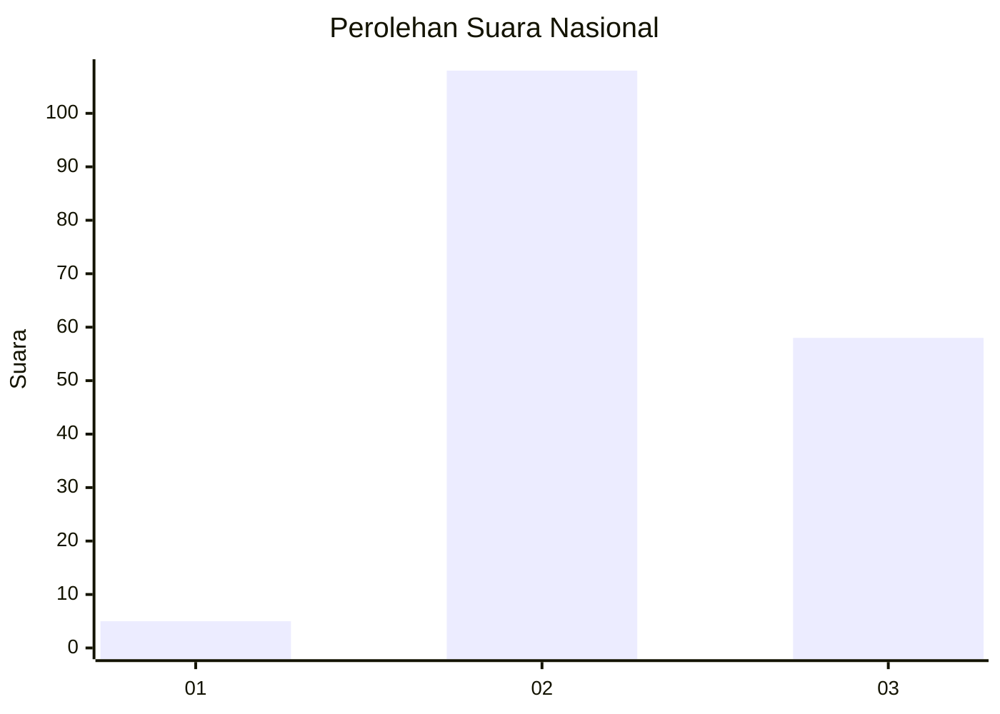
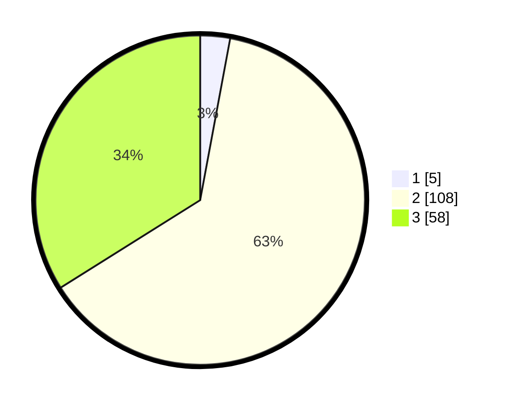

# Hasil

## Grafik

## Tabel

| No. | Nama Paslon    | Suara | Suara (raw) | Persentase |
|:--- |:-------------- | -----:| -----------:| ----------:|
| 1   | ANIES MUHAIMIN | 5     | [5][p-1]    | 2,92       |
| 2   | PRABOWO GIBRAN | 108   | [108][p-2]  | 63,16      |
| 3   | GANJAR MAHFUD  | 58    | [58][p-3]   | 33,92      |

[p-1]: https://github.com/gigit-pemilu/pemilu-2024/blob/main/pilpres/hitung-suara/sub/51-bali/sub/05-klungkung/sub/01-nusa-penida/sub/2008-batununggul/sub/012-tps/sub/paslon-1.txt
[p-2]: https://github.com/gigit-pemilu/pemilu-2024/blob/main/pilpres/hitung-suara/sub/51-bali/sub/05-klungkung/sub/01-nusa-penida/sub/2008-batununggul/sub/012-tps/sub/paslon-2.txt
[p-3]: https://github.com/gigit-pemilu/pemilu-2024/blob/main/pilpres/hitung-suara/sub/51-bali/sub/05-klungkung/sub/01-nusa-penida/sub/2008-batununggul/sub/012-tps/sub/paslon-3.txt

## Foto C Plano

https://sirekap-obj-formc.kpu.go.id/eb55/pemilu/ppwp/51/05/01/20/08/5105012008012-20240220-074900--da9119cd-87cf-48c7-9ca2-df0bb506350f.jpg

https://sirekap-obj-formc.kpu.go.id/eb55/pemilu/ppwp/51/05/01/20/08/5105012008012-20240220-074901--d68c38f7-fbc6-4232-881e-1e7934c9781f.jpg

https://sirekap-obj-formc.kpu.go.id/eb55/pemilu/ppwp/51/05/01/20/08/5105012008012-20240220-074901--1f7a29e3-d751-4bc5-be3d-78dd08403804.jpg

## Metadata

| Key        | Value               |
| ---------- | ------------------- |
| Time Stamp | 2024-02-25 22:00:00 |

## DATA PEMILIH TETAP

Jumlah pemilih dalam DPT: **175**.
 * L: **92**.
 * P: **83**.

## DATA PENGGUNA HAK PILIH

Jumlah pengguna hak pilih dalam DPT: **170**.
 * L: **88**.
 * P: **82**.

Jumlah pengguna hak pilih dalam DPTb: **0**.
 * L: **0**.
 * P: **0**.

Jumlah pengguna hak pilih dalam DPK: **5**.
 * L: **4**.
 * P: **1**.

Jumlah pengguna hak pilih: **175**.
 * L: **92**.
 * P: **83**.

## JUMLAH SUARA SAH DAN TIDAK SAH

JUMLAH SELURUH SUARA SAH: **0**.

JUMLAH SUARA TIDAK SAH: **0**.

JUMLAH SELURUH SUARA SAH DAN SUARA TIDAK SAH: **0**.

