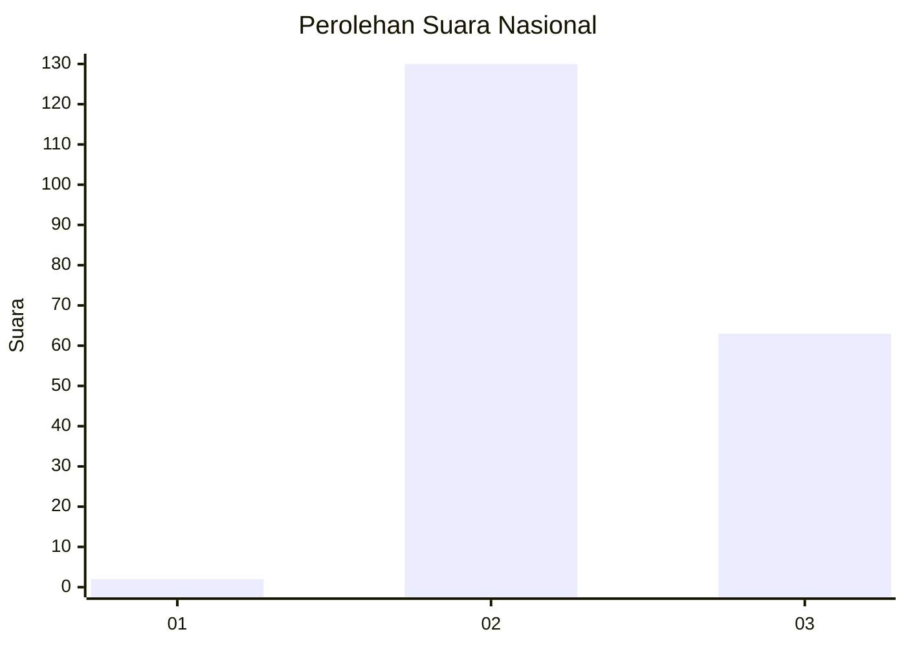
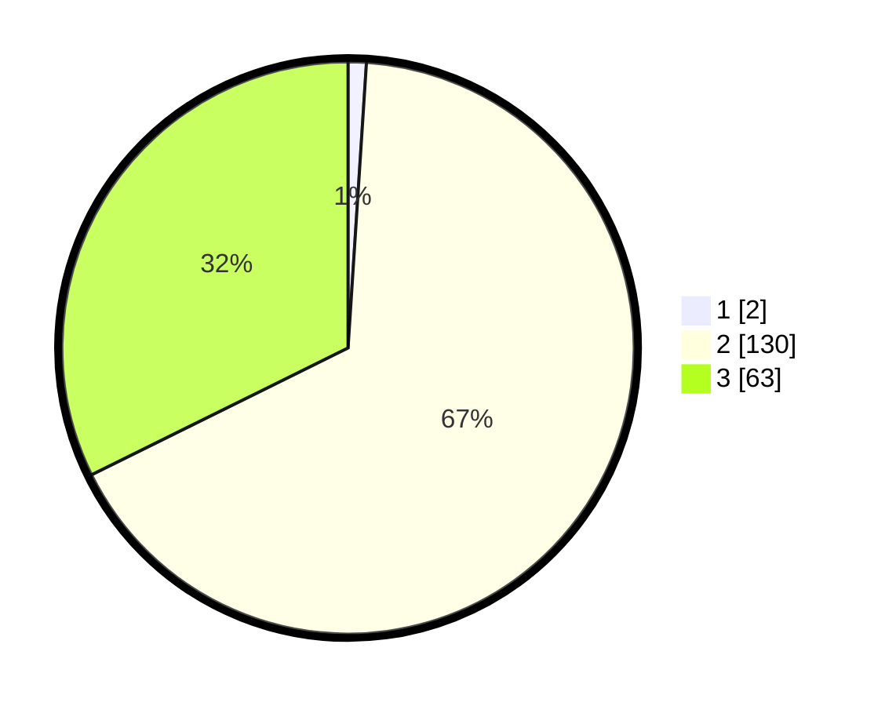

# Hasil

## Grafik

## Tabel

| No. | Nama Paslon    | Suara | Suara (raw) | Persentase |
|:--- |:-------------- | -----:| -----------:| ----------:|
| 1   | ANIES MUHAIMIN | 2     | [2][p-1]    | 1,03       |
| 2   | PRABOWO GIBRAN | 130   | [130][p-2]  | 66,67      |
| 3   | GANJAR MAHFUD  | 63    | [63][p-3]   | 32,31      |

[p-1]: https://github.com/gigit-pemilu/pemilu-2024/blob/main/pilpres/hitung-suara/sub/51-bali/sub/05-klungkung/sub/01-nusa-penida/sub/2008-batununggul/sub/013-tps/sub/paslon-1.txt
[p-2]: https://github.com/gigit-pemilu/pemilu-2024/blob/main/pilpres/hitung-suara/sub/51-bali/sub/05-klungkung/sub/01-nusa-penida/sub/2008-batununggul/sub/013-tps/sub/paslon-2.txt
[p-3]: https://github.com/gigit-pemilu/pemilu-2024/blob/main/pilpres/hitung-suara/sub/51-bali/sub/05-klungkung/sub/01-nusa-penida/sub/2008-batununggul/sub/013-tps/sub/paslon-3.txt

## Foto C Plano

https://sirekap-obj-formc.kpu.go.id/6746/pemilu/ppwp/51/05/01/20/08/5105012008013-20240214-214408--1534da0d-b501-4c1b-be04-327a65400150.jpg

https://sirekap-obj-formc.kpu.go.id/6746/pemilu/ppwp/51/05/01/20/08/5105012008013-20240214-214523--86c1caec-9726-4110-83b9-7e983eef79f5.jpg

https://sirekap-obj-formc.kpu.go.id/6746/pemilu/ppwp/51/05/01/20/08/5105012008013-20240214-205106--b0993ae6-a598-40f6-860f-70558484c792.jpg

## Metadata

| Key        | Value               |
| ---------- | ------------------- |
| Time Stamp | 2024-02-15 09:00:24 |

