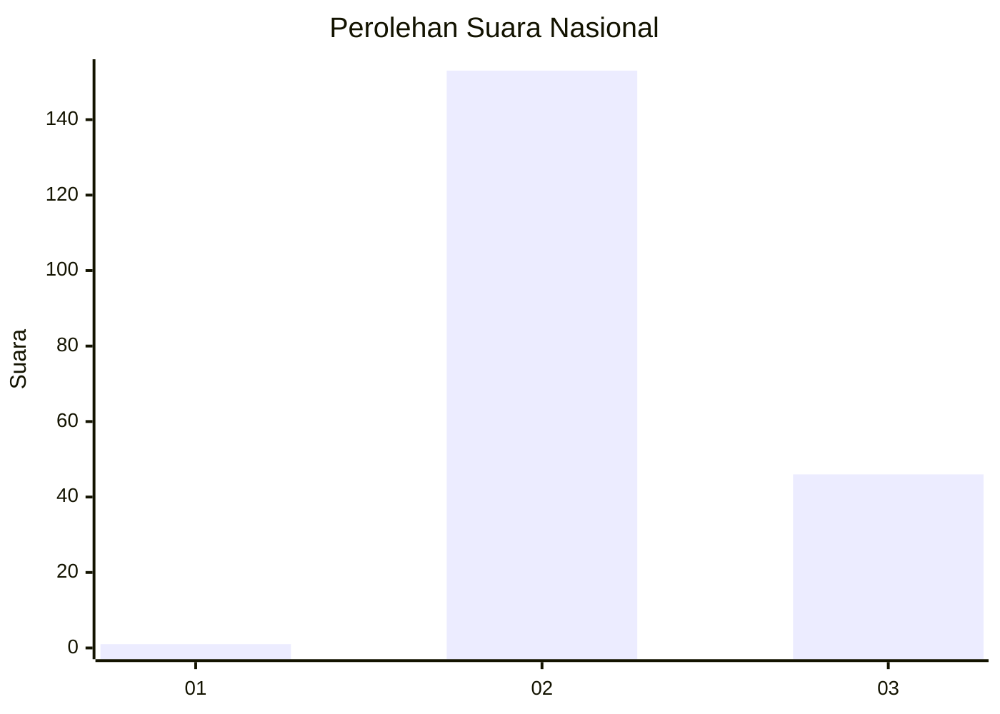
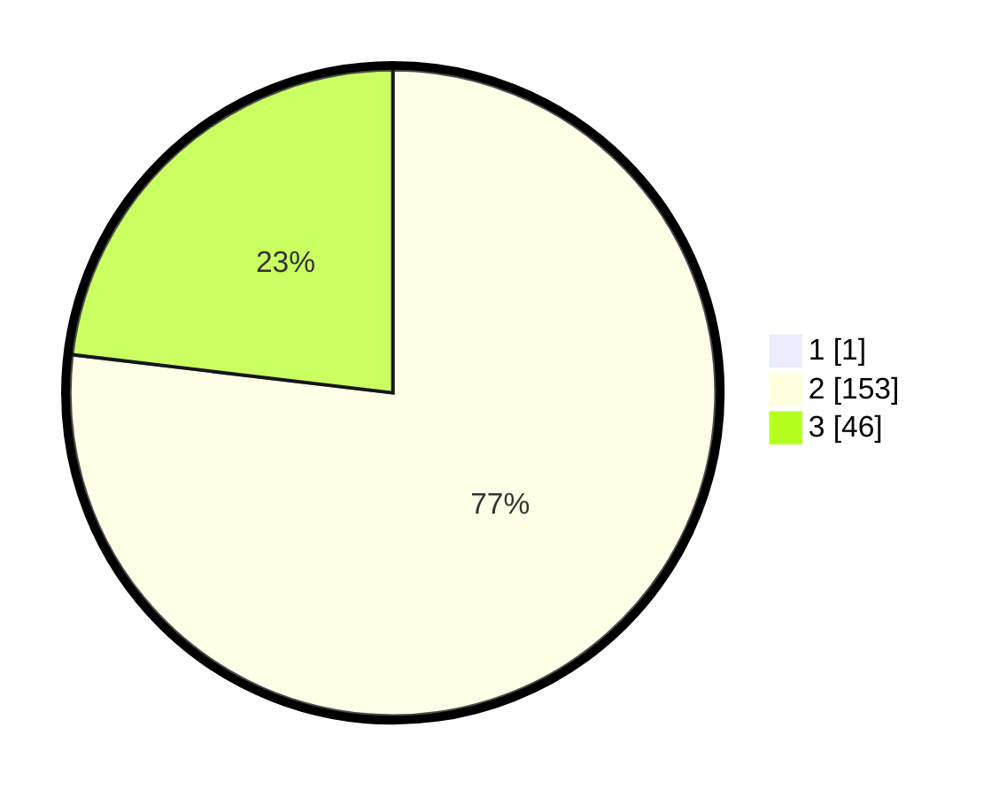

# Hasil

## Grafik

## Tabel

| No. | Nama Paslon    | Suara | Suara (raw) | Persentase |
|:--- |:-------------- | -----:| -----------:| ----------:|
| 1   | ANIES MUHAIMIN | 1     | [1][p-1]    | 0,50       |
| 2   | PRABOWO GIBRAN | 153   | [153][p-2]  | 76,50      |
| 3   | GANJAR MAHFUD  | 46    | [46][p-3]   | 23,00      |

[p-1]: https://github.com/gigit-pemilu/pemilu-2024/blob/main/pilpres/hitung-suara/sub/51-bali/sub/05-klungkung/sub/01-nusa-penida/sub/2008-batununggul/sub/017-tps/sub/paslon-1.txt
[p-2]: https://github.com/gigit-pemilu/pemilu-2024/blob/main/pilpres/hitung-suara/sub/51-bali/sub/05-klungkung/sub/01-nusa-penida/sub/2008-batununggul/sub/017-tps/sub/paslon-2.txt
[p-3]: https://github.com/gigit-pemilu/pemilu-2024/blob/main/pilpres/hitung-suara/sub/51-bali/sub/05-klungkung/sub/01-nusa-penida/sub/2008-batununggul/sub/017-tps/sub/paslon-3.txt

## Foto C Plano

https://sirekap-obj-formc.kpu.go.id/43a8/pemilu/ppwp/51/05/01/20/08/5105012008017-20240214-232412--5683755b-81c3-4dff-be4f-6a89788acdc4.jpg

https://sirekap-obj-formc.kpu.go.id/43a8/pemilu/ppwp/51/05/01/20/08/5105012008017-20240214-232509--c372a301-7f1f-448c-9ded-ae746ce0d7d4.jpg

https://sirekap-obj-formc.kpu.go.id/43a8/pemilu/ppwp/51/05/01/20/08/5105012008017-20240214-232608--12a93450-5098-4153-9a8c-fe7da86f9ac4.jpg

## Metadata

| Key        | Value               |
| ---------- | ------------------- |
| Time Stamp | 2024-02-15 19:00:26 |

