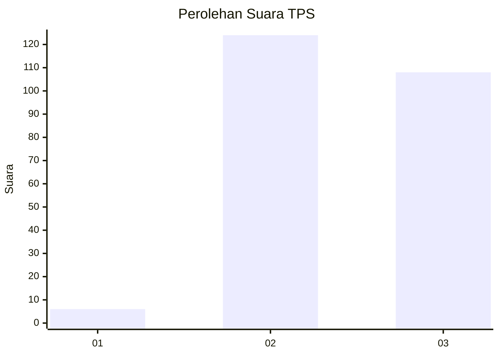
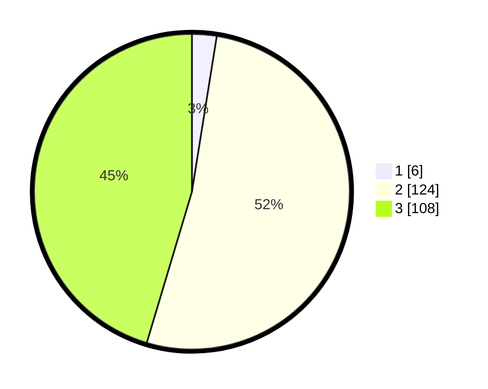

# Hasil

## Grafik

## Tabel

| No. | Nama Paslon    | Suara | Suara (raw) | Persentase |
|:--- |:-------------- | -----:| -----------:| ----------:|
| 1   | ANIES MUHAIMIN | 6     | [6][p-1]    | 2,52       |
| 2   | PRABOWO GIBRAN | 124   | [124][p-2]  | 52,10      |
| 3   | GANJAR MAHFUD  | 108   | [108][p-3]  | 45,38      |

[p-1]: https://github.com/gigit-pemilu/pemilu-2024-51-bali/blob/main/pilpres/hitung-suara/sub/51-bali/sub/05-klungkung/sub/01-nusa-penida/sub/2009-kutampi/sub/001-tps/sub/paslon-1.txt
[p-2]: https://github.com/gigit-pemilu/pemilu-2024-51-bali/blob/main/pilpres/hitung-suara/sub/51-bali/sub/05-klungkung/sub/01-nusa-penida/sub/2009-kutampi/sub/001-tps/sub/paslon-2.txt
[p-3]: https://github.com/gigit-pemilu/pemilu-2024-51-bali/blob/main/pilpres/hitung-suara/sub/51-bali/sub/05-klungkung/sub/01-nusa-penida/sub/2009-kutampi/sub/001-tps/sub/paslon-3.txt

## Foto C Plano

https://sirekap-obj-formc.kpu.go.id/a06a/pemilu/ppwp/51/05/01/20/09/5105012009001-20240214-195833--94d9f27f-03d5-4552-b30e-c0a70e79e70f.jpg

https://sirekap-obj-formc.kpu.go.id/a06a/pemilu/ppwp/51/05/01/20/09/5105012009001-20240214-195944--8dfb92cb-5c21-4a59-ae5b-a8e65f578bc8.jpg

https://sirekap-obj-formc.kpu.go.id/a06a/pemilu/ppwp/51/05/01/20/09/5105012009001-20240214-200014--e5b9c0c0-4b48-4c8d-b892-d33f894c5406.jpg

## Metadata

| Key        | Value               |
| ---------- | ------------------- |
| Time Stamp | 2024-02-15 09:00:24 |

