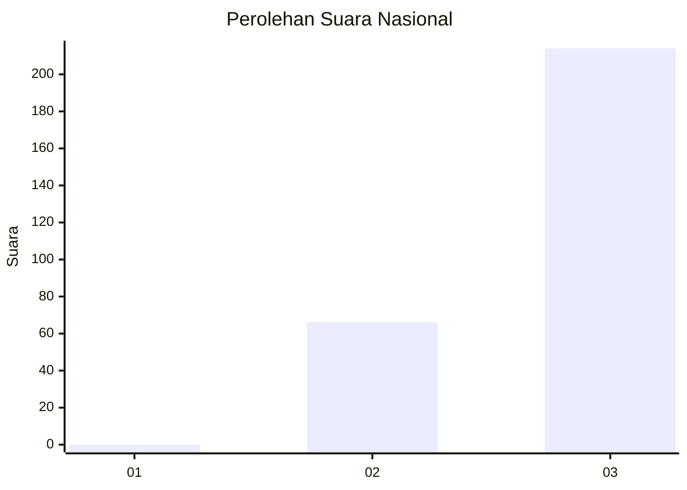
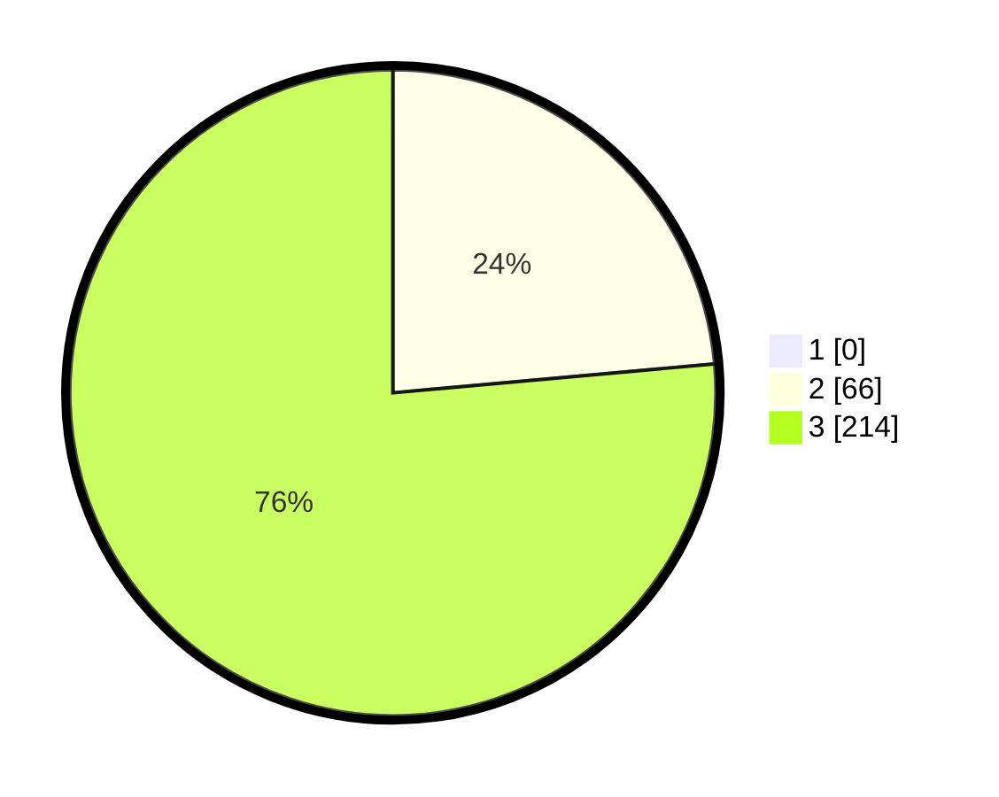

# Hasil

## Grafik

## Tabel

| No. | Nama Paslon    | Suara | Suara (raw) | Persentase |
|:--- |:-------------- | -----:| -----------:| ----------:|
| 1   | ANIES MUHAIMIN | 0     | [0][p-1]    | 0,00       |
| 2   | PRABOWO GIBRAN | 66    | [66][p-2]   | 23,57      |
| 3   | GANJAR MAHFUD  | 214   | [214][p-3]  | 76,43      |

[p-1]: https://github.com/gigit-pemilu/pemilu-2024/blob/main/pilpres/hitung-suara/sub/51-bali/sub/05-klungkung/sub/01-nusa-penida/sub/2009-kutampi/sub/003-tps/sub/paslon-1.txt
[p-2]: https://github.com/gigit-pemilu/pemilu-2024/blob/main/pilpres/hitung-suara/sub/51-bali/sub/05-klungkung/sub/01-nusa-penida/sub/2009-kutampi/sub/003-tps/sub/paslon-2.txt
[p-3]: https://github.com/gigit-pemilu/pemilu-2024/blob/main/pilpres/hitung-suara/sub/51-bali/sub/05-klungkung/sub/01-nusa-penida/sub/2009-kutampi/sub/003-tps/sub/paslon-3.txt

## Foto C Plano

https://sirekap-obj-formc.kpu.go.id/eef5/pemilu/ppwp/51/05/01/20/09/5105012009003-20240214-213210--18255fe5-b5d6-4d17-9e94-4b431428d685.jpg

https://sirekap-obj-formc.kpu.go.id/eef5/pemilu/ppwp/51/05/01/20/09/5105012009003-20240214-213318--58c1536c-187a-4252-9436-1e86c23d100e.jpg

https://sirekap-obj-formc.kpu.go.id/eef5/pemilu/ppwp/51/05/01/20/09/5105012009003-20240214-213414--cb566c17-5495-4280-98ac-bdde6deacea3.jpg

## Metadata

| Key        | Value               |
| ---------- | ------------------- |
| Time Stamp | 2024-02-15 09:00:24 |

