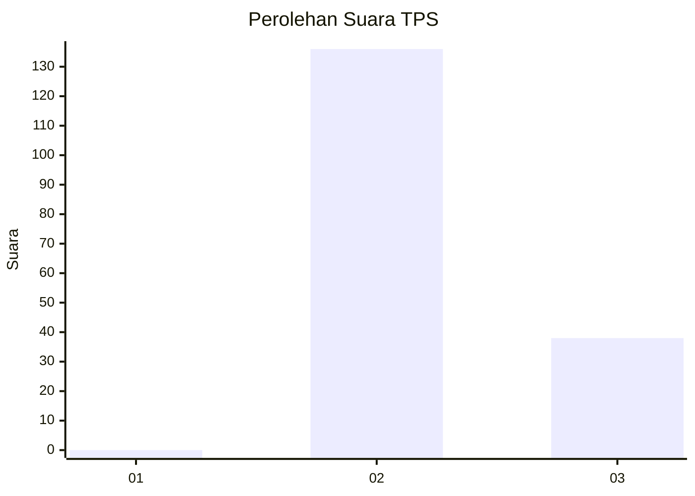
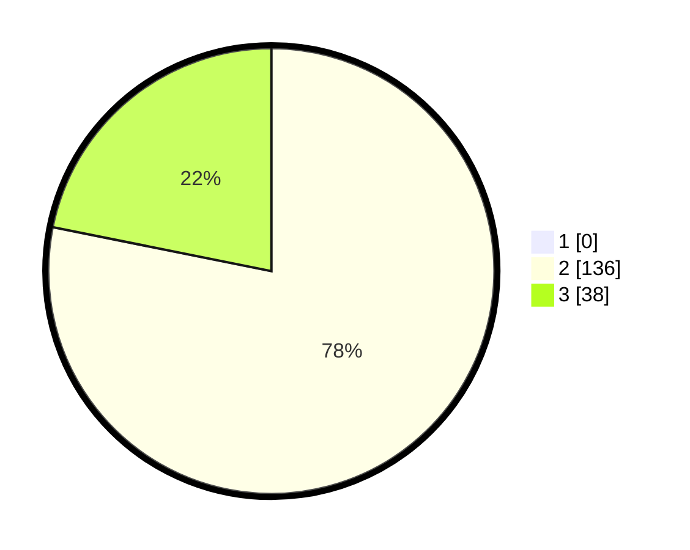

# Hasil

## Grafik

## Tabel

| No. | Nama Paslon    | Suara | Suara (raw) | Persentase |
|:--- |:-------------- | -----:| -----------:| ----------:|
| 1   | ANIES MUHAIMIN | 0     | [0][p-1]    | 0,00       |
| 2   | PRABOWO GIBRAN | 136   | [136][p-2]  | 78,16      |
| 3   | GANJAR MAHFUD  | 38    | [38][p-3]   | 21,84      |

[p-1]: https://github.com/gigit-pemilu/pemilu-2024-51-bali/blob/main/pilpres/hitung-suara/sub/51-bali/sub/05-klungkung/sub/01-nusa-penida/sub/2009-kutampi/sub/006-tps/sub/paslon-1.txt
[p-2]: https://github.com/gigit-pemilu/pemilu-2024-51-bali/blob/main/pilpres/hitung-suara/sub/51-bali/sub/05-klungkung/sub/01-nusa-penida/sub/2009-kutampi/sub/006-tps/sub/paslon-2.txt
[p-3]: https://github.com/gigit-pemilu/pemilu-2024-51-bali/blob/main/pilpres/hitung-suara/sub/51-bali/sub/05-klungkung/sub/01-nusa-penida/sub/2009-kutampi/sub/006-tps/sub/paslon-3.txt

## Foto C Plano

https://sirekap-obj-formc.kpu.go.id/26cc/pemilu/ppwp/51/05/01/20/09/5105012009006-20240214-192030--ed6e2ba8-c1de-44c5-9d0c-8bcb6467da98.jpg

https://sirekap-obj-formc.kpu.go.id/26cc/pemilu/ppwp/51/05/01/20/09/5105012009006-20240214-192319--4063fa1e-ff70-4919-8575-41af88bdc96a.jpg

https://sirekap-obj-formc.kpu.go.id/26cc/pemilu/ppwp/51/05/01/20/09/5105012009006-20240214-192410--db3618d4-31a6-46e1-881c-6f7adea9e7e6.jpg

## Metadata

| Key        | Value               |
| ---------- | ------------------- |
| Time Stamp | 2024-02-15 09:00:24 |

