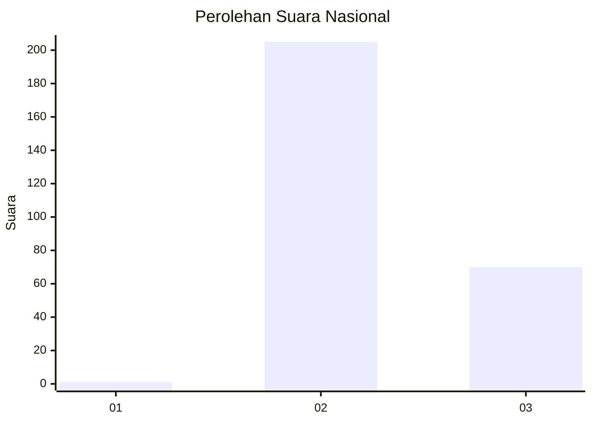
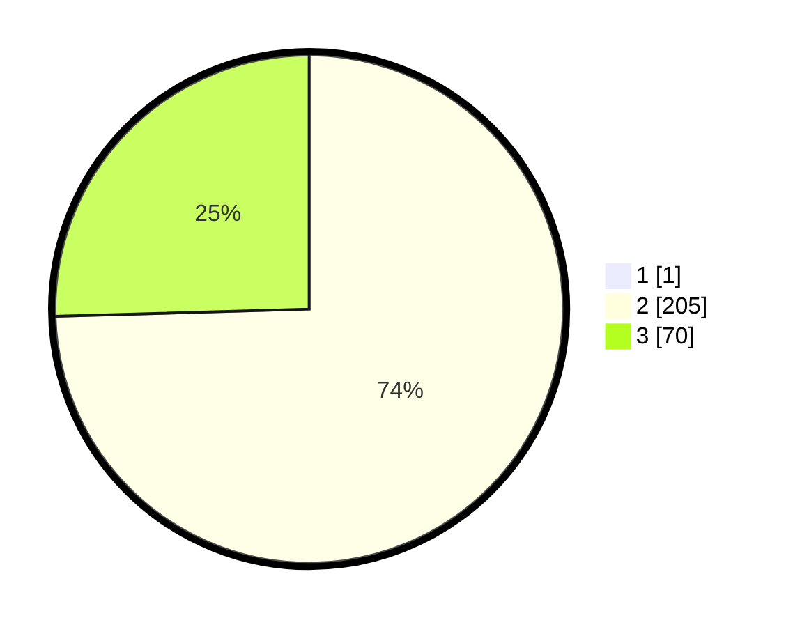

# Hasil

## Grafik

## Tabel

| No. | Nama Paslon    | Suara | Suara (raw) | Persentase |
|:--- |:-------------- | -----:| -----------:| ----------:|
| 1   | ANIES MUHAIMIN | 1     | [1][p-1]    | 0,36       |
| 2   | PRABOWO GIBRAN | 205   | [205][p-2]  | 74,28      |
| 3   | GANJAR MAHFUD  | 70    | [70][p-3]   | 25,36      |

[p-1]: https://github.com/gigit-pemilu/pemilu-2024/blob/main/pilpres/hitung-suara/sub/51-bali/sub/05-klungkung/sub/01-nusa-penida/sub/2009-kutampi/sub/007-tps/sub/paslon-1.txt
[p-2]: https://github.com/gigit-pemilu/pemilu-2024/blob/main/pilpres/hitung-suara/sub/51-bali/sub/05-klungkung/sub/01-nusa-penida/sub/2009-kutampi/sub/007-tps/sub/paslon-2.txt
[p-3]: https://github.com/gigit-pemilu/pemilu-2024/blob/main/pilpres/hitung-suara/sub/51-bali/sub/05-klungkung/sub/01-nusa-penida/sub/2009-kutampi/sub/007-tps/sub/paslon-3.txt

## Foto C Plano

https://sirekap-obj-formc.kpu.go.id/b87d/pemilu/ppwp/51/05/01/20/09/5105012009007-20240223-100853--2e0f2356-39c7-44e4-a5b1-0207b7ac6abf.jpg

https://sirekap-obj-formc.kpu.go.id/b87d/pemilu/ppwp/51/05/01/20/09/5105012009007-20240223-103143--9fd004ac-45b3-4ba5-bf93-bd13c3a6273f.jpg

https://sirekap-obj-formc.kpu.go.id/b87d/pemilu/ppwp/51/05/01/20/09/5105012009007-20240223-101715--f121ef5d-73dc-403d-88c7-cb862917857b.jpg

## Metadata

| Key        | Value               |
| ---------- | ------------------- |
| Time Stamp | 2024-02-24 22:31:28 |

