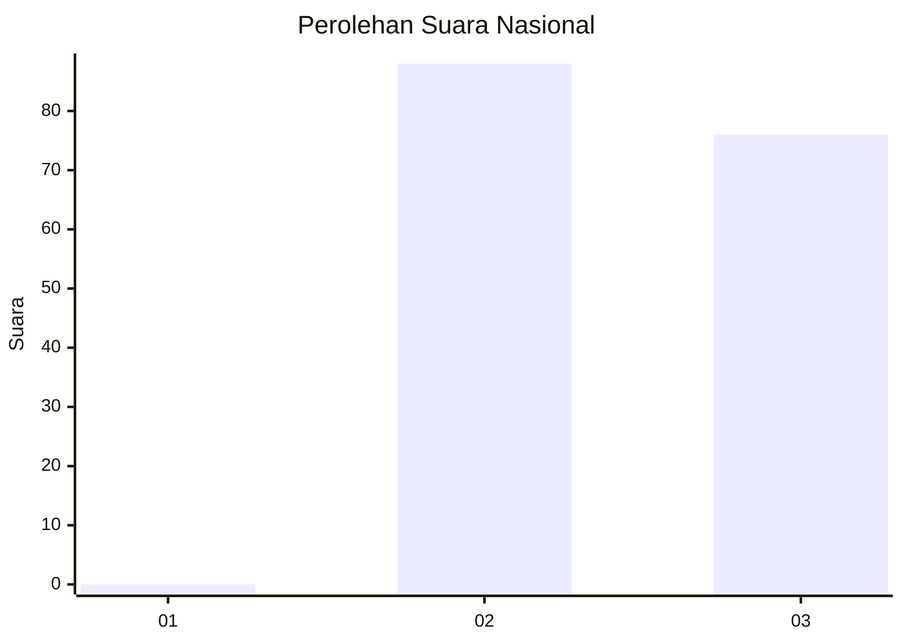
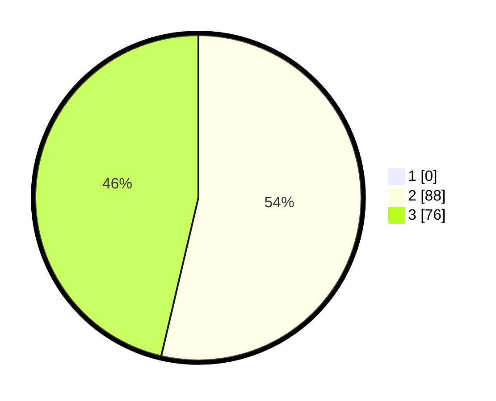

# Hasil

## Grafik

## Tabel

| No. | Nama Paslon    | Suara | Suara (raw) | Persentase |
|:--- |:-------------- | -----:| -----------:| ----------:|
| 1   | ANIES MUHAIMIN | 0     | [0][p-1]    | 0,00       |
| 2   | PRABOWO GIBRAN | 88    | [88][p-2]   | 53,66      |
| 3   | GANJAR MAHFUD  | 76    | [76][p-3]   | 46,34      |

[p-1]: https://github.com/gigit-pemilu/pemilu-2024/blob/main/pilpres/hitung-suara/sub/51-bali/sub/05-klungkung/sub/01-nusa-penida/sub/2009-kutampi/sub/008-tps/sub/paslon-1.txt
[p-2]: https://github.com/gigit-pemilu/pemilu-2024/blob/main/pilpres/hitung-suara/sub/51-bali/sub/05-klungkung/sub/01-nusa-penida/sub/2009-kutampi/sub/008-tps/sub/paslon-2.txt
[p-3]: https://github.com/gigit-pemilu/pemilu-2024/blob/main/pilpres/hitung-suara/sub/51-bali/sub/05-klungkung/sub/01-nusa-penida/sub/2009-kutampi/sub/008-tps/sub/paslon-3.txt

## Foto C Plano

https://sirekap-obj-formc.kpu.go.id/0afb/pemilu/ppwp/51/05/01/20/09/5105012009008-20240223-095721--f1ef0a7c-b9c4-4c5d-bfff-077db6002650.jpg

https://sirekap-obj-formc.kpu.go.id/0afb/pemilu/ppwp/51/05/01/20/09/5105012009008-20240223-095834--162d30e8-7216-4618-96d1-6b1aa316aa27.jpg

https://sirekap-obj-formc.kpu.go.id/0afb/pemilu/ppwp/51/05/01/20/09/5105012009008-20240223-095937--165cbb06-f7d0-460c-8cb5-d63bffec0b7a.jpg

## Metadata

| Key        | Value               |
| ---------- | ------------------- |
| Time Stamp | 2024-02-24 22:31:28 |

