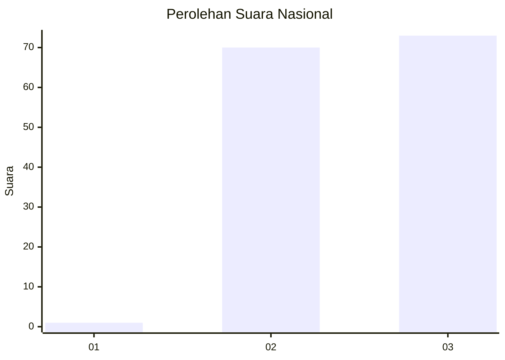
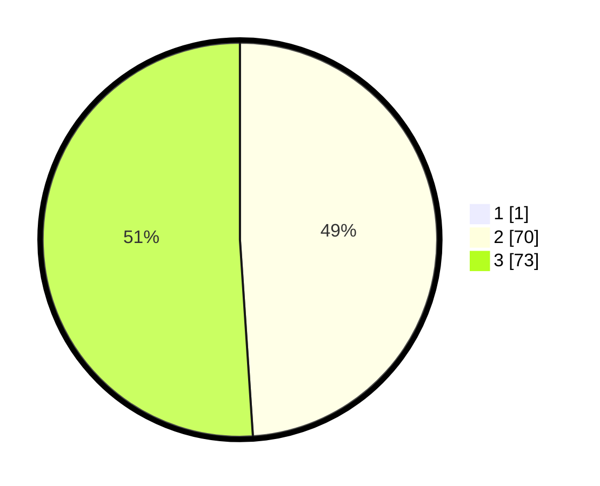

# Hasil

## Grafik

## Tabel

| No. | Nama Paslon    | Suara | Suara (raw) | Persentase |
|:--- |:-------------- | -----:| -----------:| ----------:|
| 1   | ANIES MUHAIMIN | 1     | [1][p-1]    | 0,69       |
| 2   | PRABOWO GIBRAN | 70    | [70][p-2]   | 48,61      |
| 3   | GANJAR MAHFUD  | 73    | [73][p-3]   | 50,69      |

[p-1]: https://github.com/gigit-pemilu/pemilu-2024/blob/main/pilpres/hitung-suara/sub/51-bali/sub/05-klungkung/sub/01-nusa-penida/sub/2009-kutampi/sub/009-tps/sub/paslon-1.txt
[p-2]: https://github.com/gigit-pemilu/pemilu-2024/blob/main/pilpres/hitung-suara/sub/51-bali/sub/05-klungkung/sub/01-nusa-penida/sub/2009-kutampi/sub/009-tps/sub/paslon-2.txt
[p-3]: https://github.com/gigit-pemilu/pemilu-2024/blob/main/pilpres/hitung-suara/sub/51-bali/sub/05-klungkung/sub/01-nusa-penida/sub/2009-kutampi/sub/009-tps/sub/paslon-3.txt

## Foto C Plano

https://sirekap-obj-formc.kpu.go.id/19e6/pemilu/ppwp/51/05/01/20/09/5105012009009-20240223-100927--8cffabfd-08dd-40a2-92ba-2e9911e92718.jpg

https://sirekap-obj-formc.kpu.go.id/19e6/pemilu/ppwp/51/05/01/20/09/5105012009009-20240223-101700--5899a16f-6d3b-41d8-8920-ef209998627f.jpg

https://sirekap-obj-formc.kpu.go.id/19e6/pemilu/ppwp/51/05/01/20/09/5105012009009-20240223-101212--ac19a86c-e4c8-46e6-9887-f43daa3a4cb9.jpg

## Metadata

| Key        | Value               |
| ---------- | ------------------- |
| Time Stamp | 2024-02-24 22:31:28 |

