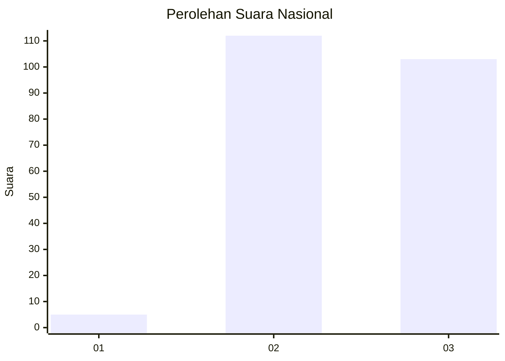
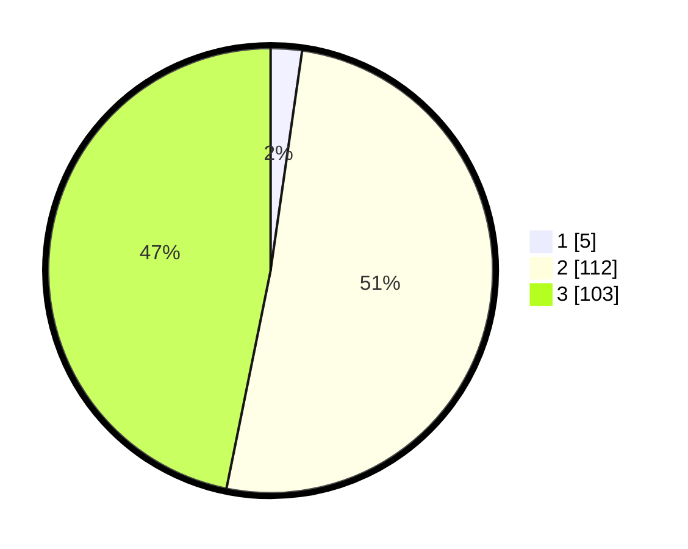

# Hasil

## Grafik

## Tabel

| No. | Nama Paslon    | Suara | Suara (raw) | Persentase |
|:--- |:-------------- | -----:| -----------:| ----------:|
| 1   | ANIES MUHAIMIN | 5     | [5][p-1]    | 2,27       |
| 2   | PRABOWO GIBRAN | 112   | [112][p-2]  | 50,91      |
| 3   | GANJAR MAHFUD  | 103   | [103][p-3]  | 46,82      |

[p-1]: https://github.com/gigit-pemilu/pemilu-2024/blob/main/pilpres/hitung-suara/sub/51-bali/sub/05-klungkung/sub/01-nusa-penida/sub/2009-kutampi/sub/012-tps/sub/paslon-1.txt
[p-2]: https://github.com/gigit-pemilu/pemilu-2024/blob/main/pilpres/hitung-suara/sub/51-bali/sub/05-klungkung/sub/01-nusa-penida/sub/2009-kutampi/sub/012-tps/sub/paslon-2.txt
[p-3]: https://github.com/gigit-pemilu/pemilu-2024/blob/main/pilpres/hitung-suara/sub/51-bali/sub/05-klungkung/sub/01-nusa-penida/sub/2009-kutampi/sub/012-tps/sub/paslon-3.txt

## Foto C Plano

https://sirekap-obj-formc.kpu.go.id/4517/pemilu/ppwp/51/05/01/20/09/5105012009012-20240214-195619--b04af345-0902-4112-8614-da14ec0212e1.jpg

https://sirekap-obj-formc.kpu.go.id/4517/pemilu/ppwp/51/05/01/20/09/5105012009012-20240214-200550--8dce9185-117a-4c14-98c9-38fb21432a44.jpg

https://sirekap-obj-formc.kpu.go.id/4517/pemilu/ppwp/51/05/01/20/09/5105012009012-20240214-200706--885ec76c-c508-48f7-a03f-c3390c09a462.jpg

## Metadata

| Key        | Value               |
| ---------- | ------------------- |
| Time Stamp | 2024-02-15 19:00:26 |

