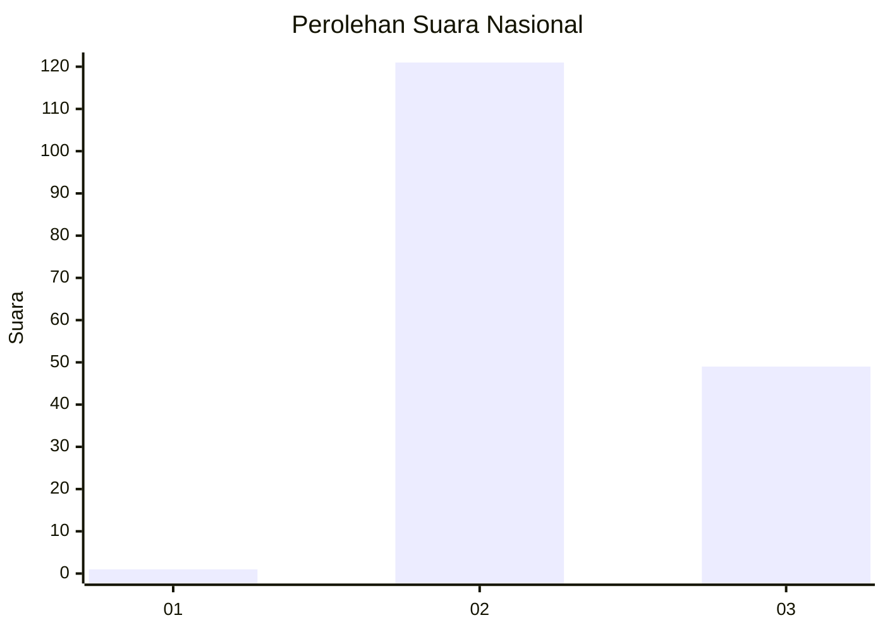
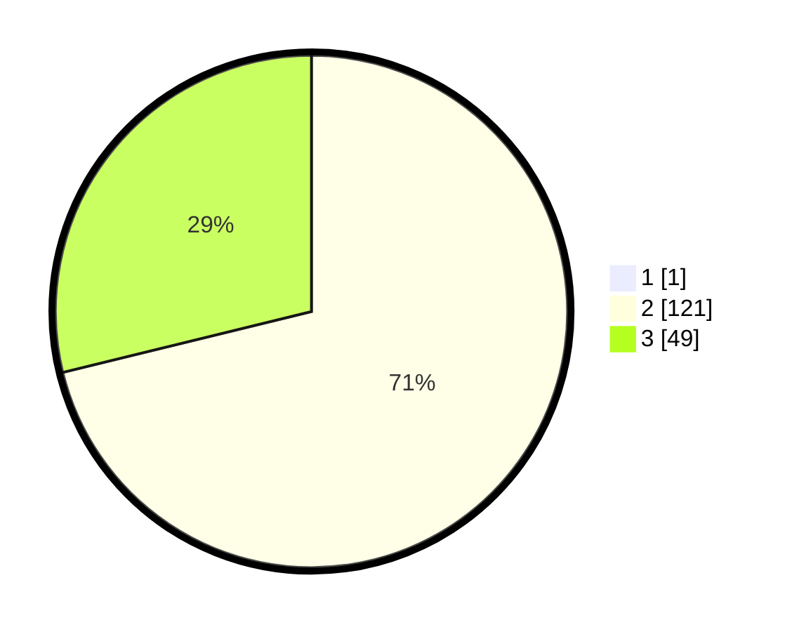

# Hasil

## Grafik

## Tabel

| No. | Nama Paslon    | Suara | Suara (raw) | Persentase |
|:--- |:-------------- | -----:| -----------:| ----------:|
| 1   | ANIES MUHAIMIN | 1     | [1][p-1]    | 0,58       |
| 2   | PRABOWO GIBRAN | 121   | [121][p-2]  | 70,76      |
| 3   | GANJAR MAHFUD  | 49    | [49][p-3]   | 28,65      |

[p-1]: https://github.com/gigit-pemilu/pemilu-2024/blob/main/pilpres/hitung-suara/sub/51-bali/sub/05-klungkung/sub/01-nusa-penida/sub/2010-ped/sub/002-tps/sub/paslon-1.txt
[p-2]: https://github.com/gigit-pemilu/pemilu-2024/blob/main/pilpres/hitung-suara/sub/51-bali/sub/05-klungkung/sub/01-nusa-penida/sub/2010-ped/sub/002-tps/sub/paslon-2.txt
[p-3]: https://github.com/gigit-pemilu/pemilu-2024/blob/main/pilpres/hitung-suara/sub/51-bali/sub/05-klungkung/sub/01-nusa-penida/sub/2010-ped/sub/002-tps/sub/paslon-3.txt

## Foto C Plano

https://sirekap-obj-formc.kpu.go.id/b4db/pemilu/ppwp/51/05/01/20/10/5105012010002-20240218-141843--fa4ff343-bdd0-4647-9610-2b1d744f467f.jpg

https://sirekap-obj-formc.kpu.go.id/b4db/pemilu/ppwp/51/05/01/20/10/5105012010002-20240218-141845--fafe6b8c-d065-48c1-a654-d34d71bed7be.jpg

https://sirekap-obj-formc.kpu.go.id/b4db/pemilu/ppwp/51/05/01/20/10/5105012010002-20240218-141844--4989ecc0-04d2-4228-bb4d-485cbe811526.jpg

## Metadata

| Key        | Value               |
| ---------- | ------------------- |
| Time Stamp | 2024-02-19 13:00:00 |

## DATA PEMILIH TETAP

Jumlah pemilih dalam DPT: **207**.
 * L: **101**.
 * P: **106**.

## DATA PENGGUNA HAK PILIH

Jumlah pengguna hak pilih dalam DPT: **176**.
 * L: **85**.
 * P: **91**.

Jumlah pengguna hak pilih dalam DPTb: **1**.
 * L: **0**.
 * P: **1**.

Jumlah pengguna hak pilih dalam DPK: **1**.
 * L: **1**.
 * P: **0**.

Jumlah pengguna hak pilih: **178**.
 * L: **86**.
 * P: **92**.

## JUMLAH SUARA SAH DAN TIDAK SAH

JUMLAH SELURUH SUARA SAH: **171**.

JUMLAH SUARA TIDAK SAH: **7**.

JUMLAH SELURUH SUARA SAH DAN SUARA TIDAK SAH: **178**.

