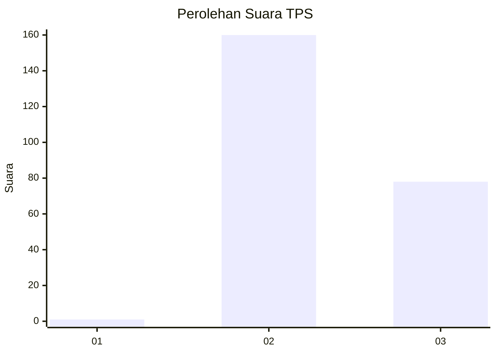
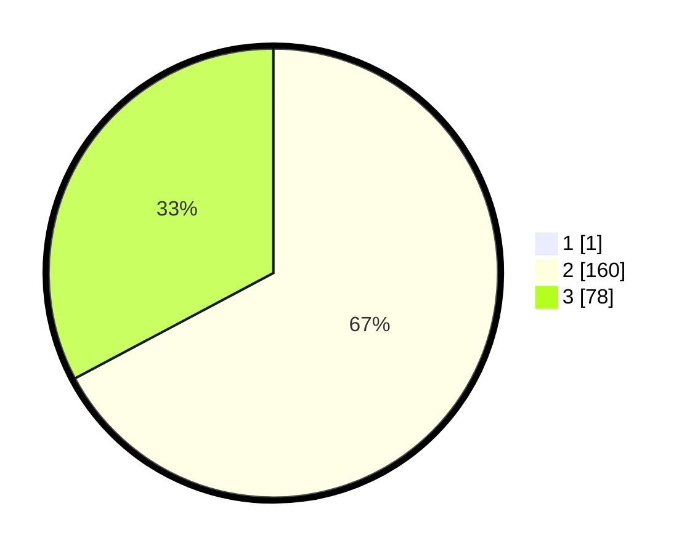

# Hasil

## Grafik

## Tabel

| No. | Nama Paslon    | Suara | Suara (raw) | Persentase |
|:--- |:-------------- | -----:| -----------:| ----------:|
| 1   | ANIES MUHAIMIN | 1     | [1][p-1]    | 0,42       |
| 2   | PRABOWO GIBRAN | 160   | [160][p-2]  | 66,95      |
| 3   | GANJAR MAHFUD  | 78    | [78][p-3]   | 32,64      |

[p-1]: https://github.com/gigit-pemilu/pemilu-2024-51-bali/blob/main/pilpres/hitung-suara/sub/51-bali/sub/05-klungkung/sub/01-nusa-penida/sub/2010-ped/sub/004-tps/sub/paslon-1.txt
[p-2]: https://github.com/gigit-pemilu/pemilu-2024-51-bali/blob/main/pilpres/hitung-suara/sub/51-bali/sub/05-klungkung/sub/01-nusa-penida/sub/2010-ped/sub/004-tps/sub/paslon-2.txt
[p-3]: https://github.com/gigit-pemilu/pemilu-2024-51-bali/blob/main/pilpres/hitung-suara/sub/51-bali/sub/05-klungkung/sub/01-nusa-penida/sub/2010-ped/sub/004-tps/sub/paslon-3.txt

## Foto C Plano

https://sirekap-obj-formc.kpu.go.id/1d38/pemilu/ppwp/51/05/01/20/10/5105012010004-20240214-194833--4bd319d0-1143-4e61-b72f-25b975583a0d.jpg

https://sirekap-obj-formc.kpu.go.id/1d38/pemilu/ppwp/51/05/01/20/10/5105012010004-20240214-194915--b801f346-1395-41a8-acb9-30c856c2bf2a.jpg

https://sirekap-obj-formc.kpu.go.id/1d38/pemilu/ppwp/51/05/01/20/10/5105012010004-20240214-194950--fb5ce9b0-d7bc-456d-92b4-7c39ca92dec3.jpg

## Metadata

| Key        | Value               |
| ---------- | ------------------- |
| Time Stamp | 2024-02-15 09:00:24 |

