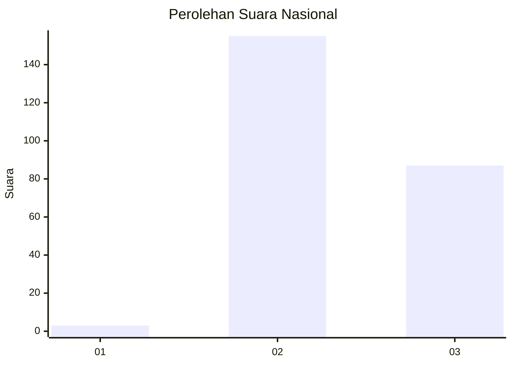
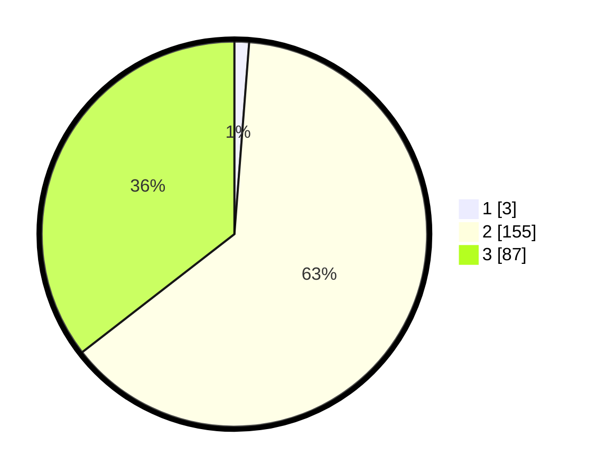

# Hasil

## Grafik

## Tabel

| No. | Nama Paslon    | Suara | Suara (raw) | Persentase |
|:--- |:-------------- | -----:| -----------:| ----------:|
| 1   | ANIES MUHAIMIN | 3     | [3][p-1]    | 1,22       |
| 2   | PRABOWO GIBRAN | 155   | [155][p-2]  | 63,27      |
| 3   | GANJAR MAHFUD  | 87    | [87][p-3]   | 35,51      |

[p-1]: https://github.com/gigit-pemilu/pemilu-2024/blob/main/pilpres/hitung-suara/sub/51-bali/sub/05-klungkung/sub/01-nusa-penida/sub/2010-ped/sub/005-tps/sub/paslon-1.txt
[p-2]: https://github.com/gigit-pemilu/pemilu-2024/blob/main/pilpres/hitung-suara/sub/51-bali/sub/05-klungkung/sub/01-nusa-penida/sub/2010-ped/sub/005-tps/sub/paslon-2.txt
[p-3]: https://github.com/gigit-pemilu/pemilu-2024/blob/main/pilpres/hitung-suara/sub/51-bali/sub/05-klungkung/sub/01-nusa-penida/sub/2010-ped/sub/005-tps/sub/paslon-3.txt

## Foto C Plano

https://sirekap-obj-formc.kpu.go.id/56ff/pemilu/ppwp/51/05/01/20/10/5105012010005-20240214-211318--38c3d8b3-c8c2-4784-b719-a8f959864565.jpg

https://sirekap-obj-formc.kpu.go.id/56ff/pemilu/ppwp/51/05/01/20/10/5105012010005-20240214-211441--56d58c88-ce9a-4518-84f7-dff8f717794e.jpg

https://sirekap-obj-formc.kpu.go.id/56ff/pemilu/ppwp/51/05/01/20/10/5105012010005-20240214-211556--cbf94c9b-3cc9-4cd2-968d-4f0db6f79020.jpg

## Metadata

| Key        | Value               |
| ---------- | ------------------- |
| Time Stamp | 2024-02-15 09:00:24 |

