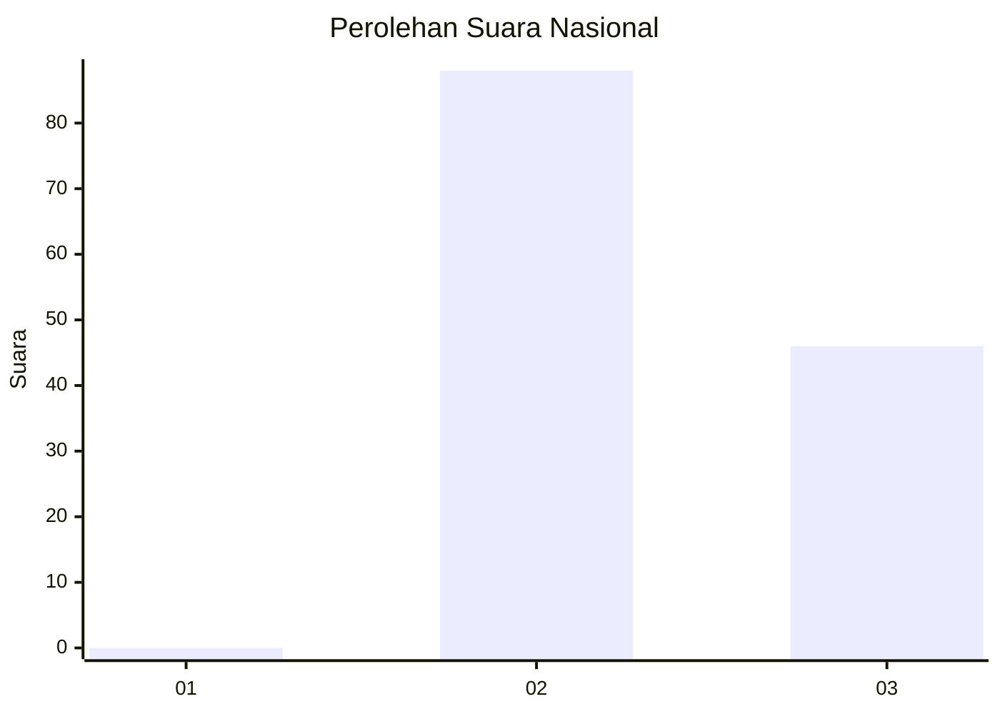
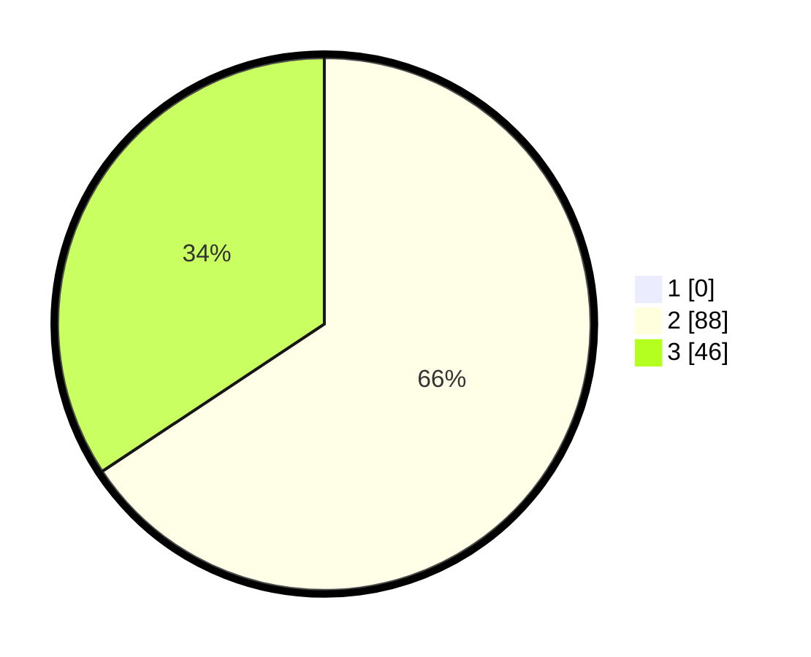

# Hasil

## Grafik

## Tabel

| No. | Nama Paslon    | Suara | Suara (raw) | Persentase |
|:--- |:-------------- | -----:| -----------:| ----------:|
| 1   | ANIES MUHAIMIN | 0     | [0][p-1]    | 0,00       |
| 2   | PRABOWO GIBRAN | 88    | [88][p-2]   | 65,67      |
| 3   | GANJAR MAHFUD  | 46    | [46][p-3]   | 34,33      |

[p-1]: https://github.com/gigit-pemilu/pemilu-2024/blob/main/pilpres/hitung-suara/sub/51-bali/sub/05-klungkung/sub/01-nusa-penida/sub/2010-ped/sub/008-tps/sub/paslon-1.txt
[p-2]: https://github.com/gigit-pemilu/pemilu-2024/blob/main/pilpres/hitung-suara/sub/51-bali/sub/05-klungkung/sub/01-nusa-penida/sub/2010-ped/sub/008-tps/sub/paslon-2.txt
[p-3]: https://github.com/gigit-pemilu/pemilu-2024/blob/main/pilpres/hitung-suara/sub/51-bali/sub/05-klungkung/sub/01-nusa-penida/sub/2010-ped/sub/008-tps/sub/paslon-3.txt

## Foto C Plano

https://sirekap-obj-formc.kpu.go.id/7d28/pemilu/ppwp/51/05/01/20/10/5105012010008-20240214-192743--e6e9483e-9bd9-48e3-b644-cbf7fbcc24ea.jpg

https://sirekap-obj-formc.kpu.go.id/7d28/pemilu/ppwp/51/05/01/20/10/5105012010008-20240215-080159--bf27a7d6-644c-4997-ac54-4c5fbda7e364.jpg

https://sirekap-obj-formc.kpu.go.id/7d28/pemilu/ppwp/51/05/01/20/10/5105012010008-20240215-075827--3ff1e424-1fc1-4e9f-915f-4bfb8f54c301.jpg

## Metadata

| Key        | Value               |
| ---------- | ------------------- |
| Time Stamp | 2024-02-15 17:00:25 |

## DATA PEMILIH TETAP

Jumlah pemilih dalam DPT: **156**.
 * L: **88**.
 * P: **68**.

## DATA PENGGUNA HAK PILIH

Jumlah pengguna hak pilih dalam DPT: **130**.
 * L: **71**.
 * P: **59**.

Jumlah pengguna hak pilih dalam DPTb: **3**.
 * L: **3**.
 * P: **0**.

Jumlah pengguna hak pilih dalam DPK: **1**.
 * L: **0**.
 * P: **1**.

Jumlah pengguna hak pilih: **134**.
 * L: **74**.
 * P: **60**.

## JUMLAH SUARA SAH DAN TIDAK SAH

JUMLAH SELURUH SUARA SAH: **134**.

JUMLAH SUARA TIDAK SAH: **0**.

JUMLAH SELURUH SUARA SAH DAN SUARA TIDAK SAH: **134**.

