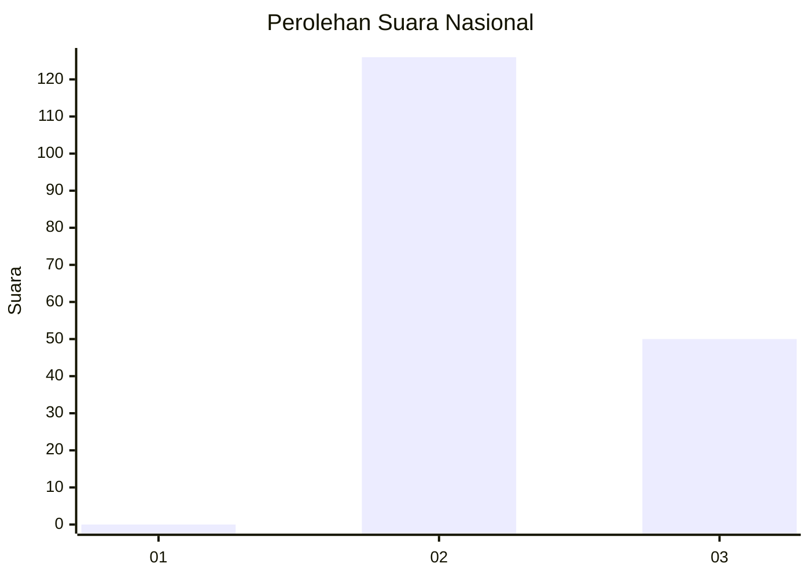
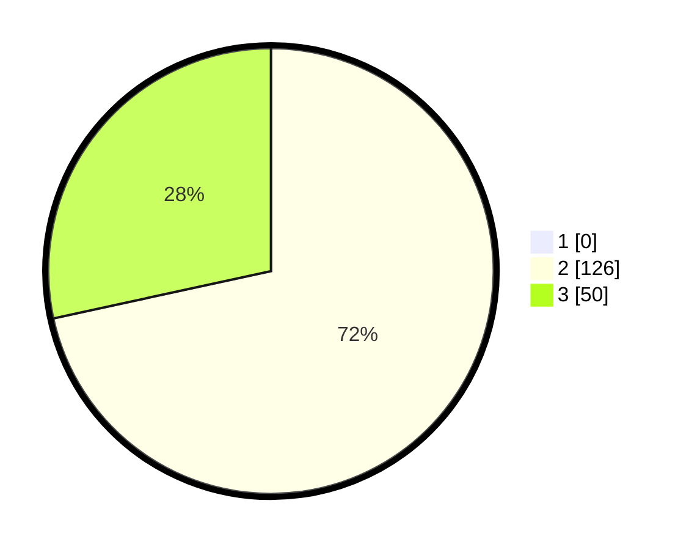

# Hasil

## Grafik

## Tabel

| No. | Nama Paslon    | Suara | Suara (raw) | Persentase |
|:--- |:-------------- | -----:| -----------:| ----------:|
| 1   | ANIES MUHAIMIN | 0     | [0][p-1]    | 0,00       |
| 2   | PRABOWO GIBRAN | 126   | [126][p-2]  | 71,59      |
| 3   | GANJAR MAHFUD  | 50    | [50][p-3]   | 28,41      |

[p-1]: https://github.com/gigit-pemilu/pemilu-2024/blob/main/pilpres/hitung-suara/sub/51-bali/sub/05-klungkung/sub/01-nusa-penida/sub/2010-ped/sub/011-tps/sub/paslon-1.txt
[p-2]: https://github.com/gigit-pemilu/pemilu-2024/blob/main/pilpres/hitung-suara/sub/51-bali/sub/05-klungkung/sub/01-nusa-penida/sub/2010-ped/sub/011-tps/sub/paslon-2.txt
[p-3]: https://github.com/gigit-pemilu/pemilu-2024/blob/main/pilpres/hitung-suara/sub/51-bali/sub/05-klungkung/sub/01-nusa-penida/sub/2010-ped/sub/011-tps/sub/paslon-3.txt

## Foto C Plano

https://sirekap-obj-formc.kpu.go.id/a62c/pemilu/ppwp/51/05/01/20/10/5105012010011-20240214-193556--69d25f5d-04f7-412a-a606-d90a5c10323d.jpg

https://sirekap-obj-formc.kpu.go.id/a62c/pemilu/ppwp/51/05/01/20/10/5105012010011-20240214-193652--f928bece-dd63-4c59-b76c-57e7115856f7.jpg

https://sirekap-obj-formc.kpu.go.id/a62c/pemilu/ppwp/51/05/01/20/10/5105012010011-20240214-214413--29d26676-5e6a-4d14-9cfa-0e818db35478.jpg

## Metadata

| Key        | Value               |
| ---------- | ------------------- |
| Time Stamp | 2024-02-15 12:00:28 |

