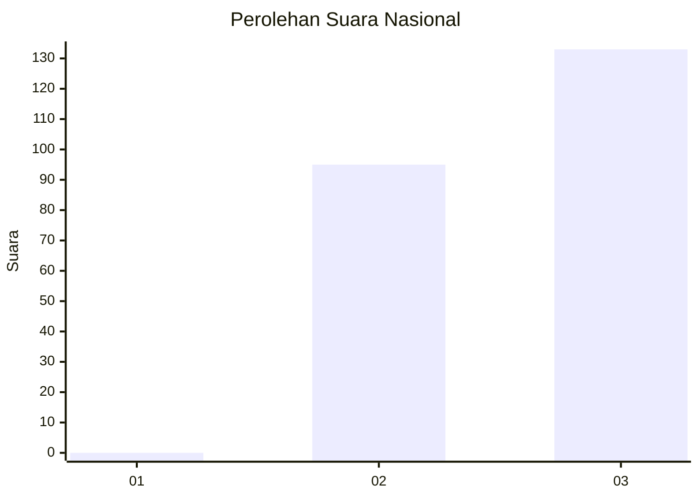
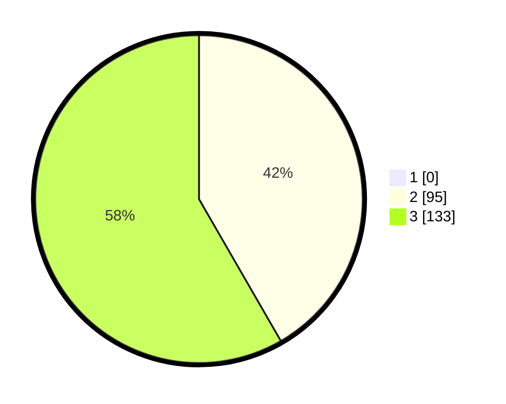

# Hasil

## Grafik

## Tabel

| No. | Nama Paslon    | Suara | Suara (raw) | Persentase |
|:--- |:-------------- | -----:| -----------:| ----------:|
| 1   | ANIES MUHAIMIN | 0     | [0][p-1]    | 0,00       |
| 2   | PRABOWO GIBRAN | 95    | [95][p-2]   | 41,67      |
| 3   | GANJAR MAHFUD  | 133   | [133][p-3]  | 58,33      |

[p-1]: https://github.com/gigit-pemilu/pemilu-2024/blob/main/pilpres/hitung-suara/sub/51-bali/sub/05-klungkung/sub/01-nusa-penida/sub/2010-ped/sub/012-tps/sub/paslon-1.txt
[p-2]: https://github.com/gigit-pemilu/pemilu-2024/blob/main/pilpres/hitung-suara/sub/51-bali/sub/05-klungkung/sub/01-nusa-penida/sub/2010-ped/sub/012-tps/sub/paslon-2.txt
[p-3]: https://github.com/gigit-pemilu/pemilu-2024/blob/main/pilpres/hitung-suara/sub/51-bali/sub/05-klungkung/sub/01-nusa-penida/sub/2010-ped/sub/012-tps/sub/paslon-3.txt

## Foto C Plano

https://sirekap-obj-formc.kpu.go.id/6987/pemilu/ppwp/51/05/01/20/10/5105012010012-20240214-160115--d59f25f6-87d0-4eb0-a70a-25aa4a54a1be.jpg

https://sirekap-obj-formc.kpu.go.id/6987/pemilu/ppwp/51/05/01/20/10/5105012010012-20240220-133756--1f1b7ed2-11e5-4fa0-92af-df8749c346a4.jpg

https://sirekap-obj-formc.kpu.go.id/6987/pemilu/ppwp/51/05/01/20/10/5105012010012-20240220-133918--02ca5cab-9e95-47a3-be52-5031f048870e.jpg

## Metadata

| Key        | Value               |
| ---------- | ------------------- |
| Time Stamp | 2024-02-20 15:00:00 |

## DATA PEMILIH TETAP

Jumlah pemilih dalam DPT: **262**.
 * L: **132**.
 * P: **130**.

## DATA PENGGUNA HAK PILIH

Jumlah pengguna hak pilih dalam DPT: **224**.
 * L: **155**.
 * P: **709**.

Jumlah pengguna hak pilih dalam DPTb: **364**.
 * L: **800**.
 * P: **805**.

Jumlah pengguna hak pilih dalam DPK: **4**.
 * L: **803**.
 * P: **501**.

Jumlah pengguna hak pilih: **223**.
 * L: **488**.
 * P: **151**.

## JUMLAH SUARA SAH DAN TIDAK SAH

JUMLAH SELURUH SUARA SAH: **228**.

JUMLAH SUARA TIDAK SAH: **1**.

JUMLAH SELURUH SUARA SAH DAN SUARA TIDAK SAH: **229**.

