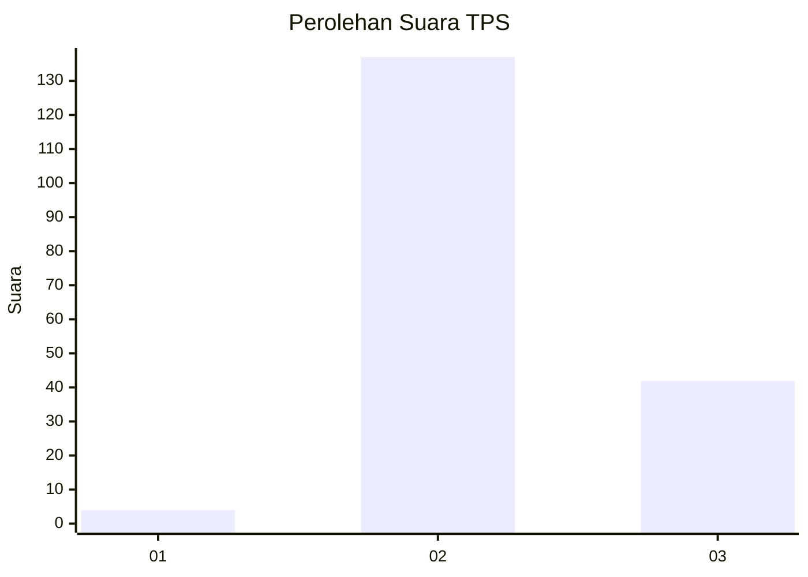
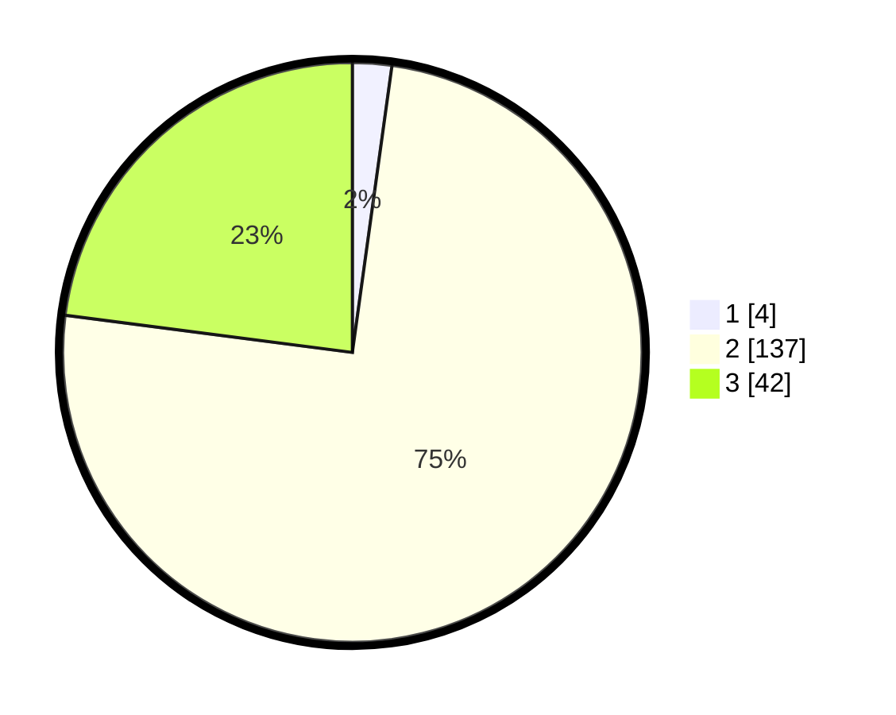

# Hasil

## Grafik

## Tabel

| No. | Nama Paslon    | Suara | Suara (raw) | Persentase |
|:--- |:-------------- | -----:| -----------:| ----------:|
| 1   | ANIES MUHAIMIN | 4     | [4][p-1]    | 2,19       |
| 2   | PRABOWO GIBRAN | 137   | [137][p-2]  | 74,86      |
| 3   | GANJAR MAHFUD  | 42    | [42][p-3]   | 22,95      |

[p-1]: https://github.com/gigit-pemilu/pemilu-2024-51-bali/blob/main/pilpres/hitung-suara/sub/51-bali/sub/05-klungkung/sub/01-nusa-penida/sub/2010-ped/sub/013-tps/sub/paslon-1.txt
[p-2]: https://github.com/gigit-pemilu/pemilu-2024-51-bali/blob/main/pilpres/hitung-suara/sub/51-bali/sub/05-klungkung/sub/01-nusa-penida/sub/2010-ped/sub/013-tps/sub/paslon-2.txt
[p-3]: https://github.com/gigit-pemilu/pemilu-2024-51-bali/blob/main/pilpres/hitung-suara/sub/51-bali/sub/05-klungkung/sub/01-nusa-penida/sub/2010-ped/sub/013-tps/sub/paslon-3.txt

## Foto C Plano

https://sirekap-obj-formc.kpu.go.id/03b4/pemilu/ppwp/51/05/01/20/10/5105012010013-20240214-195828--6a0c920e-c6a8-41d8-aa2a-fe194b4b100e.jpg

https://sirekap-obj-formc.kpu.go.id/03b4/pemilu/ppwp/51/05/01/20/10/5105012010013-20240214-233208--4eb3c43e-4529-4fc3-b2d7-9f86f2ccc153.jpg

https://sirekap-obj-formc.kpu.go.id/03b4/pemilu/ppwp/51/05/01/20/10/5105012010013-20240214-233815--d8836d4a-b0cd-4d27-9476-e8ee36f55cb8.jpg

## Metadata

| Key        | Value               |
| ---------- | ------------------- |
| Time Stamp | 2024-02-15 17:30:25 |

## DATA PEMILIH TETAP

Jumlah pemilih dalam DPT: **209**.
 * L: **105**.
 * P: **104**.

## DATA PENGGUNA HAK PILIH

Jumlah pengguna hak pilih dalam DPT: **186**.
 * L: **94**.
 * P: **92**.

Jumlah pengguna hak pilih dalam DPTb: **0**.
 * L: **0**.
 * P: **0**.

Jumlah pengguna hak pilih dalam DPK: **0**.
 * L: **0**.
 * P: **0**.

Jumlah pengguna hak pilih: **186**.
 * L: **94**.
 * P: **92**.

## JUMLAH SUARA SAH DAN TIDAK SAH

JUMLAH SELURUH SUARA SAH: **183**.

JUMLAH SUARA TIDAK SAH: **3**.

JUMLAH SELURUH SUARA SAH DAN SUARA TIDAK SAH: **186**.

