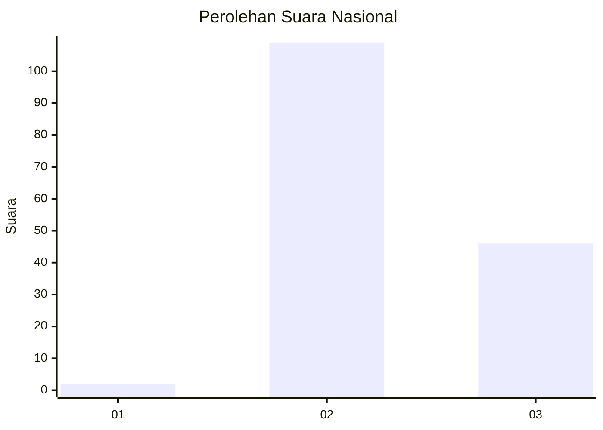

# Hasil

## Grafik

## Tabel

| No. | Nama Paslon    | Suara | Suara (raw) | Persentase |
|:--- |:-------------- | -----:| -----------:| ----------:|
| 1   | ANIES MUHAIMIN | 2     | [2][p-1]    | 1,27       |
| 2   | PRABOWO GIBRAN | 109   | [109][p-2]  | 69,43      |
| 3   | GANJAR MAHFUD  | 46    | [46][p-3]   | 29,30      |

[p-1]: https://github.com/gigit-pemilu/pemilu-2024/blob/main/pilpres/hitung-suara/sub/51-bali/sub/05-klungkung/sub/01-nusa-penida/sub/2010-ped/sub/014-tps/sub/paslon-1.txt
[p-2]: https://github.com/gigit-pemilu/pemilu-2024/blob/main/pilpres/hitung-suara/sub/51-bali/sub/05-klungkung/sub/01-nusa-penida/sub/2010-ped/sub/014-tps/sub/paslon-2.txt
[p-3]: https://github.com/gigit-pemilu/pemilu-2024/blob/main/pilpres/hitung-suara/sub/51-bali/sub/05-klungkung/sub/01-nusa-penida/sub/2010-ped/sub/014-tps/sub/paslon-3.txt

## Foto C Plano

https://sirekap-obj-formc.kpu.go.id/404c/pemilu/ppwp/51/05/01/20/10/5105012010014-20240214-232532--3f6633de-7717-4bf6-8774-f0311b07bbcc.jpg

https://sirekap-obj-formc.kpu.go.id/404c/pemilu/ppwp/51/05/01/20/10/5105012010014-20240214-232608--47b4e50c-df01-4968-b9dd-1a2b9e354e63.jpg

https://sirekap-obj-formc.kpu.go.id/404c/pemilu/ppwp/51/05/01/20/10/5105012010014-20240214-232641--ac1c8dcd-3504-4a0c-b4fe-0d419b010426.jpg

## Metadata

| Key        | Value               |
| ---------- | ------------------- |
| Time Stamp | 2024-02-17 19:30:00 |

## DATA PEMILIH TETAP

Jumlah pemilih dalam DPT: **185**.
 * L: **92**.
 * P: **93**.

## DATA PENGGUNA HAK PILIH

Jumlah pengguna hak pilih dalam DPT: **159**.
 * L: **82**.
 * P: **77**.

Jumlah pengguna hak pilih dalam DPTb: **0**.
 * L: **0**.
 * P: **0**.

Jumlah pengguna hak pilih dalam DPK: **2**.
 * L: **0**.
 * P: **2**.

Jumlah pengguna hak pilih: **161**.
 * L: **82**.
 * P: **79**.

## JUMLAH SUARA SAH DAN TIDAK SAH

JUMLAH SELURUH SUARA SAH: **157**.

JUMLAH SUARA TIDAK SAH: **4**.

JUMLAH SELURUH SUARA SAH DAN SUARA TIDAK SAH: **161**.

