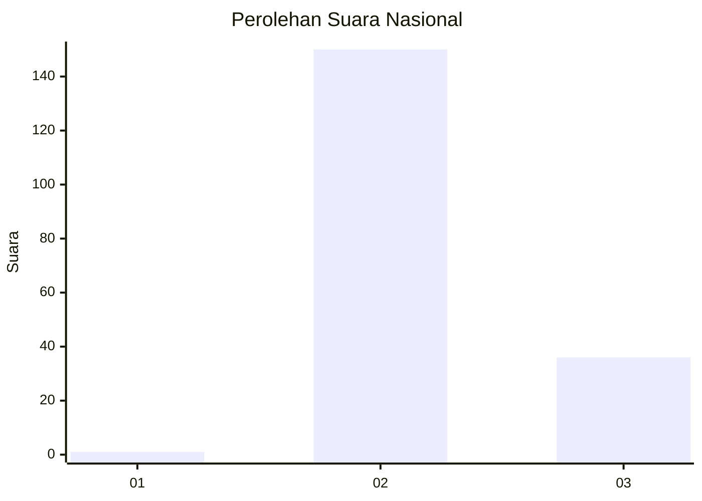
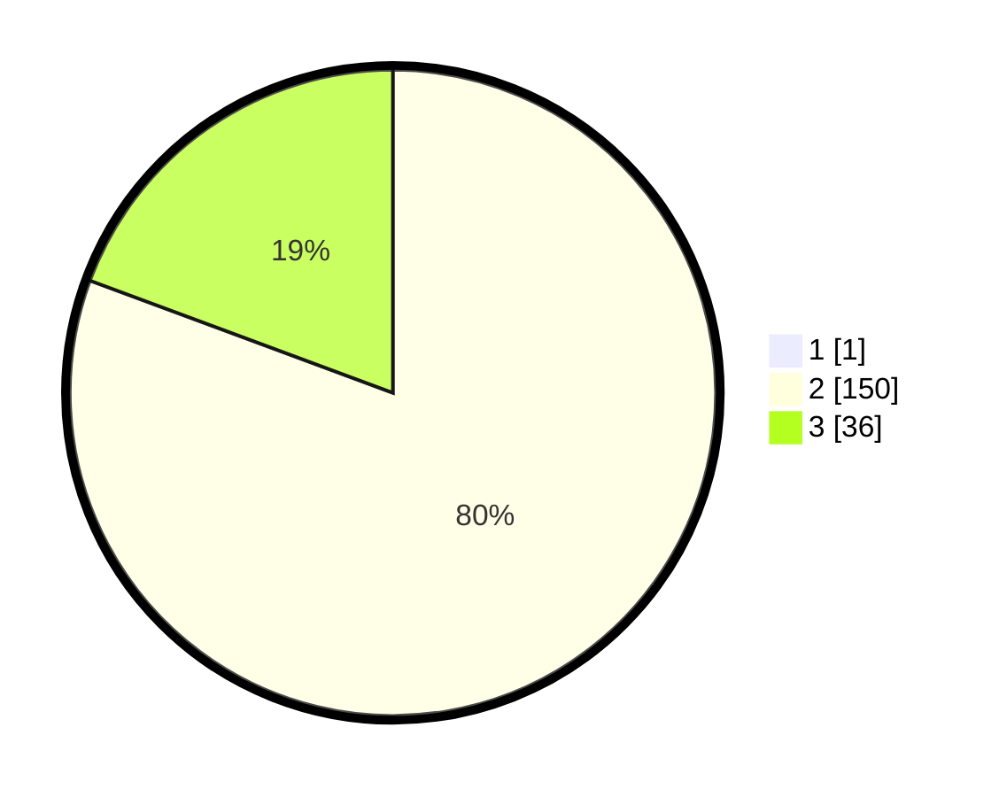

# Hasil

## Grafik

## Tabel

| No. | Nama Paslon    | Suara | Suara (raw) | Persentase |
|:--- |:-------------- | -----:| -----------:| ----------:|
| 1   | ANIES MUHAIMIN | 1     | [1][p-1]    | 0,53       |
| 2   | PRABOWO GIBRAN | 150   | [150][p-2]  | 80,21      |
| 3   | GANJAR MAHFUD  | 36    | [36][p-3]   | 19,25      |

[p-1]: https://github.com/gigit-pemilu/pemilu-2024/blob/main/pilpres/hitung-suara/sub/51-bali/sub/05-klungkung/sub/01-nusa-penida/sub/2010-ped/sub/015-tps/sub/paslon-1.txt
[p-2]: https://github.com/gigit-pemilu/pemilu-2024/blob/main/pilpres/hitung-suara/sub/51-bali/sub/05-klungkung/sub/01-nusa-penida/sub/2010-ped/sub/015-tps/sub/paslon-2.txt
[p-3]: https://github.com/gigit-pemilu/pemilu-2024/blob/main/pilpres/hitung-suara/sub/51-bali/sub/05-klungkung/sub/01-nusa-penida/sub/2010-ped/sub/015-tps/sub/paslon-3.txt

## Foto C Plano

https://sirekap-obj-formc.kpu.go.id/48da/pemilu/ppwp/51/05/01/20/10/5105012010015-20240215-074700--255589d5-7200-473a-af1b-a652a7578249.jpg

https://sirekap-obj-formc.kpu.go.id/48da/pemilu/ppwp/51/05/01/20/10/5105012010015-20240214-221733--84f0e779-d264-4822-91be-fab2910e50a5.jpg

https://sirekap-obj-formc.kpu.go.id/48da/pemilu/ppwp/51/05/01/20/10/5105012010015-20240215-074548--31c57ac3-52f0-48ac-a75a-64cae4948329.jpg

## Metadata

| Key        | Value               |
| ---------- | ------------------- |
| Time Stamp | 2024-02-15 21:01:18 |

