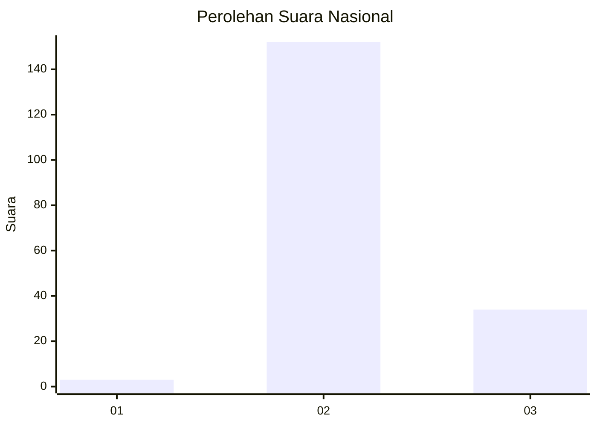
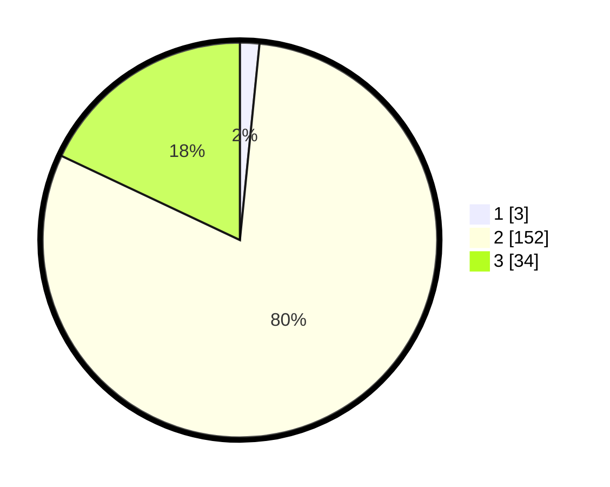

# Hasil

## Grafik

## Tabel

| No. | Nama Paslon    | Suara | Suara (raw) | Persentase |
|:--- |:-------------- | -----:| -----------:| ----------:|
| 1   | ANIES MUHAIMIN | 3     | [3][p-1]    | 1,59       |
| 2   | PRABOWO GIBRAN | 152   | [152][p-2]  | 80,42      |
| 3   | GANJAR MAHFUD  | 34    | [34][p-3]   | 17,99      |

[p-1]: https://github.com/gigit-pemilu/pemilu-2024/blob/main/pilpres/hitung-suara/sub/51-bali/sub/05-klungkung/sub/01-nusa-penida/sub/2010-ped/sub/016-tps/sub/paslon-1.txt
[p-2]: https://github.com/gigit-pemilu/pemilu-2024/blob/main/pilpres/hitung-suara/sub/51-bali/sub/05-klungkung/sub/01-nusa-penida/sub/2010-ped/sub/016-tps/sub/paslon-2.txt
[p-3]: https://github.com/gigit-pemilu/pemilu-2024/blob/main/pilpres/hitung-suara/sub/51-bali/sub/05-klungkung/sub/01-nusa-penida/sub/2010-ped/sub/016-tps/sub/paslon-3.txt

## Foto C Plano

https://sirekap-obj-formc.kpu.go.id/46c4/pemilu/ppwp/51/05/01/20/10/5105012010016-20240215-074508--11e508b4-d73b-4cc4-8b1d-a82d7450e41f.jpg

https://sirekap-obj-formc.kpu.go.id/46c4/pemilu/ppwp/51/05/01/20/10/5105012010016-20240214-155756--8b326364-7c96-428d-ac8c-f6d591d81bc3.jpg

https://sirekap-obj-formc.kpu.go.id/46c4/pemilu/ppwp/51/05/01/20/10/5105012010016-20240214-155801--f2ba64f6-6bab-4b2a-b39e-1f191dbecbeb.jpg

## Metadata

| Key        | Value               |
| ---------- | ------------------- |
| Time Stamp | 2024-02-15 09:00:24 |

