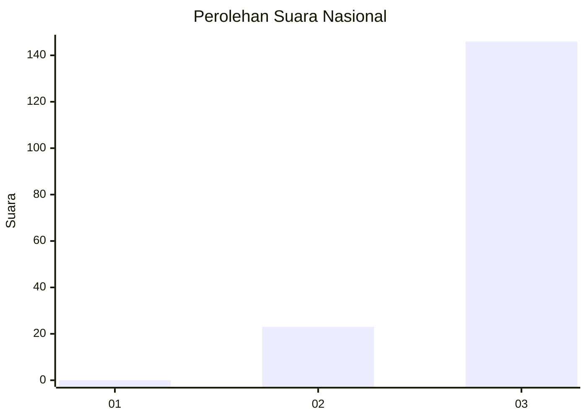
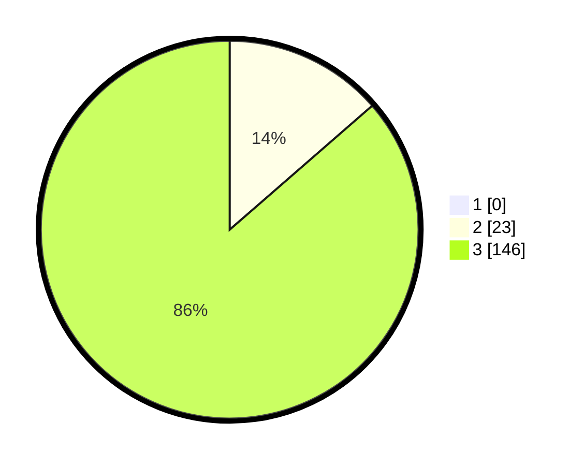

# Hasil

## Grafik

## Tabel

| No. | Nama Paslon    | Suara | Suara (raw) | Persentase |
|:--- |:-------------- | -----:| -----------:| ----------:|
| 1   | ANIES MUHAIMIN | 0     | [0][p-1]    | 0,00       |
| 2   | PRABOWO GIBRAN | 23    | [23][p-2]   | 13,61      |
| 3   | GANJAR MAHFUD  | 146   | [146][p-3]  | 86,39      |

[p-1]: https://github.com/gigit-pemilu/pemilu-2024/blob/main/pilpres/hitung-suara/sub/51-bali/sub/05-klungkung/sub/01-nusa-penida/sub/2010-ped/sub/017-tps/sub/paslon-1.txt
[p-2]: https://github.com/gigit-pemilu/pemilu-2024/blob/main/pilpres/hitung-suara/sub/51-bali/sub/05-klungkung/sub/01-nusa-penida/sub/2010-ped/sub/017-tps/sub/paslon-2.txt
[p-3]: https://github.com/gigit-pemilu/pemilu-2024/blob/main/pilpres/hitung-suara/sub/51-bali/sub/05-klungkung/sub/01-nusa-penida/sub/2010-ped/sub/017-tps/sub/paslon-3.txt

## Foto C Plano

https://sirekap-obj-formc.kpu.go.id/e024/pemilu/ppwp/51/05/01/20/10/5105012010017-20240214-233851--ea55a136-1670-4b60-be85-2fc4776cc185.jpg

https://sirekap-obj-formc.kpu.go.id/e024/pemilu/ppwp/51/05/01/20/10/5105012010017-20240214-205617--0c2027a2-288e-4102-b39c-2e3788c241db.jpg

https://sirekap-obj-formc.kpu.go.id/e024/pemilu/ppwp/51/05/01/20/10/5105012010017-20240214-234055--2369546a-b539-48b2-8e7f-b64853771f4e.jpg

## Metadata

| Key        | Value               |
| ---------- | ------------------- |
| Time Stamp | 2024-02-15 19:30:26 |

