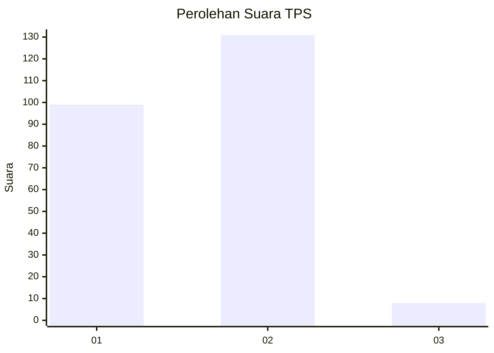
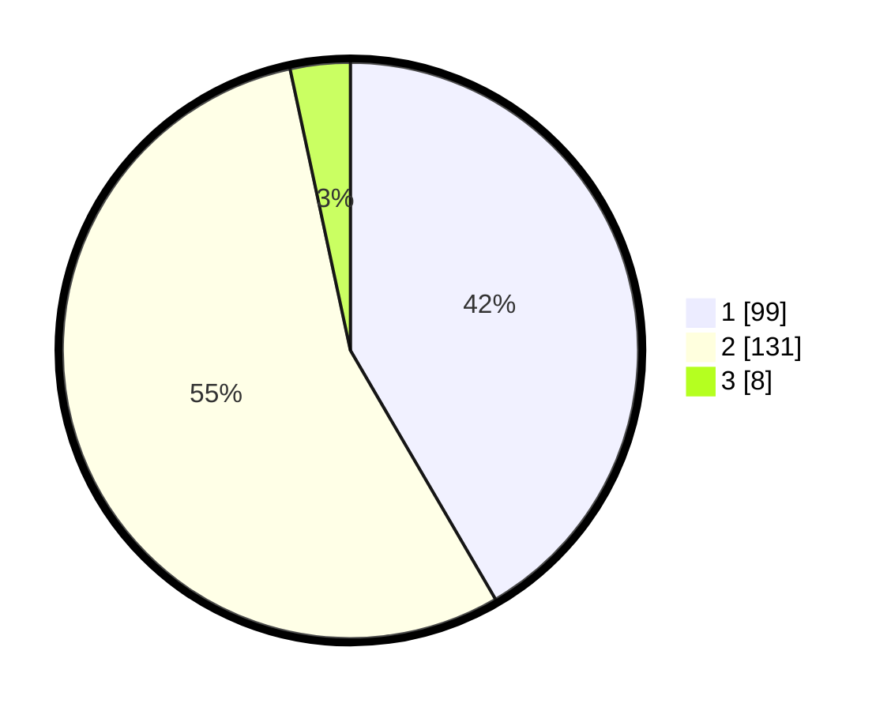

# Hasil

## Grafik

## Tabel

| No. | Nama Paslon    | Suara | Suara (raw) | Persentase |
|:--- |:-------------- | -----:| -----------:| ----------:|
| 1   | ANIES MUHAIMIN | 99    | [99][p-1]   | 41,60      |
| 2   | PRABOWO GIBRAN | 131   | [131][p-2]  | 55,04      |
| 3   | GANJAR MAHFUD  | 8     | [8][p-3]    | 3,36       |

[p-1]: https://github.com/gigit-pemilu/pemilu-2024-51-bali/blob/main/pilpres/hitung-suara/sub/51-bali/sub/05-klungkung/sub/01-nusa-penida/sub/2011-kampung-toyapakeh/sub/001-tps/sub/paslon-1.txt
[p-2]: https://github.com/gigit-pemilu/pemilu-2024-51-bali/blob/main/pilpres/hitung-suara/sub/51-bali/sub/05-klungkung/sub/01-nusa-penida/sub/2011-kampung-toyapakeh/sub/001-tps/sub/paslon-2.txt
[p-3]: https://github.com/gigit-pemilu/pemilu-2024-51-bali/blob/main/pilpres/hitung-suara/sub/51-bali/sub/05-klungkung/sub/01-nusa-penida/sub/2011-kampung-toyapakeh/sub/001-tps/sub/paslon-3.txt

## Foto C Plano

https://sirekap-obj-formc.kpu.go.id/b248/pemilu/ppwp/51/05/01/20/11/5105012011001-20240214-215909--bc0fa9b4-6e2f-40da-93c8-8f923b557652.jpg

https://sirekap-obj-formc.kpu.go.id/b248/pemilu/ppwp/51/05/01/20/11/5105012011001-20240214-200354--3dfa05af-d64c-47a7-a358-6db2fa0c28ca.jpg

https://sirekap-obj-formc.kpu.go.id/b248/pemilu/ppwp/51/05/01/20/11/5105012011001-20240214-201935--f3e07bac-833f-4419-8925-573016febf00.jpg

## Metadata

| Key        | Value               |
| ---------- | ------------------- |
| Time Stamp | 2024-02-15 12:00:28 |

