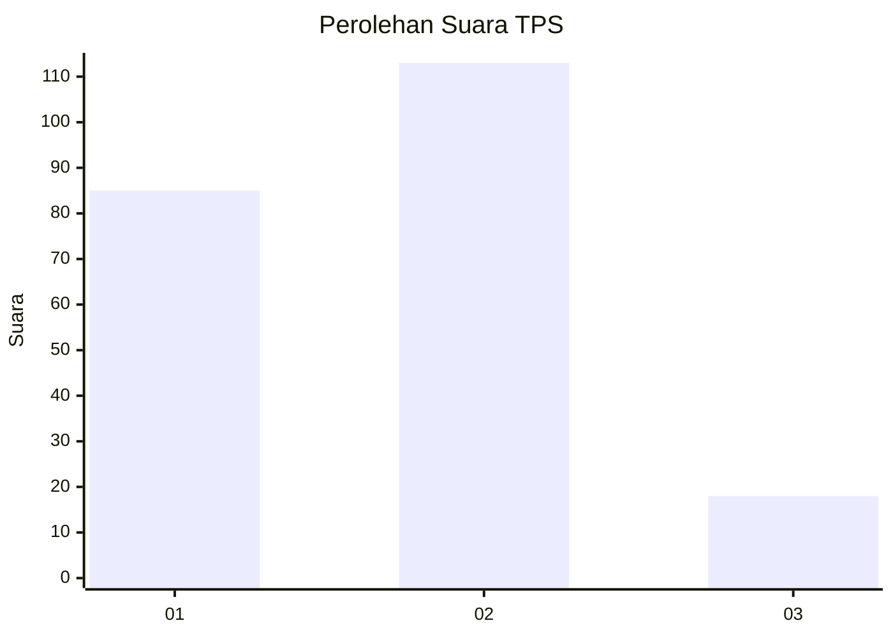
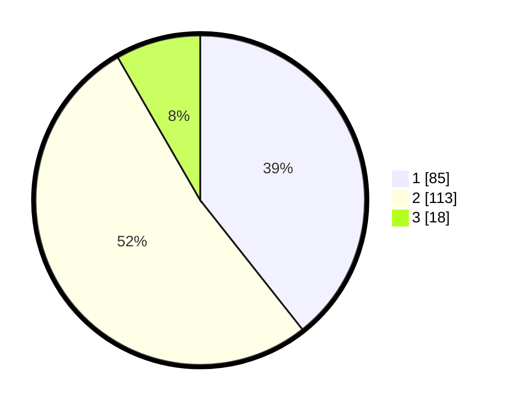

# Hasil

## Grafik

## Tabel

| No. | Nama Paslon    | Suara | Suara (raw) | Persentase |
|:--- |:-------------- | -----:| -----------:| ----------:|
| 1   | ANIES MUHAIMIN | 85    | [85][p-1]   | 39,35      |
| 2   | PRABOWO GIBRAN | 113   | [113][p-2]  | 52,31      |
| 3   | GANJAR MAHFUD  | 18    | [18][p-3]   | 8,33       |

[p-1]: https://github.com/gigit-pemilu/pemilu-2024-51-bali/blob/main/pilpres/hitung-suara/sub/51-bali/sub/05-klungkung/sub/01-nusa-penida/sub/2011-kampung-toyapakeh/sub/002-tps/sub/paslon-1.txt
[p-2]: https://github.com/gigit-pemilu/pemilu-2024-51-bali/blob/main/pilpres/hitung-suara/sub/51-bali/sub/05-klungkung/sub/01-nusa-penida/sub/2011-kampung-toyapakeh/sub/002-tps/sub/paslon-2.txt
[p-3]: https://github.com/gigit-pemilu/pemilu-2024-51-bali/blob/main/pilpres/hitung-suara/sub/51-bali/sub/05-klungkung/sub/01-nusa-penida/sub/2011-kampung-toyapakeh/sub/002-tps/sub/paslon-3.txt

## Foto C Plano

https://sirekap-obj-formc.kpu.go.id/80c0/pemilu/ppwp/51/05/01/20/11/5105012011002-20240214-211858--6dd3fb76-a2c9-4385-88da-7c9b352cc17a.jpg

https://sirekap-obj-formc.kpu.go.id/80c0/pemilu/ppwp/51/05/01/20/11/5105012011002-20240214-231751--fe9aefa0-f112-4d23-b864-ec7b7d78fc2a.jpg

https://sirekap-obj-formc.kpu.go.id/80c0/pemilu/ppwp/51/05/01/20/11/5105012011002-20240214-231603--d3a6e8b6-df06-47fb-b4b4-e96896dd7911.jpg

## Metadata

| Key        | Value               |
| ---------- | ------------------- |
| Time Stamp | 2024-02-15 16:00:26 |

