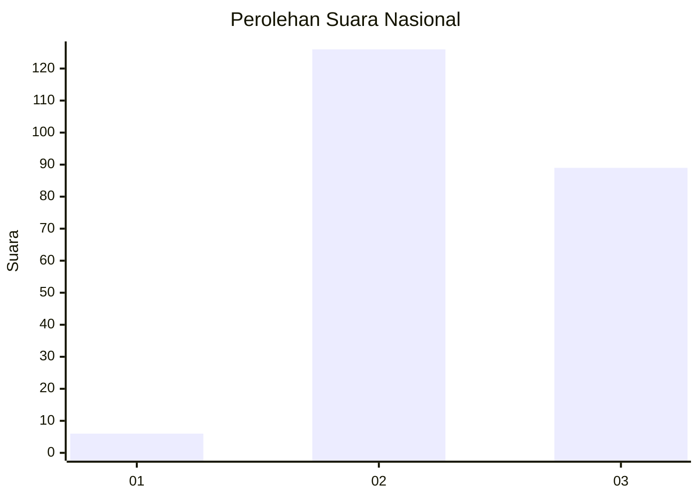
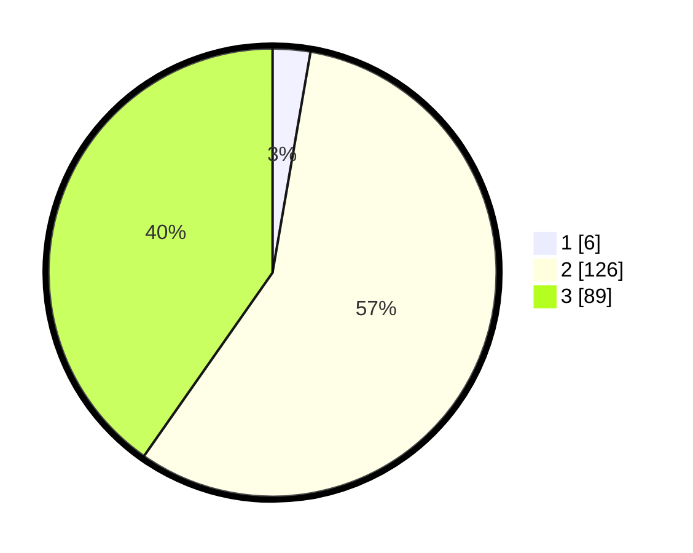

# Hasil

## Grafik

## Tabel

| No. | Nama Paslon    | Suara | Suara (raw) | Persentase |
|:--- |:-------------- | -----:| -----------:| ----------:|
| 1   | ANIES MUHAIMIN | 6     | [6][p-1]    | 2,71       |
| 2   | PRABOWO GIBRAN | 126   | [126][p-2]  | 57,01      |
| 3   | GANJAR MAHFUD  | 89    | [89][p-3]   | 40,27      |

[p-1]: https://github.com/gigit-pemilu/pemilu-2024/blob/main/pilpres/hitung-suara/sub/51-bali/sub/05-klungkung/sub/01-nusa-penida/sub/2012-lembongan/sub/012-tps/sub/paslon-1.txt
[p-2]: https://github.com/gigit-pemilu/pemilu-2024/blob/main/pilpres/hitung-suara/sub/51-bali/sub/05-klungkung/sub/01-nusa-penida/sub/2012-lembongan/sub/012-tps/sub/paslon-2.txt
[p-3]: https://github.com/gigit-pemilu/pemilu-2024/blob/main/pilpres/hitung-suara/sub/51-bali/sub/05-klungkung/sub/01-nusa-penida/sub/2012-lembongan/sub/012-tps/sub/paslon-3.txt

## Foto C Plano

https://sirekap-obj-formc.kpu.go.id/eb03/pemilu/ppwp/51/05/01/20/12/5105012012012-20240220-155521--26422e39-779b-4a0a-9752-62b2ca0109fc.jpg

https://sirekap-obj-formc.kpu.go.id/eb03/pemilu/ppwp/51/05/01/20/12/5105012012012-20240220-155611--8eef753a-0f93-4c0a-bf0b-faacf910aac8.jpg

https://sirekap-obj-formc.kpu.go.id/eb03/pemilu/ppwp/51/05/01/20/12/5105012012012-20240220-155653--f5af60ca-2ca7-4c55-9320-10ff3c206591.jpg

## Metadata

| Key        | Value               |
| ---------- | ------------------- |
| Time Stamp | 2024-03-01 14:00:00 |

