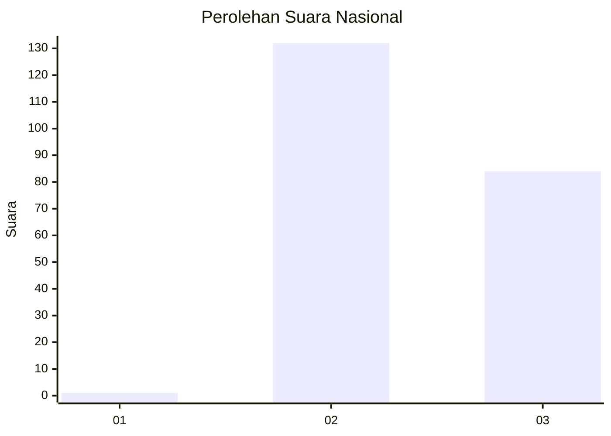
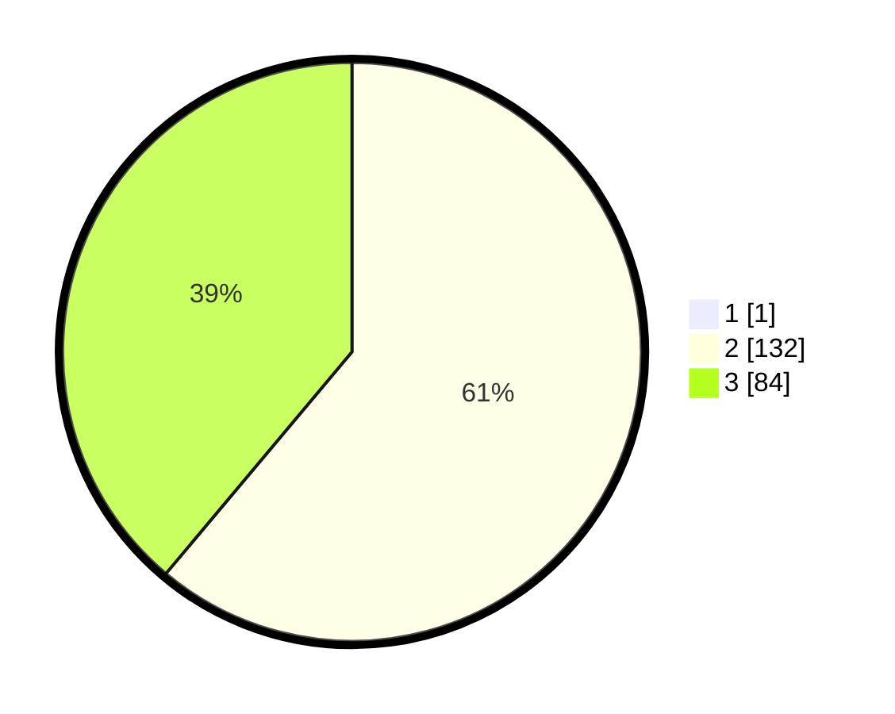

# Hasil

## Grafik

## Tabel

| No. | Nama Paslon    | Suara | Suara (raw) | Persentase |
|:--- |:-------------- | -----:| -----------:| ----------:|
| 1   | ANIES MUHAIMIN | 1     | [1][p-1]    | 0,46       |
| 2   | PRABOWO GIBRAN | 132   | [132][p-2]  | 60,83      |
| 3   | GANJAR MAHFUD  | 84    | [84][p-3]   | 38,71      |

[p-1]: https://github.com/gigit-pemilu/pemilu-2024/blob/main/pilpres/hitung-suara/sub/51-bali/sub/05-klungkung/sub/01-nusa-penida/sub/2013-jungutbatu/sub/002-tps/sub/paslon-1.txt
[p-2]: https://github.com/gigit-pemilu/pemilu-2024/blob/main/pilpres/hitung-suara/sub/51-bali/sub/05-klungkung/sub/01-nusa-penida/sub/2013-jungutbatu/sub/002-tps/sub/paslon-2.txt
[p-3]: https://github.com/gigit-pemilu/pemilu-2024/blob/main/pilpres/hitung-suara/sub/51-bali/sub/05-klungkung/sub/01-nusa-penida/sub/2013-jungutbatu/sub/002-tps/sub/paslon-3.txt

## Foto C Plano

https://sirekap-obj-formc.kpu.go.id/cac5/pemilu/ppwp/51/05/01/20/13/5105012013002-20240214-221308--75ab7704-f2e2-47d5-b12f-cceb262b0a12.jpg

https://sirekap-obj-formc.kpu.go.id/cac5/pemilu/ppwp/51/05/01/20/13/5105012013002-20240214-221515--0848d3e8-29c0-460b-bb21-71c9229db439.jpg

https://sirekap-obj-formc.kpu.go.id/cac5/pemilu/ppwp/51/05/01/20/13/5105012013002-20240214-221630--2d095f48-3efc-4c47-9347-4adc8b7ecc92.jpg

## Metadata

| Key        | Value               |
| ---------- | ------------------- |
| Time Stamp | 2024-02-15 09:00:24 |

