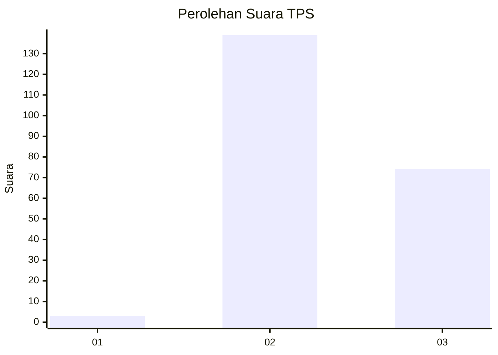
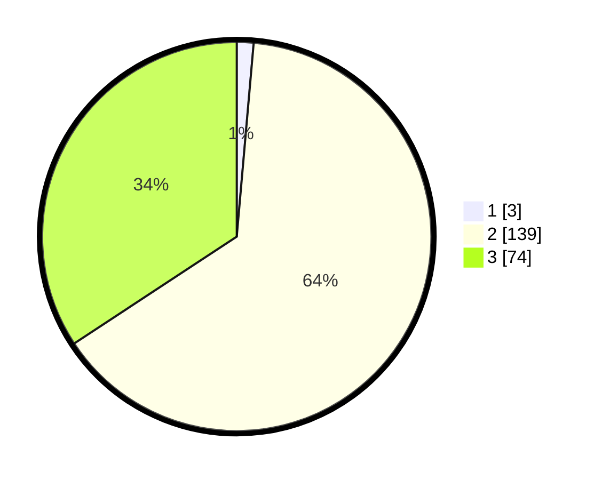

# Hasil

## Grafik

## Tabel

| No. | Nama Paslon    | Suara | Suara (raw) | Persentase |
|:--- |:-------------- | -----:| -----------:| ----------:|
| 1   | ANIES MUHAIMIN | 3     | [3][p-1]    | 1,39       |
| 2   | PRABOWO GIBRAN | 139   | [139][p-2]  | 64,35      |
| 3   | GANJAR MAHFUD  | 74    | [74][p-3]   | 34,26      |

[p-1]: https://github.com/gigit-pemilu/pemilu-2024-51-bali/blob/main/pilpres/hitung-suara/sub/51-bali/sub/05-klungkung/sub/01-nusa-penida/sub/2013-jungutbatu/sub/005-tps/sub/paslon-1.txt
[p-2]: https://github.com/gigit-pemilu/pemilu-2024-51-bali/blob/main/pilpres/hitung-suara/sub/51-bali/sub/05-klungkung/sub/01-nusa-penida/sub/2013-jungutbatu/sub/005-tps/sub/paslon-2.txt
[p-3]: https://github.com/gigit-pemilu/pemilu-2024-51-bali/blob/main/pilpres/hitung-suara/sub/51-bali/sub/05-klungkung/sub/01-nusa-penida/sub/2013-jungutbatu/sub/005-tps/sub/paslon-3.txt

## Foto C Plano

https://sirekap-obj-formc.kpu.go.id/8784/pemilu/ppwp/51/05/01/20/13/5105012013005-20240216-135200--fb5fd371-cf11-4ea1-be26-33d056f24b50.jpg

https://sirekap-obj-formc.kpu.go.id/8784/pemilu/ppwp/51/05/01/20/13/5105012013005-20240216-135202--1945e905-7b77-4dad-ad5d-4667d3ed5c3c.jpg

https://sirekap-obj-formc.kpu.go.id/8784/pemilu/ppwp/51/05/01/20/13/5105012013005-20240216-135201--d612d3ae-bfa9-41cb-93c3-94ab92474a24.jpg

## Metadata

| Key        | Value               |
| ---------- | ------------------- |
| Time Stamp | 2024-02-17 03:00:02 |

## DATA PEMILIH TETAP

Jumlah pemilih dalam DPT: **263**.
 * L: **132**.
 * P: **131**.

## DATA PENGGUNA HAK PILIH

Jumlah pengguna hak pilih dalam DPT: **217**.
 * L: **116**.
 * P: **101**.

Jumlah pengguna hak pilih dalam DPTb: **0**.
 * L: **0**.
 * P: **0**.

Jumlah pengguna hak pilih dalam DPK: **1**.
 * L: **0**.
 * P: **1**.

Jumlah pengguna hak pilih: **218**.
 * L: **116**.
 * P: **102**.

## JUMLAH SUARA SAH DAN TIDAK SAH

JUMLAH SELURUH SUARA SAH: **216**.

JUMLAH SUARA TIDAK SAH: **2**.

JUMLAH SELURUH SUARA SAH DAN SUARA TIDAK SAH: **218**.

