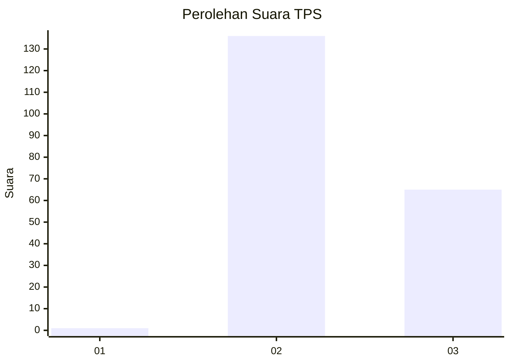
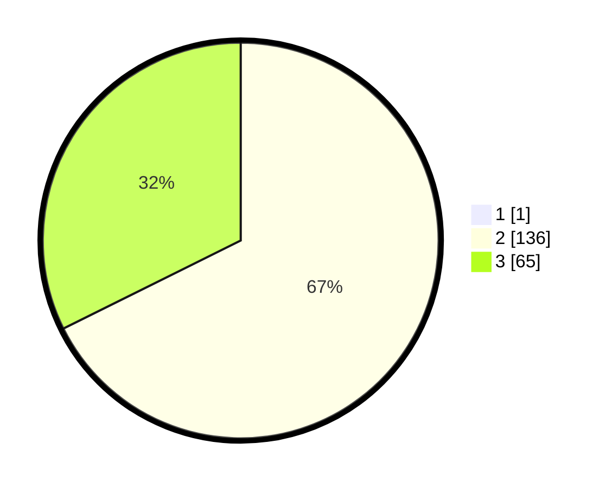

# Hasil

## Grafik

## Tabel

| No. | Nama Paslon    | Suara | Suara (raw) | Persentase |
|:--- |:-------------- | -----:| -----------:| ----------:|
| 1   | ANIES MUHAIMIN | 1     | [1][p-1]    | 0,50       |
| 2   | PRABOWO GIBRAN | 136   | [136][p-2]  | 67,33      |
| 3   | GANJAR MAHFUD  | 65    | [65][p-3]   | 32,18      |

[p-1]: https://github.com/gigit-pemilu/pemilu-2024-51-bali/blob/main/pilpres/hitung-suara/sub/51-bali/sub/05-klungkung/sub/01-nusa-penida/sub/2013-jungutbatu/sub/007-tps/sub/paslon-1.txt
[p-2]: https://github.com/gigit-pemilu/pemilu-2024-51-bali/blob/main/pilpres/hitung-suara/sub/51-bali/sub/05-klungkung/sub/01-nusa-penida/sub/2013-jungutbatu/sub/007-tps/sub/paslon-2.txt
[p-3]: https://github.com/gigit-pemilu/pemilu-2024-51-bali/blob/main/pilpres/hitung-suara/sub/51-bali/sub/05-klungkung/sub/01-nusa-penida/sub/2013-jungutbatu/sub/007-tps/sub/paslon-3.txt

## Foto C Plano

https://sirekap-obj-formc.kpu.go.id/28b0/pemilu/ppwp/51/05/01/20/13/5105012013007-20240217-211308--55b7b6aa-d244-413e-852a-10df6da73996.jpg

https://sirekap-obj-formc.kpu.go.id/28b0/pemilu/ppwp/51/05/01/20/13/5105012013007-20240217-211309--902ee843-6fb3-4c47-a623-9b78d55bc6ca.jpg

https://sirekap-obj-formc.kpu.go.id/28b0/pemilu/ppwp/51/05/01/20/13/5105012013007-20240217-211308--2500a287-6704-40a9-9cf6-a6a9f9192567.jpg

## Metadata

| Key        | Value               |
| ---------- | ------------------- |
| Time Stamp | 2024-02-19 13:00:00 |

## DATA PEMILIH TETAP

Jumlah pemilih dalam DPT: **256**.
 * L: **122**.
 * P: **134**.

## DATA PENGGUNA HAK PILIH

Jumlah pengguna hak pilih dalam DPT: **204**.
 * L: **104**.
 * P: **100**.

Jumlah pengguna hak pilih dalam DPTb: **0**.
 * L: **0**.
 * P: **0**.

Jumlah pengguna hak pilih dalam DPK: **1**.
 * L: **1**.
 * P: **0**.

Jumlah pengguna hak pilih: **205**.
 * L: **105**.
 * P: **100**.

## JUMLAH SUARA SAH DAN TIDAK SAH

JUMLAH SELURUH SUARA SAH: **202**.

JUMLAH SUARA TIDAK SAH: **3**.

JUMLAH SELURUH SUARA SAH DAN SUARA TIDAK SAH: **205**.

