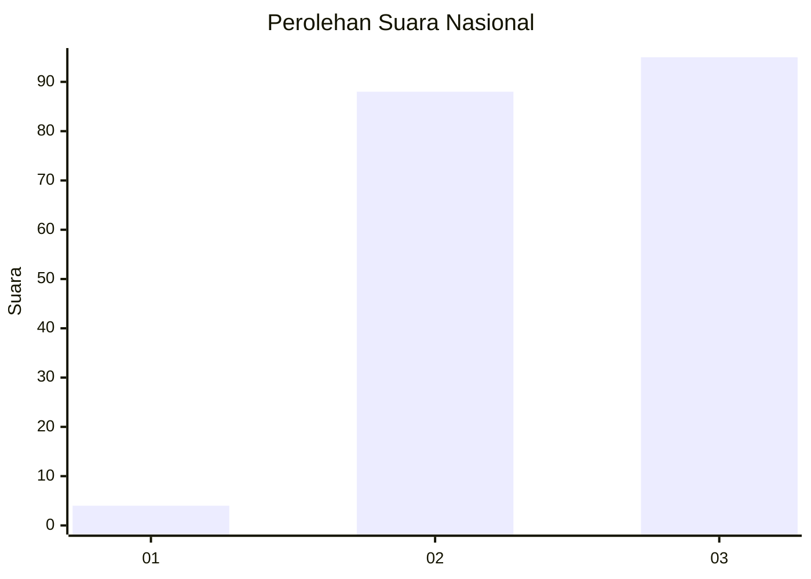
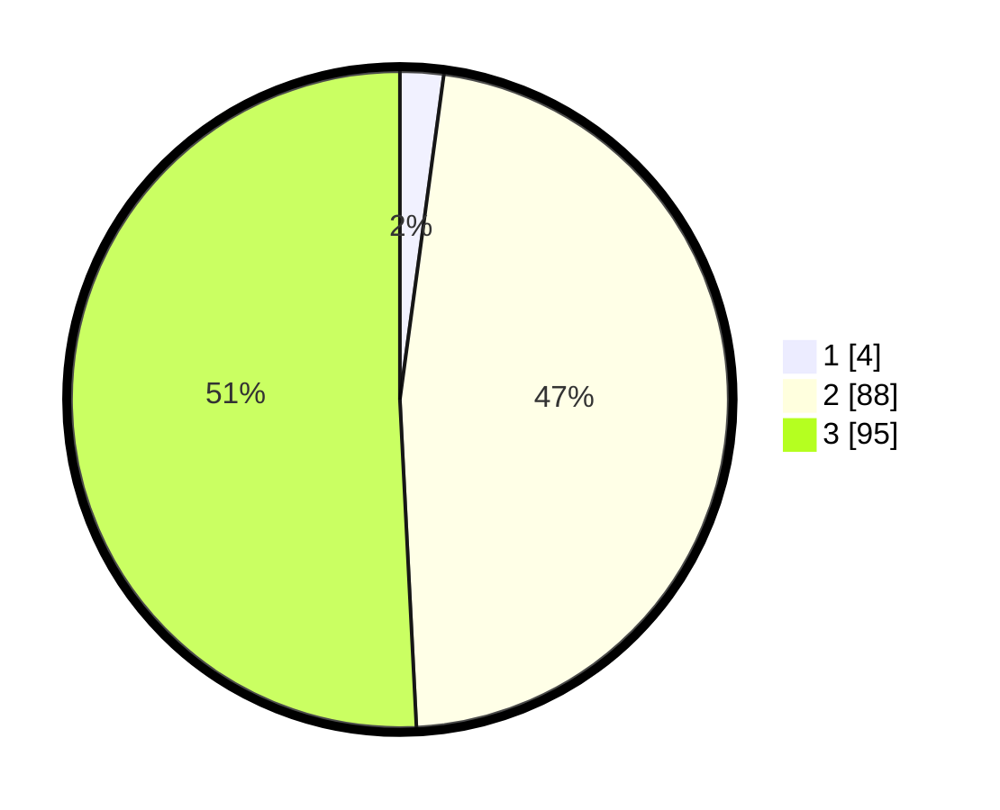

# Hasil

## Grafik

## Tabel

| No. | Nama Paslon    | Suara | Suara (raw) | Persentase |
|:--- |:-------------- | -----:| -----------:| ----------:|
| 1   | ANIES MUHAIMIN | 4     | [4][p-1]    | 2,14       |
| 2   | PRABOWO GIBRAN | 88    | [88][p-2]   | 47,06      |
| 3   | GANJAR MAHFUD  | 95    | [95][p-3]   | 50,80      |

[p-1]: https://github.com/gigit-pemilu/pemilu-2024/blob/main/pilpres/hitung-suara/sub/51-bali/sub/05-klungkung/sub/01-nusa-penida/sub/2013-jungutbatu/sub/009-tps/sub/paslon-1.txt
[p-2]: https://github.com/gigit-pemilu/pemilu-2024/blob/main/pilpres/hitung-suara/sub/51-bali/sub/05-klungkung/sub/01-nusa-penida/sub/2013-jungutbatu/sub/009-tps/sub/paslon-2.txt
[p-3]: https://github.com/gigit-pemilu/pemilu-2024/blob/main/pilpres/hitung-suara/sub/51-bali/sub/05-klungkung/sub/01-nusa-penida/sub/2013-jungutbatu/sub/009-tps/sub/paslon-3.txt

## Foto C Plano

https://sirekap-obj-formc.kpu.go.id/0472/pemilu/ppwp/51/05/01/20/13/5105012013009-20240214-231610--38259213-b580-45c6-9ba9-95861867032a.jpg

https://sirekap-obj-formc.kpu.go.id/0472/pemilu/ppwp/51/05/01/20/13/5105012013009-20240214-231255--366cb5ee-14cd-42b4-afe8-a32c058af74e.jpg

https://sirekap-obj-formc.kpu.go.id/0472/pemilu/ppwp/51/05/01/20/13/5105012013009-20240214-231444--5babeabd-3a0b-4157-b372-9f283494a564.jpg

## Metadata

| Key        | Value               |
| ---------- | ------------------- |
| Time Stamp | 2024-02-15 15:00:29 |

