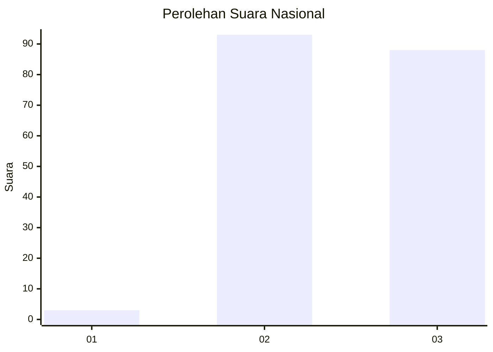
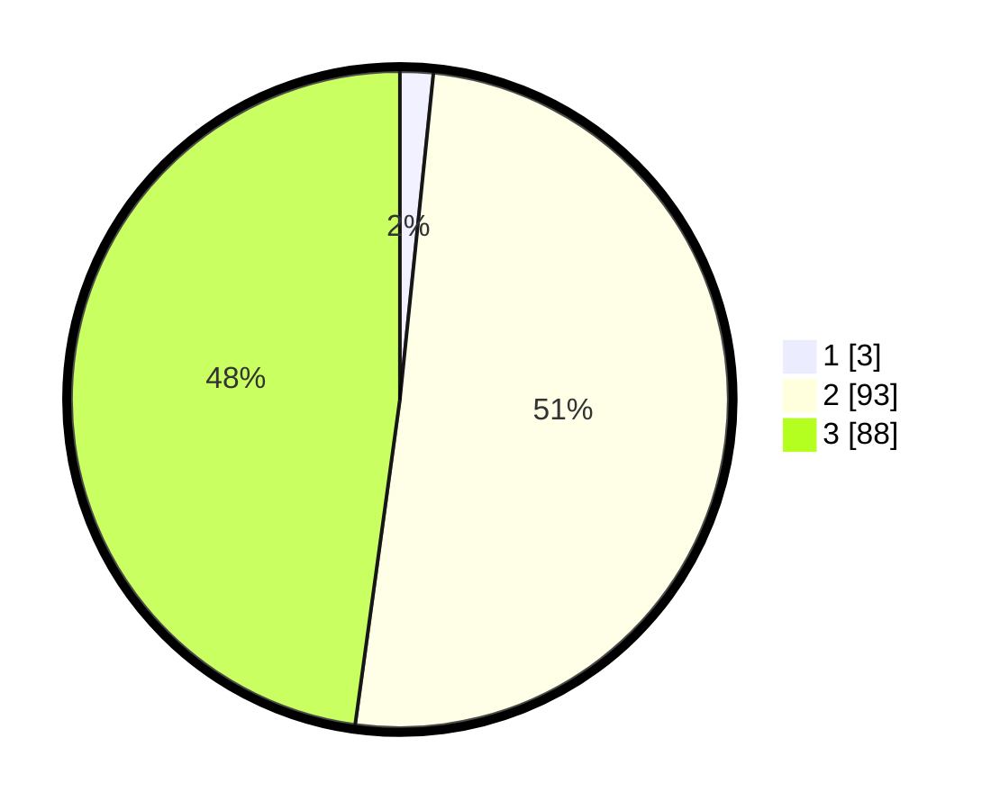

# Hasil

## Grafik

## Tabel

| No. | Nama Paslon    | Suara | Suara (raw) | Persentase |
|:--- |:-------------- | -----:| -----------:| ----------:|
| 1   | ANIES MUHAIMIN | 3     | [3][p-1]    | 1,63       |
| 2   | PRABOWO GIBRAN | 93    | [93][p-2]   | 50,54      |
| 3   | GANJAR MAHFUD  | 88    | [88][p-3]   | 47,83      |

[p-1]: https://github.com/gigit-pemilu/pemilu-2024/blob/main/pilpres/hitung-suara/sub/51-bali/sub/05-klungkung/sub/01-nusa-penida/sub/2013-jungutbatu/sub/010-tps/sub/paslon-1.txt
[p-2]: https://github.com/gigit-pemilu/pemilu-2024/blob/main/pilpres/hitung-suara/sub/51-bali/sub/05-klungkung/sub/01-nusa-penida/sub/2013-jungutbatu/sub/010-tps/sub/paslon-2.txt
[p-3]: https://github.com/gigit-pemilu/pemilu-2024/blob/main/pilpres/hitung-suara/sub/51-bali/sub/05-klungkung/sub/01-nusa-penida/sub/2013-jungutbatu/sub/010-tps/sub/paslon-3.txt

## Foto C Plano

https://sirekap-obj-formc.kpu.go.id/c56e/pemilu/ppwp/51/05/01/20/13/5105012013010-20240218-131312--7c8da966-80bb-458e-ab7d-6e63fe2652a1.jpg

https://sirekap-obj-formc.kpu.go.id/c56e/pemilu/ppwp/51/05/01/20/13/5105012013010-20240218-131314--c03f740b-d50b-4632-acd5-8cccb3af057c.jpg

https://sirekap-obj-formc.kpu.go.id/c56e/pemilu/ppwp/51/05/01/20/13/5105012013010-20240218-131313--8d184b1b-292d-407f-b055-c398e21b3116.jpg

## Metadata

| Key        | Value               |
| ---------- | ------------------- |
| Time Stamp | 2024-02-19 13:00:00 |

## DATA PEMILIH TETAP

Jumlah pemilih dalam DPT: **244**.
 * L: **119**.
 * P: **125**.

## DATA PENGGUNA HAK PILIH

Jumlah pengguna hak pilih dalam DPT: **189**.
 * L: **99**.
 * P: **90**.

Jumlah pengguna hak pilih dalam DPTb: **0**.
 * L: **0**.
 * P: **0**.

Jumlah pengguna hak pilih dalam DPK: **0**.
 * L: **0**.
 * P: **0**.

Jumlah pengguna hak pilih: **189**.
 * L: **99**.
 * P: **90**.

## JUMLAH SUARA SAH DAN TIDAK SAH

JUMLAH SELURUH SUARA SAH: **184**.

JUMLAH SUARA TIDAK SAH: **5**.

JUMLAH SELURUH SUARA SAH DAN SUARA TIDAK SAH: **189**.

