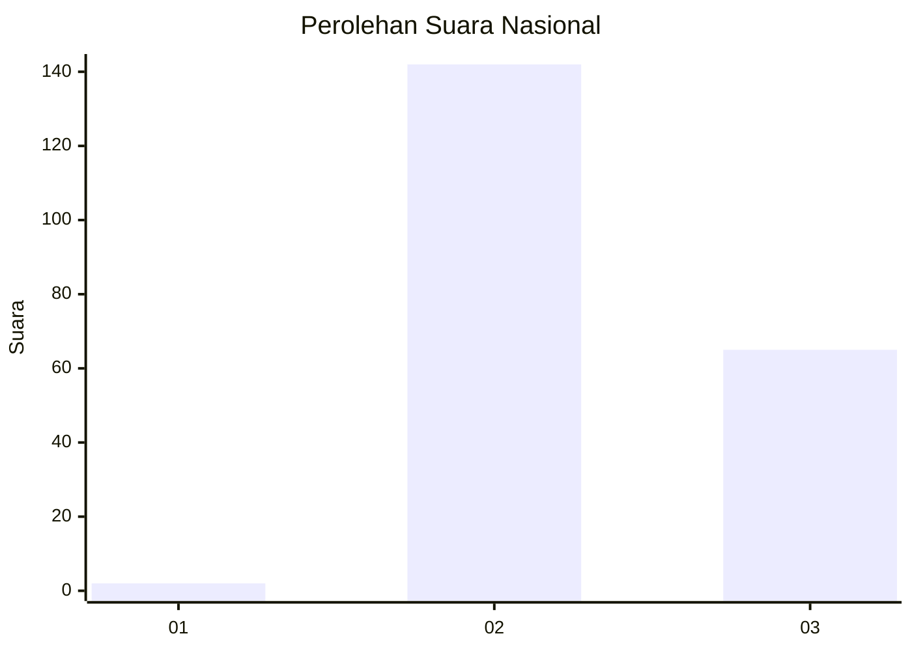
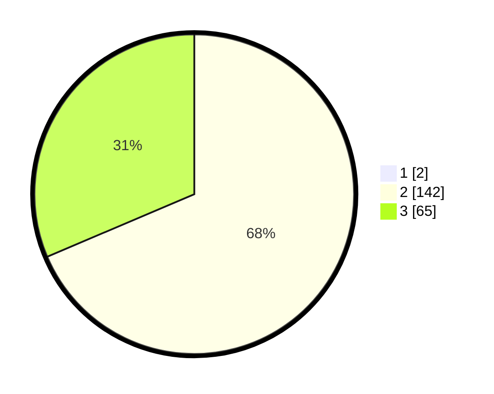

# Hasil

## Grafik

## Tabel

| No. | Nama Paslon    | Suara | Suara (raw) | Persentase |
|:--- |:-------------- | -----:| -----------:| ----------:|
| 1   | ANIES MUHAIMIN | 2     | [2][p-1]    | 0,96       |
| 2   | PRABOWO GIBRAN | 142   | [142][p-2]  | 67,94      |
| 3   | GANJAR MAHFUD  | 65    | [65][p-3]   | 31,10      |

[p-1]: https://github.com/gigit-pemilu/pemilu-2024/blob/main/pilpres/hitung-suara/sub/51-bali/sub/05-klungkung/sub/01-nusa-penida/sub/2013-jungutbatu/sub/011-tps/sub/paslon-1.txt
[p-2]: https://github.com/gigit-pemilu/pemilu-2024/blob/main/pilpres/hitung-suara/sub/51-bali/sub/05-klungkung/sub/01-nusa-penida/sub/2013-jungutbatu/sub/011-tps/sub/paslon-2.txt
[p-3]: https://github.com/gigit-pemilu/pemilu-2024/blob/main/pilpres/hitung-suara/sub/51-bali/sub/05-klungkung/sub/01-nusa-penida/sub/2013-jungutbatu/sub/011-tps/sub/paslon-3.txt

## Foto C Plano

https://sirekap-obj-formc.kpu.go.id/f106/pemilu/ppwp/51/05/01/20/13/5105012013011-20240214-223651--e9a70fe6-c62e-4f53-8781-b31aca2ec054.jpg

https://sirekap-obj-formc.kpu.go.id/f106/pemilu/ppwp/51/05/01/20/13/5105012013011-20240214-223829--e9f378aa-b489-4fb8-9fce-b1c10aa345d6.jpg

https://sirekap-obj-formc.kpu.go.id/f106/pemilu/ppwp/51/05/01/20/13/5105012013011-20240214-223942--9b6dc98d-b765-420d-8b80-fb6b66e3cdda.jpg

## Metadata

| Key        | Value               |
| ---------- | ------------------- |
| Time Stamp | 2024-02-15 16:00:26 |

