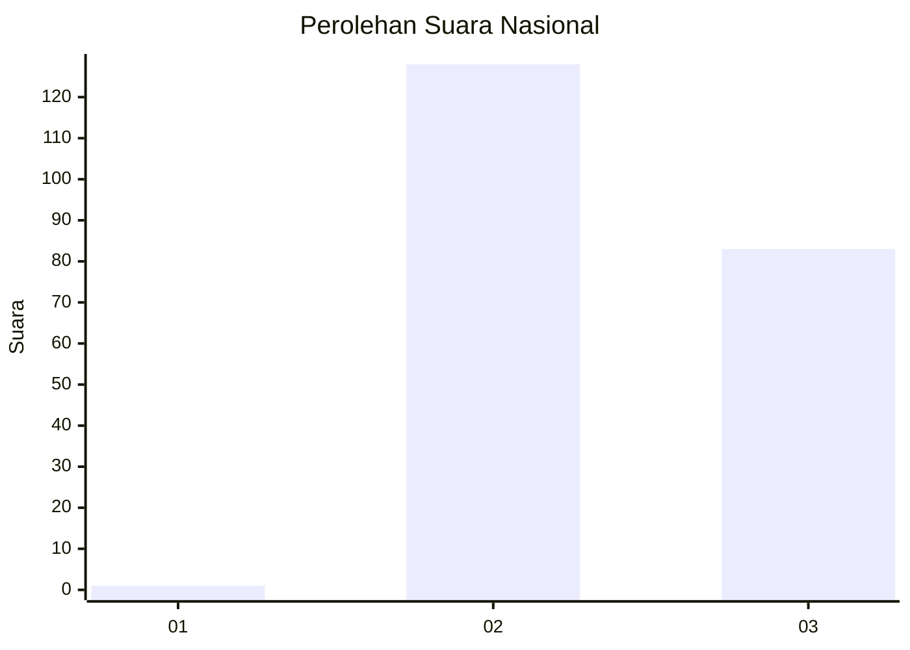
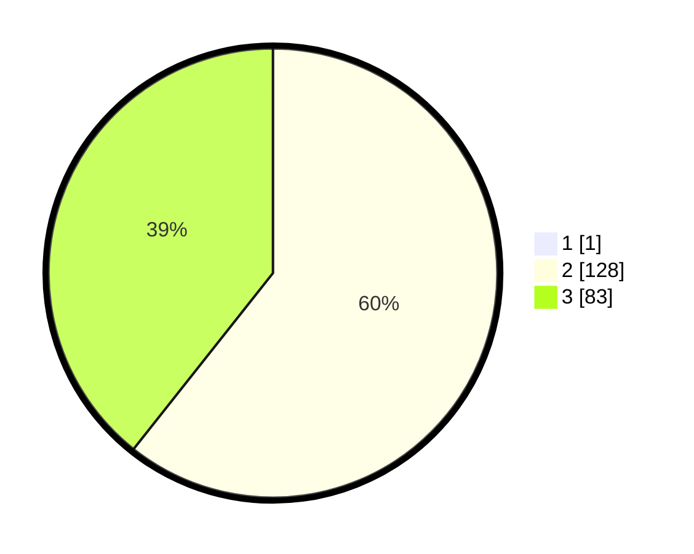

# Hasil

## Grafik

## Tabel

| No. | Nama Paslon    | Suara | Suara (raw) | Persentase |
|:--- |:-------------- | -----:| -----------:| ----------:|
| 1   | ANIES MUHAIMIN | 1     | [1][p-1]    | 0,47       |
| 2   | PRABOWO GIBRAN | 128   | [128][p-2]  | 60,38      |
| 3   | GANJAR MAHFUD  | 83    | [83][p-3]   | 39,15      |

[p-1]: https://github.com/gigit-pemilu/pemilu-2024/blob/main/pilpres/hitung-suara/sub/51-bali/sub/05-klungkung/sub/01-nusa-penida/sub/2013-jungutbatu/sub/012-tps/sub/paslon-1.txt
[p-2]: https://github.com/gigit-pemilu/pemilu-2024/blob/main/pilpres/hitung-suara/sub/51-bali/sub/05-klungkung/sub/01-nusa-penida/sub/2013-jungutbatu/sub/012-tps/sub/paslon-2.txt
[p-3]: https://github.com/gigit-pemilu/pemilu-2024/blob/main/pilpres/hitung-suara/sub/51-bali/sub/05-klungkung/sub/01-nusa-penida/sub/2013-jungutbatu/sub/012-tps/sub/paslon-3.txt

## Foto C Plano

https://sirekap-obj-formc.kpu.go.id/8440/pemilu/ppwp/51/05/01/20/13/5105012013012-20240214-230004--b1c130c1-b4d7-4da3-a30e-95417d07b186.jpg

https://sirekap-obj-formc.kpu.go.id/8440/pemilu/ppwp/51/05/01/20/13/5105012013012-20240214-230205--b8d67d83-e50c-462b-b3a9-bda7d5fbe3cc.jpg

https://sirekap-obj-formc.kpu.go.id/8440/pemilu/ppwp/51/05/01/20/13/5105012013012-20240214-230358--c6a50dea-8bbe-4035-83a9-c551c55078e3.jpg

## Metadata

| Key        | Value               |
| ---------- | ------------------- |
| Time Stamp | 2024-02-15 15:00:29 |

