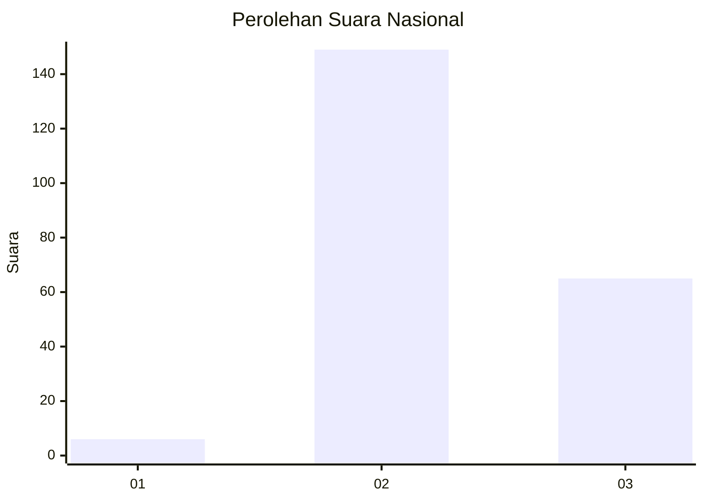

# Hasil

## Grafik

## Tabel

| No. | Nama Paslon    | Suara | Suara (raw) | Persentase |
|:--- |:-------------- | -----:| -----------:| ----------:|
| 1   | ANIES MUHAIMIN | 6     | [6][p-1]    | 2,73       |
| 2   | PRABOWO GIBRAN | 149   | [149][p-2]  | 67,73      |
| 3   | GANJAR MAHFUD  | 65    | [65][p-3]   | 29,55      |

[p-1]: https://github.com/gigit-pemilu/pemilu-2024/blob/main/pilpres/hitung-suara/sub/51-bali/sub/05-klungkung/sub/01-nusa-penida/sub/2014-pejukutan/sub/002-tps/sub/paslon-1.txt
[p-2]: https://github.com/gigit-pemilu/pemilu-2024/blob/main/pilpres/hitung-suara/sub/51-bali/sub/05-klungkung/sub/01-nusa-penida/sub/2014-pejukutan/sub/002-tps/sub/paslon-2.txt
[p-3]: https://github.com/gigit-pemilu/pemilu-2024/blob/main/pilpres/hitung-suara/sub/51-bali/sub/05-klungkung/sub/01-nusa-penida/sub/2014-pejukutan/sub/002-tps/sub/paslon-3.txt

## Foto C Plano

https://sirekap-obj-formc.kpu.go.id/f6cd/pemilu/ppwp/51/05/01/20/14/5105012014002-20240215-093639--6b67583b-ab2c-4392-81ae-30164748412b.jpg

https://sirekap-obj-formc.kpu.go.id/f6cd/pemilu/ppwp/51/05/01/20/14/5105012014002-20240215-093857--03ab15cc-ad85-4cc9-8219-ccc468be9ed1.jpg

https://sirekap-obj-formc.kpu.go.id/f6cd/pemilu/ppwp/51/05/01/20/14/5105012014002-20240215-093745--f569c48d-d6fc-4191-9d97-33308b2671f1.jpg

## Metadata

| Key        | Value               |
| ---------- | ------------------- |
| Time Stamp | 2024-02-15 15:00:29 |

